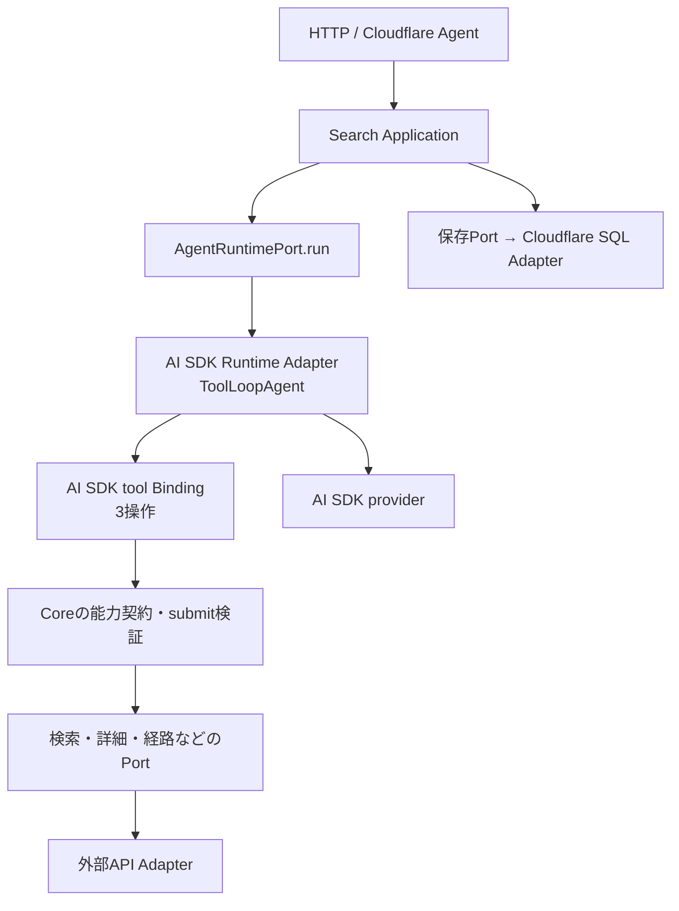

# ADR 0010: AI SDKとCloudflare Agents SDKで実行基盤を構成する

- **Status:** Accepted（SDK利用はユーザー指定、具体的な選定はその委任に基づく。インストール・互換性の実測は未実施）
- **Superseded in part by:** [0011](./0011-cloudflare-led-agent-runtime.md)（Cloudflare側に実行管理を集約。独立したToolLoopAgentの採用を見直す。以下の構成は当時の記録）
- **Date:** 2026-09-08
- **Updates:** 0006のヘキサゴナル構成を維持し、設計0004・0005のHarnessを汎用ループのスクラッチ実装とは解釈しない。

## Decision

**Vercel AI SDK + Cloudflare Agents SDK + valibot**を採用する。

- `ai`: `ToolLoopAgent`、`tool()`、SDKのループ制御・モデル接続・結果管理・構造化出力を利用する。
- `agents`: `Agent`をDurable Object上のスレッド実行環境として利用する。
- `valibot` + `@ai-sdk/valibot`: 既存のデータ契約をSDKのTool入力・構造化出力へ接続する。
- モデル接続は選定モデルのAI SDK provider packageを利用する。モデル名と正確なSDKバージョンは、実装時に互換性を確認してlockfileへ固定する。

VercelへのデプロイやVercel Gatewayの利用はこの決定に含めない。バックエンドはCloudflareに置く。フロントのReact Native UI、HTTP、hooks/state/servicesは維持する。

## なぜこの組み合わせか

| 候補 | 判断 |
|---|---|
| AI SDK + Cloudflare Agent | 採用。モデル・Toolループと、スレッド・実行環境を分離できる。valibot契約を接続できる |
| AI SDKのみ + 生のDO | 可能だが、決定済みのCloudflare Agent基盤を自作へ戻す必要がない |
| Cloudflare AIChatAgent中心 | 現時点では使わない。独自のHTTP応答・候補UI・保持方針に対して、チャット用の同期・永続化全体を導入する必然性がない |
| グラフ型ワークフロー基盤の追加 | 初期3操作の自律選択に、別のグラフ実行・状態基盤を重ねる必要がない |
| スクラッチのTool Calling・ループ | 採用しない。SDKと同じ責務を再実装しない |

これは他SDKが実現不可能という比較ではなく、現在のアーキテクチャに対する依存と責務の少なさによる判断。

## SDKとアプリの責務

| SDKに任せる | ima.側で実装する |
|---|---|
| providerのモデルAPI・Tool Calling形式 | ユーザー原文・候補・観測の文脈構築 |
| Tool定義と入力スキーマ接続 | 検索・詳細取得Portの契約と処理 |
| Tool実行後のモデル継続ループ | 根拠ID・鮮度・候補のsubmit検証 |
| 構造化出力の生成・スキーマ検証 | 表示契約、候補維持/更新、帰属 |
| step制限・フック・AbortSignalの接続 | プロダクトの予算値・一度だけの応答確定 |
| Cloudflare Agentのライフサイクル・SQLアクセス | 所有者認可、保存内容・期限、revision競合処理 |

SDKを利用しても、供給元の取得処理やアプリ固有のルールまで自動実装されるわけではない。SDKの再試行とAdapterの再試行を重ねて試行回数が増えないよう、予算の責務を明示する。

## ヘキサゴナルの境界

図は実行方向。コードの依存は外側からCoreの契約へ向ける。

- Coreには`ai` / `agents` / provider SDKの型を持ち込まない。
- `Tool`、SDKメッセージ、`LanguageModel`等への変換はRuntime Adapterに閉じる。
- 旧案の`ModelPort.next`をCoreの自作whileループから呼ぶ方式は、`AgentRuntimePort.run`でSDKの一連の実行を委譲する方式へ変更する。不要なら低レベルModelPortを別途残さない。
- CoreのTool仕様は能力の契約。SDK用`tool()`へのBindingは`adapters/outbound/ai-sdk`へ置く。
- ApplicationのHarnessは文脈・予算・検証・確定を組み立てる薄い処理であり、SDKのループの二重実装ではない。
- `Agent`継承クラスは外側。スレッド単位でApplicationを構成し、SDK実行状態を共有グローバル変数へ置かない。

## ループと終端のSDK接続

- Tool選択はモデルのautoを基本にする。最初の検索強制や、step番号に応じた固定Tool切替をしない。
- `prepareStep`は必要な文脈・残予算の反映に使う。プロンプトを勝手に検索語へ書き換えない。
- `stopWhen`等のSDKの停止機構を使う。`hasToolCall('submit_cards')`だけで止めると検証失敗でも終了し得るため、**submitの成功結果**を停止条件にする。
- submit失敗は構造化したTool結果として戻し、SDKに次のモデル呼び出しを任せる。
- メッセージ経路はSDKの構造化出力を利用する。submit経路は検証済みTool結果を応答に使う。Tool停止時に最終テキスト出力がないことを、必ずしも失敗としない。
- 検証済み候補の一時結果と、永続的な応答確定は分ける。SDK実行終了後にApplicationがrevisionを確認し、一度だけ確定する。
- 任意のSDK例外を握りつぶして成功にしない。Tool成功と最終出力の有無を分けて処理できることを統合テストで確認する。

## 実装前の限定的な統合確認

本体着手の最初に、SDK mock modelとFixtureの小さな検証を行う。実際のSDKバージョン・providerモデルを固定するまでは、下記が動作済みとは主張しない。

1. Tool不要で構造化メッセージを返せる。
2. search → details → submit成功で余分なモデル呼び出しなしに終了できる。
3. submitの業務検証エラーがモデルへ戻り、修正して成功できる。
4. Tool結果で止まった場合に、未生成の最終structured outputを無条件に読み出さない。
5. valibotのunion・optional・制約がproviderのschema制約に適合する。
6. AbortSignal、step上限、部分失敗、同時Toolの制御、古いターンの確定拒否。

公式のstructured output説明では、最終出力の生成もstepに含まれる。Tool停止とメッセージ生成の分岐を予算内で確認する。SDKの公開フックで実現できない独自仕様があれば、まず仕様の簡素化を検討し、汎用ランタイムを自作し始めない。

## 依存の追加タイミング

現workspaceはHTMLモックと設計書で、package.jsonはまだない。今回の変更は採用方針・設計の更新。実装用workspaceの作成時に必要なパッケージだけを追加する。AI SDK React hooks、AIChatAgent、MCP、Workflow、Code Modeは初期依存に追加しない。

公式ドキュメントの現行ページと検索結果には世代差があるため、API名の例を混在させない。SDKとprovider packageの互換バージョンをlockfileで固定し、対応する公式資料で実装する。

## 根拠（2026-09-08確認）

- [AI SDK ToolLoopAgent](https://ai-sdk.dev/docs/reference/ai-sdk-core/tool-loop-agent)
- [AI SDK Loop Control](https://ai-sdk.dev/docs/agents/loop-control)
- [AI SDK valibotSchema](https://ai-sdk.dev/docs/reference/ai-sdk-core/valibot-schema)
- [AI SDK Structured Data](https://ai-sdk.dev/docs/ai-sdk-core/generating-structured-data)
- [Cloudflare Agents API](https://developers.cloudflare.com/agents/runtime/agents-api/)
- [Cloudflare Using AI Models](https://developers.cloudflare.com/agents/runtime/operations/using-ai-models/)

Cloudflare公式もAI SDKによるモデル接続を案内している。両SDKは今回の選定では異なる責務を担う。
