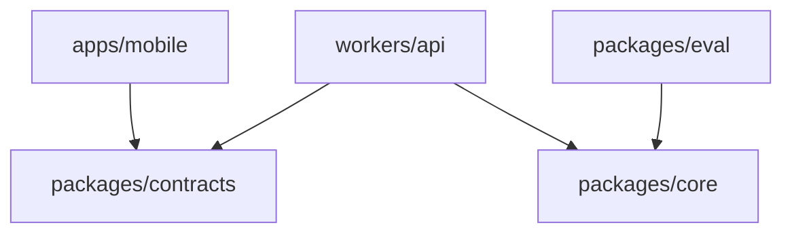

# ADR 0012: package境界で依存方向を固定する

- **Status:** Accepted
- **Date:** 2026-09-09
- **Deciders:** プロダクトオーナー
- **Supersedes (in part):** [0006](./0006-lightweight-frontend-hexagonal-backend.md)のCoreをWorker内部へ配置する例と、共有契約をpackages/schemaとする配置。

## Decision

フロントの軽量構成とバックエンドのヘキサゴナル構成を維持し、独立packageを依存境界にする。package分割はデプロイ面の追加やマイクロサービス化を意味しない。

| 配置 | 所有するもの | アプリ内で宣言する依存 |
|---|---|---|
| `apps/mobile` | UI、hooks、state、HTTP/SQLite/位置/共有services | contracts |
| `packages/contracts` | 公開HTTPリクエスト・応答、描画データとその検証schema | 他のアプリ内packageなし |
| `packages/core` | Application、Domain、入力/出力Ports、観測・業務検証 | 他のアプリ内packageなし |
| `workers/api` | HTTP、Cloudflare/LLM SDK、Tool Binding、外部Adapter、Bootstrap | contracts、core |
| `packages/eval` | Core向けFixture Adapterと評価シナリオ。本番非配置 | core |

矢印はコードの依存方向。coreとcontractsは互いに依存せず、公開契約とCore内部型の変換はworkers/apiが担当する。schema検証等の必要な汎用ライブラリまで禁止するものではない。Cloudflare・AI・店舗provider SDKへの依存はCoreに認めない。

## 責務の維持

- Domain/Ports/Applicationはcore内部のディレクトリで分ける。レイヤやToolごとのpackageを一律に作らない。
- フロント内部はUI + hooks/state + services。Port/Repository/DIを一律導入しない。
- モデル向けTool Bindingはworkers/api側の入力Adapter。Coreの能力契約やsubmit検証と分離する。
- Bootstrapが具象Adapterを構成し、CoreのPortへ注入する。Coreから外側を直接importしない。
- contractsへ業務処理や内部Portを移さない。mobileからCoreへ直接依存しない。
- SDK/DO/HTTPを対象とする統合テストはworkers/api側で行う。Core向けevalのために本番packageからevalを参照しない。

## 境界を維持する仕組み

1. `package.json`に許可する依存だけを宣言する。
2. `exports`で公開入口を限定し、package外から内部実装へ直接依存させない。
3. TypeScriptのpackage単位の型検査・ビルドをCIで行う。
4. 依存lintで相対パスやaliasによるpackage越境、循環依存、禁止SDKへの依存を検査する。型importも対象。
5. Core内部のレイヤ依存と、UIからの直接I/Oも検査する。package分割だけで責務が守られたとは判断しない。

具体的なlint製品・独自ルールの導入方針・CI/行数制約は後続の[ADR0013](./0013-quality-harness-and-size-limits.md)で決定済み。設定実装と検収はM02が担当する。

## 既存資料の読み替えと次の作業

- 旧`packages/schema`は`packages/contracts`へ読み替える。
- `workers/api/src/core`に配置するとした内部契約・処理は`packages/core`へ移す方針。
- 公開契約と内部契約を一つの共通schema packageへまとめない。
- 既存モック・旧ADRは履歴として保持する。未実装なので実コードの移行作業はまだない。
- M01で実装基準、M02でworkspaceと境界検査、M03で公開/内部契約の配置へ反映する。全35件への配置・検収・依存の反映は[影響対応表](../planning/package-impact-2026-09-09.md)を参照。
