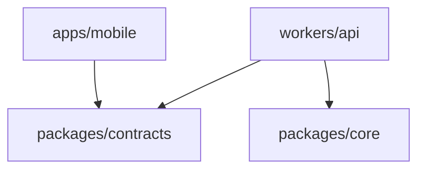

# ADR 0015: eval package を廃止する

- **Status:** Accepted
- **Date:** 2026-09-12
- **Deciders:** プロダクトオーナー
- **Supersedes (in part):** [0012](./0012-package-dependency-boundaries.md)の `packages/eval` 配置と eval→core 依存。

## Decision

`packages/eval` は廃止する。`@ima/eval` を import する本番・試験コードはなく、独立した評価packageとして維持しない。

Core向けに一意だった BarrierCommitPort / BarrierCommitHash の同一revision CAS 競合試験は `packages/core` のテストへ移す。それ以外の eval シナリオ・Fixture Adapter は移さない。

残る package 境界は次のとおり。

| 配置                 | 所有するもの                                                        | アプリ内で宣言する依存  |
| -------------------- | ------------------------------------------------------------------- | ----------------------- |
| `apps/mobile`        | UI、hooks、state、HTTP/SQLite/位置/共有services                     | contracts               |
| `packages/contracts` | 公開HTTPリクエスト・応答、描画データとその検証schema                | 他のアプリ内packageなし |
| `packages/core`      | Application、Domain、入力/出力Ports、観測・業務検証、Core単体テスト | 他のアプリ内packageなし |
| `workers/api`        | HTTP、Cloudflare/LLM SDK、Tool Binding、外部Adapter、Bootstrap      | contracts、core         |

mobile は core・worker・追加packageへ依存しない。api は mobile と追加packageへ依存しない。core は worker・mobile・contracts へ依存しない。

## Consequences

workspace・依存lint・manifest検査は eval を前提にしない。CoreのCAS試験はcore内で完結する。
