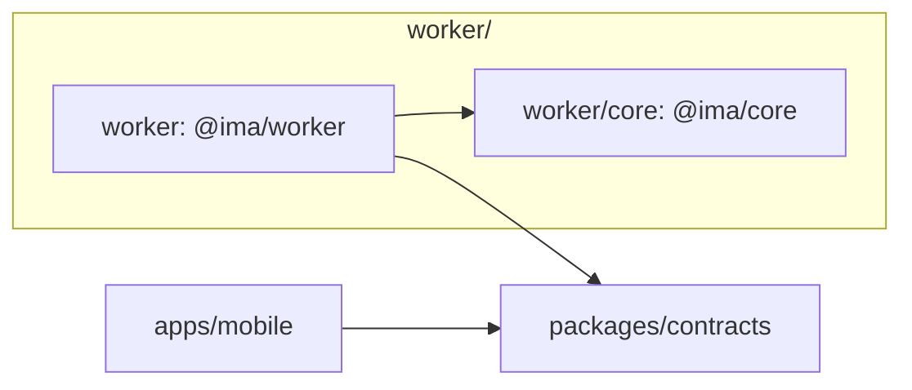
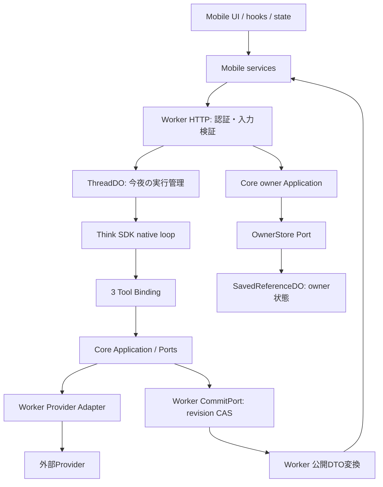

# アーキテクチャ

## 構成と依存方向

iPhoneアプリとCloudflare Workerの2デプロイ面を持つモジュラーモノリス。フロントはUI・hooks/state・services、バックエンドの業務判断はヘキサゴナル構成とする。



矢印はコードの依存方向。4つのworkspaceを使い、Coreとcontractsは相互依存しない。

バックエンドは`worker/`配下にまとめる。`worker/`自体を実行package `@ima/worker`、その内側の`core/`を業務判断の独立package `@ima/core`とする。各責務のディレクトリはWorker package内のモジュールであり、個別のpackageにはしない。`packages/contracts`はMobileとAPIの共有契約としてバックエンドの外に置く。

| 配置                 | 責務                                                                          |
| -------------------- | ----------------------------------------------------------------------------- |
| `apps/mobile`        | UI描画、hooksによる接続、state管理、HTTP・SQLite・位置・共有のservices        |
| `packages/contracts` | 公開HTTP DTO、描画型、検証schema。業務処理や内部Portは置かない                |
| `worker/core`        | Domain、Application、入力・出力Ports、候補・観測・根拠・応答確定の判断        |
| `worker`             | HTTP認証・DTO変換、SDK実行、Tool Binding、Provider/Storage Adapter、Bootstrap |

package外からは公開exportsを使う。相対パス、alias、型import、再exportでも境界を迂回しない。
workspace内部の実装参照は`@core/`・`@worker/`・`@mobile/`・`@contracts/`を使う。対応先は[共通TypeScript設定](../tsconfig.base.json)を正とし、Vitestもこの定義を読む。workspace間は`@ima/core`・`@ima/contracts`などのpackage名を使い、内部aliasで他packageへ入らない。`@worker/`は`worker/`を指すが、`@worker/core/`でCore内部へ入ることは禁止する。テスト補助・tooling・設定・assetの参照には相対パスを使う。
Core内部はApplication→Ports/Domain、Ports→Domainの方向を守る。SDK、直接I/O、環境変数、直接の時計・乱数をCoreへ持ち込まず、必要な値やPortを注入する。
UIはservices経由でI/Oを行い、stateへネイティブI/Oを混ぜない。

## コードの配置

レイヤ内は変更対象で分け、フォルダ名は小文字のkebab-caseとする。ファイル名はエディタのタブでも対象が分かる名前を維持し、単独で責務が明確なファイルは直下に置ける。

```text
apps/mobile/
packages/contracts/
worker/
├── core/                    # 独立package。src/にdomain・application・ports
├── adapters/
│   ├── inbound/
│   │   ├── http/
│   │   └── tools/
│   └── outbound/
│       ├── providers/
│       ├── persistence/
│       └── security/
├── runtime/
├── entrypoints/cloudflare/
├── composition/
├── security/
├── telemetry/
├── tests/
├── tooling/
├── package.json
└── wrangler*.jsonc
```

WorkerのAdapterは`worker/adapters/`へ集約する。`inbound/http`はHTTP入口、`inbound/tools`はLLMのTool入口。`outbound/providers`はHot Pepper・OpenAI・終電の接続と変換、`outbound/persistence`はDO・SQL・メモリストアの具体実装、`outbound/security`は写真トークンの署名実装を持つ。テストも`worker/tests/adapters/`で同じ分類を使い、HTTP配下の`integration/`はworkerdで実行する。

CoreのPortは`worker/core/src/ports/`に置く。OwnerStoreと保存参照の契約もCoreが所有し、保存・決定の手順は`core/src/application/saved-references/`が担う。HTTP Adapterは公開DTOとエラーの変換を担当する。Runtime固有のPortは`runtime/ports/`に置く。

Adapterの生成・注入は`composition/`が担当する。RuntimeからAdapter・composition・entrypointsへの逆依存、Adapterからcomposition・entrypointsへの逆依存を禁止する。出力Adapterから入力Adapter、Toolから出力Adapterへの直接依存も禁止し、Toolと永続化の実装はPort経由で注入する。

| Worker内の配置            | 責務                                                                                                                      |
| ------------------------- | ------------------------------------------------------------------------------------------------------------------------- |
| `core/`                   | SDK・HTTP・永続化方式に依存しない業務判断とPort                                                                           |
| `runtime/`                | SDKを使ったturn実行、キャンセル、予算、文脈・保持・公開応答の制御。`model/`はモデル文脈・プロンプト、`threads/`は実行管理 |
| `adapters/`               | HTTP・Toolの入力変換と、Provider・永続化・署名の具体実装。SQLによるturn管理は`outbound/persistence/thread/`               |
| `entrypoints/cloudflare/` | WorkerとThreadDOの起動・プラットフォーム接続。DOのbinding名とmigrationは維持する                                          |
| `composition/`            | 環境設定を読み、Portと具象Adapter・Runtimeを組み立てる                                                                    |
| `security/`               | App Integrity・認証・レート制限の契約と判定                                                                               |
| `telemetry/`              | 運用イベントの契約・集計・受け渡し                                                                                        |

| 配置                 | 探す対象                                                                                                                                                                                       |
| -------------------- | ---------------------------------------------------------------------------------------------------------------------------------------------------------------------------------------------- |
| Core `application/`  | `model-context`はモデル入力、`candidate-registry`は候補・観測の登録、`submission`は検証・確定、`travel`は移動計算、`saved-references`は保存・決定。今回の条件変更は直下の`turn-constraints.ts` |
| Worker `runtime/`    | `tool-reads`は読み取りToolの実行制御、`turn-execution`はturn実行、`threads`はThread実行管理。予算・文脈・保持・公開応答・保存参照・計測は各フォルダ                                            |
| Mobile `services/`   | `api`はHTTPとその契約、`thread-session`は会話操作・復元、`runtime`は起動時の組み立て、`saved-places`は保存店。SQLは`sqlite`、位置取得は`location`                                              |
| Mobile `components/` | `candidates`は候補カード、`conditions`は条件入力、`response`は応答の表示状態、`saved-places`は保存店UI。表示文言・表示用変換は`presentation`                                                   |

Coreの単体テストは`worker/core/src/`の対象実装の近くに置く。Workerのテストは`worker/tests/`に集約し、`adapters/`・`runtime/`・`composition/`など実装に対応する分類を使う。評価CLIなどの開発用コードは`worker/tooling/`に置く。テスト専用fixtureを公開exportsへ追加しない。配置変更だけで既存の公開入口や責務・依存方向を変更しない。

## 実行とデータの流れ



compositionが具象Adapterを構成する。現在はHot Pepperの検索・詳細AdapterをCoreのPlaceSearchPort/PlaceDetailsPortへ注入し、店舗IDで候補を登録する。地域名はkeyword、現在地は緯度経度とrangeへ変換し、営業時間は掲載文のまま渡す。GoogleのPlaces/Routes/Photos接続は持たない。営業未確認の許容は`composition/`で組み立ててCoreの確定検証へ明示し、必須の移動・滞在条件は解除しない。公開DTOとCore内部型の変換はWorkerが所有する。
ToolはLLM向け入力Adapterであり、Provider呼出しやCoreの出力Portと同一の層にしない。

店舗写真は詳細Adapterが`photo.pc`のURLを観測として登録し、確定カードの写真根拠からWorkerがowner・端末・期限に紐づくtokenを発行する。既存の`GET /v1/photos/:token`が認証・期限検証後にHot Pepperの画像CDNから取得し、Mobileの写真表示部品へ渡す。画像本体をLLMや永続ストレージへ渡さない。

## ランタイムの制約

- Thinkのnative loopを使い、汎用ループや二重の実行管理を追加しない。採用SDKと固定版は[Worker manifest](../worker/package.json)とlockfileで管理する。
- 公開Toolは`search_places`、`get_place_details`、`submit_cards`の3つ。MCP・client・workspace操作を追加の入口にしない。
- モデルのstep全体を副作用前に検査し、read＋submit、複数submit、final＋Toolを拒否する。読み取りだけの複数操作は表現できる。Tool呼び出しと同じstepのテキストは前置きとして破棄し、終端として採用しない。終端を確定できるのはTool呼び出しのないstepだけで、最終応答stepではTool自体を拒否する。
- 終端テキストが空、または指定のenvelopeでない場合はturnを失敗させず、確定なしとして扱う。実行済みの読み取りを捨てず、状況は公開エラーの区分で伝える。
- 根拠・鮮度・必須条件・revisionを検証し、確定は1回だけ行う。`committed`で停止し、成功後の追加生成を要求しない。invalidは上限内で修正する。
- 予算、キャンセル、古いrevision、冪等再送を制御する。残り予算に応じた最終応答stepではToolを無効にする。
- 保存禁止・不明な本文はSDK永続化とlive cacheの前に置換する。Tool結果は当該turnへの一時入力に使う。許可された会話本文は既存のThreadDOコンテキストへ期限付きで保持し、各turnと再起動後に期限を検証してモデル文脈へ戻す。由来不明のcompaction summaryは保持しない。
- 再起動後の再送は同じ確定IDと許可された参照だけで成立させ、保存禁止本文の完全復元を約束しない。

設定・停止時にfixtureへ暗黙に切り替えない。Provider/model設定は[OpenAI Adapter](../worker/adapters/outbound/providers/openai)、組立ては[runtime-production-factory.ts](../worker/composition/runtime-production-factory.ts)、保存前処理は[runtime-retention.ts](../worker/runtime/retention/runtime-retention.ts)を参照する。

## データの正と保存境界

| データ                                 | 正を持つ場所                  | 制約                                            |
| -------------------------------------- | ----------------------------- | ----------------------------------------------- |
| 店の名称・営業時間・写真・経路         | 外部Provider                  | 用途別許可・帰属・期限を検証する                |
| 保存済みprefs・店舗identity・decidedAt | owner単位の`SavedReferenceDO` | 店の本文を埋め込まない                          |
| 今夜の会話実行・確定参照               | `ThreadDO`                    | session期限と保存前制御を適用する               |
| 端末prefs・保存一覧・決定時刻          | SQLiteの投影                  | サーバー再取得で更新し、失敗時のstaleを明示する |
| 終電dataset                            | `JourneyDatasetDO`            | revision CASと検証期限を持つ共有データ          |
| 運用イベント                           | `TelemetryDO`                 | 固定項目のみ。本文・秘密・生座標を記録しない    |

[OwnerStore](../worker/core/src/ports/owner-store.ts)はCoreが所有するasync Port。HTTP AdapterとCore Applicationは[DO Adapter](../worker/adapters/outbound/persistence/saved-references/durable-owner-store.ts)経由で永続化する。
bindingは`SAVED_REFERENCES`、owner shard名は`saved-reference-owner:{ownerScopeRef}`。ThreadDOへprefsをコピーして独立した正にしない。
検索bodyのprefsは今夜の上書きであり、暗黙の永続writeにしない。D1 Adapterや汎用Repositoryは必要になるまで追加しない。

## 境界の検証

Coreの単体試験はCore、HTTP/SDK/DO/Provider統合試験とモデル評価はWorker、端末試験はmobileに置く。評価専用packageは設けない。
依存の静的検査は[dependency-cruiser設定](../.dependency-cruiser.cjs)とmanifest検査で行う。
保存前制御・3操作限定・確定1回は実SDK/DOのfixtureで検証し、実APIや実機の成功とは区別する。
実行手順は[開発](development.md)と[運用](operations.md)を参照する。
