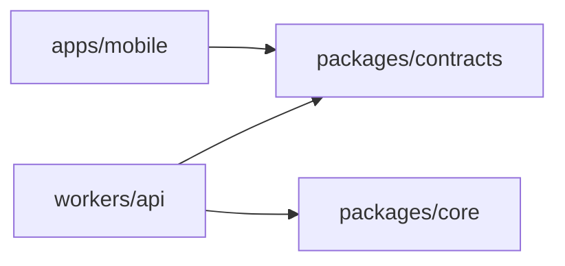

# アーキテクチャ

## 構成と依存方向

iPhoneアプリとCloudflare Workerの2デプロイ面を持つモジュラーモノリス。フロントはUI・hooks/state・services、バックエンドの業務判断はヘキサゴナル構成とする。

矢印はコードの依存方向。4つのworkspaceを使い、Coreとcontractsは相互依存しない。

| 配置                 | 責務                                                                          |
| -------------------- | ----------------------------------------------------------------------------- |
| `apps/mobile`        | UI描画、hooksによる接続、state管理、HTTP・SQLite・位置・共有のservices        |
| `packages/contracts` | 公開HTTP DTO、描画型、検証schema。業務処理や内部Portは置かない                |
| `packages/core`      | Domain、Application、入力・出力Ports、候補・観測・根拠・応答確定の判断        |
| `workers/api`        | HTTP認証・DTO変換、SDK実行、Tool Binding、Provider/Storage Adapter、Bootstrap |

package外からは公開exportsを使う。相対パス、alias、型import、再exportでも境界を迂回しない。
Core内部はApplication→Ports/Domain、Ports→Domainの方向を守る。SDK、直接I/O、環境変数、直接の時計・乱数をCoreへ持ち込まず、必要な値やPortを注入する。
UIはservices経由でI/Oを行い、stateへネイティブI/Oを混ぜない。

## 実行とデータの流れ

Bootstrapが具象Adapterを構成する。公開DTOとCore内部型の変換はWorkerが所有する。
ToolはLLM向け入力Adapterであり、Provider呼出しやCoreの出力Portと同一の層にしない。

## ランタイムの制約

- Thinkのnative loopを使い、汎用ループや二重の実行管理を追加しない。採用SDKと固定版は[Worker manifest](../workers/api/package.json)とlockfileで管理する。
- 公開Toolは`search_places`、`get_place_details`、`submit_cards`の3つ。MCP・client・workspace操作を追加の入口にしない。
- モデルのstep全体を副作用前に検査し、read＋submit、複数submit、final＋Toolを拒否する。読み取りだけの複数操作は表現できる。
- 根拠・鮮度・必須条件・revisionを検証し、確定は1回だけ行う。`committed`で停止し、成功後の追加生成を要求しない。invalidは上限内で修正する。
- 予算、キャンセル、古いrevision、冪等再送を制御する。残り予算に応じた最終応答stepではToolを無効にする。
- 保存禁止・不明な本文はSDK永続化とlive cacheの前に置換する。必要な原文・Tool結果は当該turnへの一時入力だけに使う。由来不明のcompaction summaryも保持しない。
- 再起動後の再送は同じ確定IDと許可された参照だけで成立させ、保存禁止本文の完全復元を約束しない。

設定・停止時にfixtureへ暗黙に切り替えない。Provider/model設定は[model](../workers/api/src/model)、組立ては[runtime-production-factory.ts](../workers/api/src/runtime/runtime-production-factory.ts)、保存前処理は[runtime-retention.ts](../workers/api/src/runtime/runtime-retention.ts)を参照する。

## データの正と保存境界

| データ                                 | 正を持つ場所                  | 制約                                            |
| -------------------------------------- | ----------------------------- | ----------------------------------------------- |
| 店の名称・営業時間・写真・経路         | 外部Provider                  | 用途別許可・帰属・期限を検証する                |
| 保存済みprefs・店舗identity・decidedAt | owner単位の`SavedReferenceDO` | 店の本文を埋め込まない                          |
| 今夜の会話実行・確定参照               | `ThreadDO`                    | session期限と保存前制御を適用する               |
| 端末prefs・保存一覧・決定時刻          | SQLiteの投影                  | サーバー再取得で更新し、失敗時のstaleを明示する |
| 終電dataset                            | `JourneyDatasetDO`            | revision CASと検証期限を持つ共有データ          |
| 運用イベント                           | `TelemetryDO`                 | 固定項目のみ。本文・秘密・生座標を記録しない    |

[OwnerStore](../workers/api/src/saved-references/owner-store.ts)はWorkerが所有するasync Port。HTTP/Applicationは[DO Adapter](../workers/api/src/saved-references/durable-owner-store.ts)経由で永続化する。
bindingは`SAVED_REFERENCES`、owner shard名は`saved-reference-owner:{ownerScopeRef}`。ThreadDOへprefsをコピーして独立した正にしない。
検索bodyのprefsは今夜の上書きであり、暗黙の永続writeにしない。D1 Adapterや汎用Repositoryは必要になるまで追加しない。

## 境界の検証

Coreの単体試験はCore、HTTP/SDK/DO/Provider統合試験とモデル評価はWorker、端末試験はmobileに置く。評価専用packageは設けない。
依存の静的検査は[dependency-cruiser設定](../.dependency-cruiser.cjs)とmanifest検査で行う。
保存前制御・3操作限定・確定1回は実SDK/DOのfixtureで検証し、実APIや実機の成功とは区別する。
実行手順は[開発](development.md)と[運用](operations.md)を参照する。
