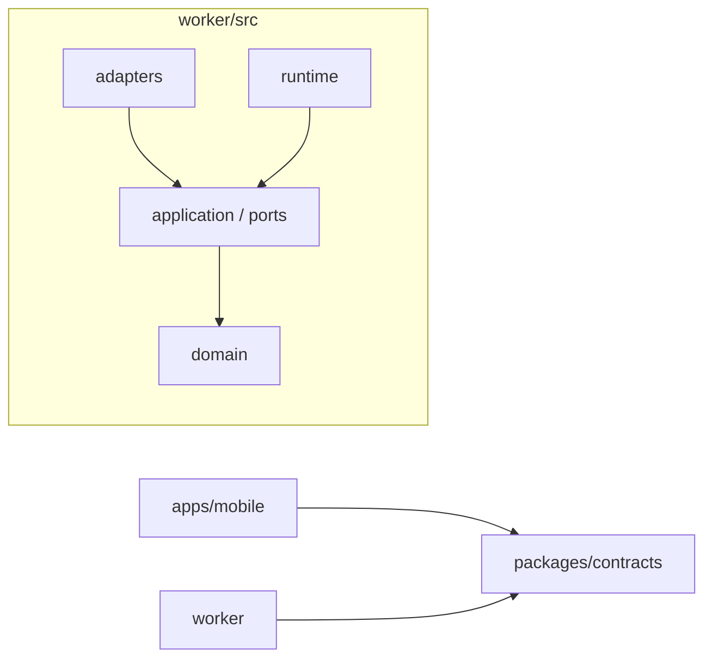
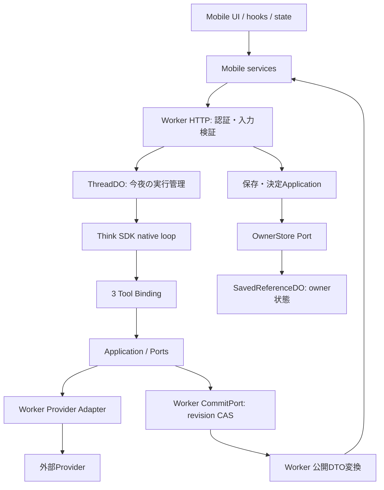

# アーキテクチャ

## 構成と依存方向

iPhoneアプリとCloudflare Workerの2デプロイ面を持つモジュラーモノリス。フロントはUI・hooks/state・services、バックエンドの業務判断はヘキサゴナル構成とする。



3つのworkspaceは`apps/mobile`・`worker`・`packages/contracts`。Worker内部のDomain・Applicationはpackageではなく、依存を静的検査するモジュールとする。MobileとWorkerの共有契約はバックエンドの外に置く。

| 配置                     | 責務                                                                   |
| ------------------------ | ---------------------------------------------------------------------- |
| `apps/mobile`            | UI描画、hooksによる接続、state管理、HTTP・SQLite・位置・共有のservices |
| `packages/contracts`     | 公開HTTP DTO、描画型、検証schema。業務処理や内部Portは置かない         |
| `worker/src/domain`      | 候補・根拠・鮮度・保持・移動条件などの業務概念とルール                 |
| `worker/src/application` | 保存・決定・応答確定の手順、候補管理、モデル文脈、業務用Port           |
| `worker/src/adapters`    | HTTP・Toolの入力変換、Provider・保存・署名の具体実装                   |

workspace間は`@ima/contracts`などの公開exportsを使い、相対パス・内部alias・型import・再exportで迂回しない。内部実装は`@worker/`・`@mobile/`・`@contracts/`を使う。対応先は[共通TypeScript設定](../tsconfig.base.json)を正とし、Vitestもこの定義を読む。`@worker/`は`worker/src/`を指す。テスト補助・tooling・設定・assetの参照には相対パスを使う。

Application→Ports/Domain、Ports→Domainの方向を守る。DomainからApplicationへの依存は禁止する。業務層は公開HTTP DTO・SDK・Adapter・Runtimeへ依存せず、外部ライブラリはschema用のValibotとテスト用Vitestに限定する。直接I/O・環境変数・直接の時計や乱数を持ち込まず、必要な値やPortを注入する。packageの一括再exportで業務層をまとめず、利用するモジュールを直接参照する。
UIはservices経由でI/Oを行い、stateへネイティブI/Oを混ぜない。

## コードの配置

レイヤ内は変更対象で分け、フォルダ名は小文字のkebab-caseとする。ファイル名はエディタのタブでも対象が分かる名前を維持する。入口と主要な契約はモジュール直下、検証などの内部詳細は意味のあるサブディレクトリへ置く。

```text
apps/mobile/
packages/contracts/
worker/
├── src/
│   ├── domain/                  # places・candidates・evidence・travel・constraints
│   ├── application/
│   │   ├── use-cases/           # save-place・decide-place・submit-responseなど
│   │   ├── candidate-registry/
│   │   ├── model-context/
│   │   ├── travel/
│   │   └── ports/
│   ├── adapters/
│   │   ├── in/http/
│   │   ├── in/tools/
│   │   ├── out/providers/
│   │   ├── out/persistence/
│   │   └── out/security/
│   ├── runtime/
│   ├── security/
│   ├── telemetry/
│   ├── entrypoints/cloudflare/
│   └── composition/
├── tests/
├── tooling/
├── package.json
└── wrangler*.jsonc
```

`domain/travel`は終電recordの検証と時刻計算、`application/travel`はPortの入出力を使う再計算と位置の検証を持つ。保存と決定は`use-cases/save-place`・`decide-place`、応答確定は`submit-response`、今回の条件変更は`update-turn-constraints`。候補登録とモデル入力の構築はそれぞれ`candidate-registry`・`model-context`に置く。

`adapters/in/http`はHTTP入口、`in/tools`はLLM Tool入口。`out/providers`はHot Pepper・OpenAI・終電の接続と変換、`out/persistence`はDO・SQL・メモリストア、`out/security`は写真トークン署名を担当する。OwnerStoreなどの業務用Portは`application/ports`が所有する。Runtime固有のPortは`runtime/ports`、認証と運用計測の契約は`security`・`telemetry`に置き、業務用Portと混ぜない。

`runtime`はSDKを使ったturn実行、キャンセル、予算、文脈・保持・公開応答の制御を持つ。`model`はモデル文脈・プロンプト、`threads`は実行管理、`tool-reads`は読み取りTool制御、`turn-execution`はturn実行を担う。SQLによるturn保存は`adapters/out/persistence/thread`に置く。

生成・注入は`composition`、Worker・ThreadDOの起動とプラットフォーム接続は`entrypoints/cloudflare`が担当する。RuntimeからAdapter・composition・entrypointsへの逆依存、Adapterからcomposition・entrypointsへの逆依存を禁止する。出力Adapterから入力Adapter、Toolから出力Adapterへの直接依存も禁止し、Port経由で注入する。DOのbinding名とmigrationは配置変更で変えない。

Domain・Applicationの単体テストは実装の近くに置く。複数の保存・決定操作を検証する試験は`application/use-cases`直下に置く。Workerのテストは`worker/tests`に集約し、`adapters/inbound`・`outbound`、`runtime`・`security`・`composition`は対応する責務を検証する。HTTP配下の`integration`はworkerdで実行する。評価CLIなどの開発用コードは`worker/tooling`に置き、fixtureを製品の公開入口に含めない。

Mobileは`src`直下を機能で分け、その内側でUI・hooks/state・servicesを分離する。機能をまたぐ画面の組み合わせは`journey`、起動時の生成・注入は`composition`が担う。単体テストは対象実装の近くへ置く。

| Mobileの配置   | 責務                                                                |
| -------------- | ------------------------------------------------------------------- |
| `journey`      | 会話・候補・応答・行き先決定の画面と操作。入口は`JourneyScreen.tsx` |
| `saved-places` | 保存店の取得・保存・プレビュー、そのUI・状態・表示変換              |
| `preferences`  | 条件の型・初期値・表示、条件編集と保存済み設定の投影                |
| `ui`           | 機能に依存しないCanvas・テーマ・帰属表示の変換                      |
| `platform`     | HTTP・SQLite・位置・資格情報・共有・触覚・ID生成の技術実装          |
| `composition`  | Runtime生成、起動hook、端末の保存状態の接続                         |

## 実行とデータの流れ



compositionが具象Adapterを構成する。現在はHot Pepperの検索・詳細AdapterをApplicationのPlaceSearchPort/PlaceDetailsPortへ注入し、店舗IDで候補を登録する。地域名はkeyword、現在地は緯度経度とrangeへ変換し、営業時間は掲載文のまま渡す。GoogleのPlaces/Routes/Photos接続は持たない。営業未確認の許容は`src/composition/`で組み立ててApplicationの確定検証へ明示し、必須の移動・滞在条件は解除しない。公開DTOと業務の内部型の変換はWorkerが所有する。
ToolはLLM向け入力Adapterであり、Provider呼出しやApplicationの出力Portと同一の層にしない。

店舗写真は詳細Adapterが`photo.pc`のURLを観測として登録し、確定カードの写真根拠からWorkerがowner・端末・期限に紐づくtokenを発行する。既存の`GET /v1/photos/:token`が認証・期限検証後にHot Pepperの画像CDNから取得し、Mobileの写真表示部品へ渡す。画像本体をLLMや永続ストレージへ渡さない。

## ランタイムの制約

- Thinkのnative loopを使い、汎用ループや二重の実行管理を追加しない。採用SDKと固定版は[Worker manifest](../worker/package.json)とlockfileで管理する。
- 公開Toolは`search_places`、`get_place_details`、`submit_cards`の3つ。MCP・client・workspace操作を追加の入口にしない。
- モデルのstep全体を副作用前に検査し、read＋submit、複数submit、final＋Toolを拒否する。読み取りだけの複数操作は表現できる。Tool呼び出しと同じstepのテキストは前置きとして破棄し、終端として採用しない。終端を確定できるのはTool呼び出しのないstepだけで、最終応答stepではTool自体を拒否する。
- 終端テキストが空、または指定のenvelopeでない場合はturnを失敗させず、確定なしとして扱う。実行済みの読み取りを捨てず、状況は公開エラーの区分で伝える。
- 根拠・鮮度・必須条件・revisionを検証し、確定は1回だけ行う。`committed`で停止し、成功後の追加生成を要求しない。invalidは上限内で修正する。
- 予算、キャンセル、古いrevision、冪等再送を制御する。残り予算に応じた最終応答stepではToolを無効にする。
- 保存禁止・不明な本文はSDK永続化とlive cacheの前に置換する。Tool結果は当該turnへの一時入力に使う。許可された会話本文は既存のThreadDOコンテキストへ期限付きで保持し、各turnと再起動後に期限を検証してモデル文脈へ戻す。由来不明のcompaction summaryは保持しない。
- 再起動後の再送は同じ確定IDと許可された参照だけで成立させ、保存禁止本文の完全復元を約束しない。

設定・停止時にfixtureへ暗黙に切り替えない。Provider/model設定は[OpenAI Adapter](../worker/src/adapters/out/providers/openai)、組立ては[runtime-production-factory.ts](../worker/src/composition/runtime-production-factory.ts)、保存前処理は[runtime-retention.ts](../worker/src/runtime/retention/runtime-retention.ts)を参照する。

## データの正と保存境界

| データ                                 | 正を持つ場所                  | 制約                                            |
| -------------------------------------- | ----------------------------- | ----------------------------------------------- |
| 店の名称・営業時間・写真・経路         | 外部Provider                  | 用途別許可・帰属・期限を検証する                |
| 保存済みprefs・店舗identity・decidedAt | owner単位の`SavedReferenceDO` | 店の本文を埋め込まない                          |
| 今夜の会話実行・確定参照               | `ThreadDO`                    | session期限と保存前制御を適用する               |
| 端末prefs・保存一覧・決定時刻          | SQLiteの投影                  | サーバー再取得で更新し、失敗時のstaleを明示する |
| 終電dataset                            | `JourneyDatasetDO`            | revision CASと検証期限を持つ共有データ          |
| 運用イベント                           | `TelemetryDO`                 | 固定項目のみ。本文・秘密・生座標を記録しない    |

[OwnerStore](../worker/src/application/ports/owner-store.ts)はApplicationが所有するasync Port。HTTP AdapterとApplicationは[DO Adapter](../worker/src/adapters/out/persistence/saved-references/durable-owner-store.ts)経由で永続化する。
bindingは`SAVED_REFERENCES`、owner shard名は`saved-reference-owner:{ownerScopeRef}`。ThreadDOへprefsをコピーして独立した正にしない。
検索bodyのprefsは今夜の上書きであり、暗黙の永続writeにしない。D1 Adapterや汎用Repositoryは必要になるまで追加しない。

## 境界の検証

業務層の単体試験はDomain・Application、HTTP/SDK/DO/Provider統合試験とモデル評価はWorker、端末試験はmobileに置く。評価専用packageは設けない。
依存の静的検査は[dependency-cruiser設定](../.dependency-cruiser.cjs)とmanifest検査で行う。
保存前制御・3操作限定・確定1回は実SDK/DOのfixtureで検証し、実APIや実機の成功とは区別する。
実行手順は[開発](development.md)と[運用](operations.md)を参照する。
