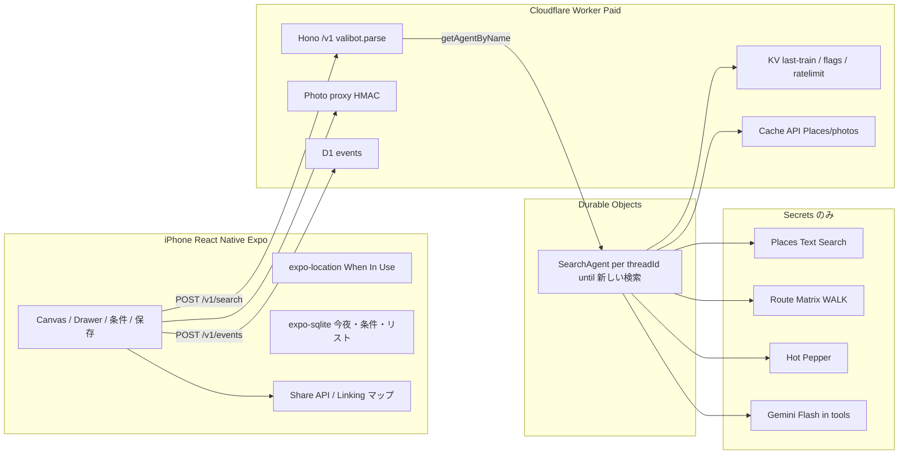
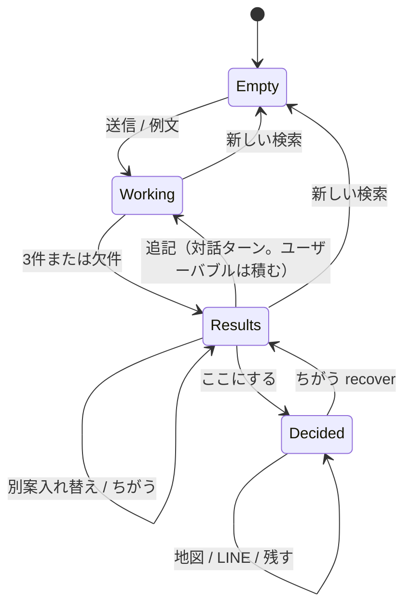
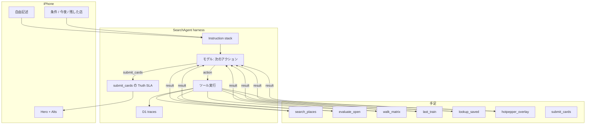
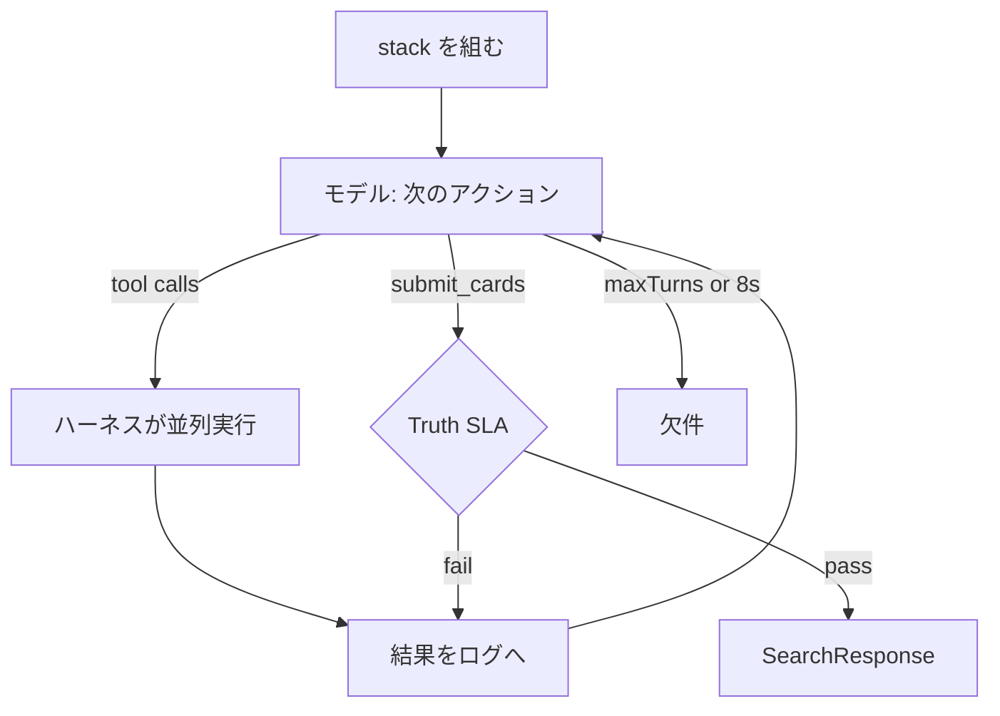
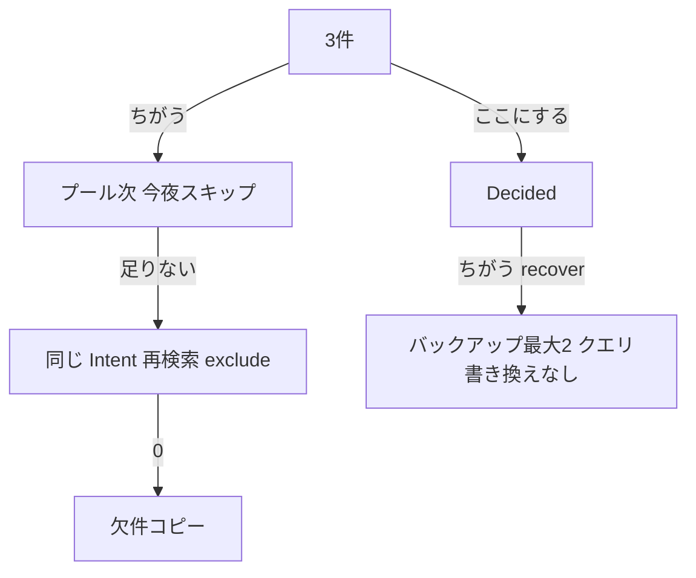

# ima.（仮称）iPhone 実装設計 — その場の次スポット

> 応答設計の更新: [ADR 0009](../adr/0009-contextual-response-presentation.md)と[自律応答ループ](./0004-autonomous-response-loop.md)を参照。LLMがToolと提示形式を選び、メッセージのみでも完了できる。本書のカード必須・アシスタント本文非保存・固定DAGの記述は現在の方針と異なる。

> 2026-09-08: アーキテクチャ構成は [ADR 0006](../adr/0006-lightweight-frontend-hexagonal-backend.md) が本書の旧レイヤ構成を上書きする。フロントはUI + hooks/state + services、バックエンドはヘキサゴナル。本書のディレクトリ例・依存図・SDK結合を含む擬似コードは移行前のDraftとして扱う。次の未決論点は [0002-next-decisions](./0002-next-decisions.md) を参照。

| 項目 | 値 |
|---|---|
| **Document** | `docs/design/0001-iphone-next-spot.md` |
| **Author** | TBD（実装担当） |
| **Date** | 2026-09-07 |
| **Status** | Draft |
| **Product** | ima.（仮称） |
| **Surface** | iPhone のみ（v1。Android / iPad / Mac は対象外。RN はスタックであり Android 出荷ではない） |
| **Canonical UX** | [ADR 0001](../adr/0001-in-the-moment-next-spot.md) §4、[ADR 0002](../adr/0002-cherished-person-lighter-load.md)、[ADR 0003](../adr/0003-plugins-and-dialogue.md)（プラグインと提案後の対話） |
| **Studio mock** | `index.html`（机ビューと保存3状態は本番に持ち込まない。WebView で包まない） |
| **Audience** | シニアエンジニア（1人〜少人数で TestFlight まで運ぶ） |
| **Stack override** | 2026-09-06 プロダクトオーナー: React Native + TypeScript、valibot、Cloudflare Worker、Durable Objects、AI はツール+ハーネスとして一等 |

---

## Overview

「次どこ行く？」が歩道で出たとき、探す役が自由記述を1回送り、今行ける場所を主提案1 + 別案2として受け取り、90秒以内に `ここにする` → 地図または LINE で今夜を先に進める。相手はアプリ不要。訪問の真偽は取らない。残渣は端末上の店リストである。

v1 の製品面は iPhone。クライアントは **React Native (Expo Dev Client) + TypeScript**。BFF は **Cloudflare Workers Paid**。1スレッドは **`SearchAgent` Durable Object**。1通目で提案 UI を出し、追記は対話ターン。**ツールはプラグイン**（選択肢を広げる手足）。ハーネスは実行と Truth SLA と停止。端末はプロバイダキーを持たない。プレリリースは恵比寿・代官山の夜を品質エンベロープとし、全国・予約・プッシュ・LINE ログインはやらない。

骨格（NVP、ADR 0001 / 0002 共通）:

```
自由記述 → エージェント探索 → 主提案1 + 別案2 → ここにする → 地図 / LINE
```

---

## Background & Motivation

作業用モック `index.html` は単一 HTML、店は Melt / 無音 / 4min の3件固定、Places も終電も LINE も未接続である。机（desktop）ビューはスタジオ用でありプロダクト面ではない。モックの `保存` は 0001 の「行った / また行きたい / 行かない」のままなので、0002 に合わせて実装する。HTML を WebView で包まない。

雇われるジョブ（ADR 0002 が 0001 §3.1 を置換）:

> When 大切にしたい人と外出していて、今の予定が終わり、「次どこ行く？」が出て、残り時間はあるが候補が頭にない  
> I want to 探す役のまま、今行ける場所をすぐ出せる  
> so I can 相手に選ばせ続けず、自分も長時間の探索とハズレの全責任を負わずに、今夜を先に進める

対象は関係種別ではない。カップル、友達、初めまして。コピーも UI も「デート」「カップル」を主語にしない。まだ入らない: 3人以上の二次会幹事、明日のプラン、アルバム、相手プロフィール。

楔: 終電がある都市の夜。品質エンベロープは恵比寿・代官山、金土 20:30–22:30（SLO。ハードロックではない）。

成功（プレリリース）: 探す役が90秒で3件を出せたか / 相手に画面または LINE で渡せたか / 今夜が止まったままか。歩いたかは望ましいが必須ではない。複利（使うほど AI が賢くなる）は主張しない。残渣はリスト。

---

## Goals & Non-Goals

### Goals（NVP）

1. iPhone 片手・歩道・雨でも、空キャンバスから1送信でカード3件（主1+別2）を出す。
2. 出してよい店は **listed hours が `clientNow` を含み / 徒歩条件内 / 終電で帰宅できる** ものに限る。Google `openNow` はリコール用の粗いフィルタであり、歩道の「入れる」ではない。不明な満席・待ち・LO は書かない。
3. `ここにする` の直後に Apple マップ（URL）で歩ける、共有シートで店名・徒歩・地図リンクを渡せる。相手はアプリ不要、LINE ログイン不要。
4. サイドバーは今夜の検索履歴。名前付き機能は **条件** と **保存** の2つのみ。
5. 保存はリスト（残した店 + 今夜決めた）。訪問確認プッシュは出さない。行は消さない。今夜決めたは 05:00 窓の表示。
6. Sign in で歩道を止めない。キーは端末に置かない。検索 API は静的アプリトークン → 外部 TestFlight 前に App Attest。
7. 1通目で提案 UI。プラグインへアクション。追記は対話。assistant 長文は出さない。
8. TestFlight 10–50 夜を観測できる最小テレメトリ。`NOW` カードの closed-after を数える。ゴールデン夜の eval を CI で回す。

### Non-Goals

- Android 出荷、iPad 最適化、Mac、机レイアウト
- デートプランナー、カップル OS、アルバム、記念日、相手登録、関係種別ピッカー
- スワイプ、ヒット一覧、3枚同サイズ、**最初の3件の前に**聞き返すこと、`useAgentChat` をキャンバスにすること（対話は提案 UI の更新であり、チャットアプリではない）
- NativeWind / Tailwind / DOM コンポーネントを RN に入れること
- i18n、音声入力、英語 UI
- LINE ログイン、LIFF、Messaging API プッシュ、「今夜どう？」
- マップ / Instagram / カレンダー同時連携、予約、全国、3+ 二次会
- 「入れた?」プッシュ、`ちがう` の永久ネバー、`入れなかった` ラベル
- バックグラウンド位置、常時プッシュ
- モック HTML の WebView ラップ、偽ステータスバー
- モデルに web-browse や「ユーザーに聞き返す」ツールを渡すこと

---

## Key Decisions

実装中に覆す場合は ADR を先に書く。**D1 の SwiftUI 採択は本改訂で破棄**（オーナー決定 2026-09-06）。

| ID | 決定 | 根拠（短） |
|---|---|---|
| **D1** | クライアントは **React Native + TypeScript**。製品面は iPhone のみ。**Expo Dev Client**（Expo Go ではない）。`index.html` を WebView にしない。 | オーナー決定。iPhone 出荷と共有スキーマを優先。Android は v1 対象外。 |
| **D19** | 共有型は **valibot**（Zod ではない）。`packages/schema` を `apps/mobile` と `workers/api` が import。境界で `v.parse`。`as` 禁止。 | オーナー決定。ツール I/O も同じスキーマ。 |
| **D7** | BFF は **Cloudflare Workers Paid（$5）+ Hono**。KV / D1 / Cache API。Free の 10ms CPU では乗らない。 | キーは Secrets。パイプラインの subrequest。 |
| **D20** | 1スレッドは **`SearchAgent` extends `Agent`**（DO）。`getByName(threadId)`。ターンごとに `run(turn)`（**`@callable` 禁止**）。トレースは DO SQL。**スレッドが生きている間は `deleteAll` しない**（対話のため）。`新しい検索` または 05:00 で D1 flush + `deleteAll`。製品 UI に `useAgentChat` / Think を使わない。 | 0003: 提案後の対話。oneshot 廃棄だと文脈が消える。 |
| **D21** | ツールは **プラグイン**（エージェントの選択肢を広げる手足）。カタログからアクションを出し、ハーネスが実行し結果を返す。最終アクションは `submit_cards`。1ターン壁時計 8s、`maxTurns` 4。LLM オフ時は同じプラグインをスクリプト順で回す。 | 0003。固定パイプラインを本体にしない。 |
| **D23** | 1通目で提案 UI。その後の追記は対話ターン。assistant 長文は出さない。カード枠を更新する。最初の3件の前に聞き返さない。 | 0003。ChatGPT の書いて足す、商品は提案 UI。 |
| **D24** | プラグインは `{ name, description, input, output, execute }` をハーネスに登録する。無いプラグインの結果は捏造しない。NVP カタログは店・営業・徒歩・終電・保存・HP・submit。 | 能力追加はプラグインを足す。 |
| **D25** | アプリは **技術分割のモジュラーモノリス**。デプロイは `apps/mobile` と `workers/api` の2つ。共有は `packages/schema` のみ。業務サービスに切らない。 | オーナー。実行環境が違うための2面であり、マイクロサービスではない。 |
| **D26** | 依存は上→下のみ。面の会合は schema + HTTP。`submit_cards` は agent の終端であり plugins に置かない。ui は infra を直 import しない。 | ADR 0005。提案 UI と Truth SLA を import で守る。 |
| **D27** | 画面の **組み立て** は [AI Elements](https://elements.ai-sdk.dev/) に合わせる。**見た目の正はモック / ADR 0001 §4.6**。公式パッケージは Web（shadcn / Tailwind / DOM）なので RN には入れない。同名の薄い primitive を `apps/mobile/src/ui/` に自前実装する。提案カードは Elements に無いので自前のまま must。`useChat` を製品の正にしない。 | オーナー。AI LIKE な骨格、ima の提示。 |
| **D28** | 追記の電線は `SearchRequest = { threadId, text, clientNow, location, prefs, savedPlaceIds, excludePlaceIds, mode }`。全文ログは送らない。前ターンの観測は DO が持つ。 | 実装前ロック。スキーマ再作業を防ぐ。 |
| **D29** | 今夜のユーザー発話と **最後の `SearchResponse`** を端末 sqlite に残す。生きた再検索の正はエージェント。キル・オフラインでも直前の3件と地図 URL は残る。 | 実装前ロック。0003 のスレッド。 |
| **D30** | Places 写真を出すカードは Google 帰属を小さく出す。HP フィールドを出したときだけホットペッパー一行。第3機能にしない。提案 UI の must は壊さない。 | Maps / Recruit ToS。 |
| **D31** | スタイルは **トークン + StyleSheet**。NativeWind / Tailwind を RN に入れない。Elements の className をコピーしない。 | 実装前ロック。D27 の RN 実装。 |
| **D32** | UI コピーは **日本語のみ**。i18n フレームワークは置かない。音声入力は NVP に入れない。 | 歩道のジョブは口語日本語。 |
| **D22** | リストの正は **端末**（`expo-sqlite`）。DO にユーザーリストを置かない。レート制限は Worker + KV（`DeviceGuard` DO は後回し）。 | 0002 の残渣はオフラインで読めること。カード取得後に電波が落ちても地図 URL とリストが残る。 |
| D2 | 店カタログの正は **Places API (New) Text Search**。Hot Pepper は LO/予算オーバーレイ（Jaccard≥0.8 かつ <50m）。矛盾しても Places 候補は落とさない。 | 写真とスポット。HP の `close` は定休日。 |
| D3 | 徒歩は **ComputeRouteMatrix `WALK` 1呼**。表示は整数分。地図起動は URL（Apple マップ）。 | 20本 ComputeRoutes は Worker 接続6と予算を割る。 |
| D4 | 終電 KV は **usable journey**（乗換込み）。欠けるペアは出さない。`from==to` は免除。HeartRails は NVP で呼ばない。 | 代官山→新宿を山手最終と書かない。 |
| D5 | 「地図を開く」は `maps.apple.com/?daddr=&dirflg=w`。LINE 本文は Google Maps HTTPS。 | 探す役は iPhone。受益者 OS は不明。 |
| D6 | LINE は **RN Share / expo-sharing が既定**。SDK/ログインなし。`line://msg/text/` は Flag。 | ADR 0001 §4.5。 |
| D8 | Sign in で検索を止めない。Internal TF: **`X-App-Token` のみ**（Attest で止めない）。外部 TF 前: **`@expo/app-integrity`** + Worker nonce/assert。Simulator は作者機のみトークンフォールバック。 | Device UUID は偽造できる。`react-native-app-attest` は Expo 未対応。 |
| D9 | LLM 呼び出しはツール内。座標はモデルに送らない。NVP モデル **Gemini 2.0 Flash**。失敗時は regex / テンプレにフォールバック。店の発明禁止。 | 状況文は PII。ChatGPT 皮の Places は ADR 却下。 |
| D10 | `ちがう` は今夜限り。Decided の `ちがう` は recover。`入れなかった` ラベルは出さない。 | ADR 0002。緊急面に3機能目を足さない。 |
| D11 | エンベロープは SLO。地理ロックしない。終電保証が無い店は出さない。 | 広尾で壁を出さない。嘘の「間に合う」も出さない。 |
| D12 | エージェント・ループが主。人手はブロックリスト後追い。応答を人間承認で止めない。 | 90秒。 |
| D13 | プッシュなし。When In Use のみ。`accuracy > 100m` または reduced なら徒歩分を出さない。 | 分を捏造しない。 |
| D14 | 390幅、Dark、Dela Gothic One + Noto Sans JP、角 **24pt**、ライムは点、主ボタンクリーム。 | ADR 0001 §4.6、モック `--radius`。 |
| D15 | Places: Text Search + `openNow: true` + **`locationBias.circle`** + **`pageSize`**。`locationRestriction.circle` は無効。 | `INVALID_ARGUMENT` 回避。漏れは Matrix で落とす。 |
| D16 | `openNow` はリコール。Truth は `periods` vs `clientNow`。`NOW` は LO 既知かつ LO 前だけ。LO 不明は `OPEN`。「入れる」とは書かない。`close-30min` 禁止。 | Google 時計 ≠ 歩道の入れる。 |
| D17 | 最寄駅は4駅静的 lat/lng + Haversine。Matrix **1呼**: `origins = [user, ...uniqueAssignedStations]`（≤5）、`destinations = places`（≤20）。`toStationMinutes = duration(station, place)` を place→駅とみなす。 | 代官山 alt の駅ウォークは恵比寿 origin では解けない。 |
| D18 | `starred` + `decidedAt`。今夜決めたは 05:00 窓ビュー、行は残す。永続の正は place ID。座標 30 日。保存行は名前+エリア、サムネなし。 | Maps ToS。単一 `source` enum は両方のバケツに入れない。 |

---

## Proposed Design

### 1. システム概観



端末: 現在地、クエリ、条件、今夜履歴、リスト、`deviceId`、アプリトークン。  
端末に置かない: Places / HP / LLM キー、Places 写真バイトの永続コピー、生 Places JSON 倉庫。

製品 UI は `useAgentChat` で DO に繋がない。検索は **1回の HTTP**（任意で SSE の段階イベント）。チャット履歴を同期しない。

### 2. クライアント画面とフェーズ

モック `state.phase`: `empty | working | results`。決定後は results + `going`。実装は単一キャンバス + フェーズ。タブアプリにしない。机レイアウトは作らない。偽ステータスバーは作らない。



| フェーズ | 画面契約 |
|---|---|
| **Empty** | 「次どこ / 行く?」（? だけライム）。リード「いまの状況、そのまま書いて。近くで今いけるとこ出す。」プレースホルダ **「いま何してる？そのまま書いて」**。チップは入力欄の上。例文はヒント。 |
| **Working** | 右寄せバブル（対話なら積む）。進捗は `agentCopy` 4段。ライムのバー。プラグイン名は出さない。1通目の前に聞き返さない。 |
| **Results** | ユーザー発話の列 + チップ最大4 + **同じ枠の**主提案 + 別案2。アシスタント本文は積まない。追記でカードを更新する。 |
| **Decided** | 「地図を開く」/「LINEで送る」。訪問確認なし。「入れなかった」なし。 |
| **Drawer** | 新しい検索 / 今夜 / 条件 / 保存。 |
| **条件** | 終電（渋谷 / 新宿 / 池袋 / なし）・徒歩 5/10/15・予算 安め/普通/気にしない。 |
| **保存** | **残した店** / **今夜決めた**。名前+エリア。サムネなし。 |

Composer: チップは入力に足すだけ。検索は ↑。位置と時刻は書かせない。キーボード上に composer。

検索語ソース: 条件語、`MOODS`（食後 / 二軒目 / 雨で屋内）、モック `TERMS`、今夜ラベル、残した店名。

例文（デート主語なし）:

- 恵比寿、ご飯終わり。静かめで甘いもの。徒歩10分。終電まで。
- 雨だから屋内。まだ話していたい。高すぎない二軒目。
- 少し疲れた。座れて、すぐ着く。甘いものはもういらない。

Working コピー（UI に出してよい。ツール名は出さない）:

| step | タイトル | サブ | DAG 段階 |
|---|---|---|---|
| 0 | 状況を読んでる | 位置と時刻はもう取ってある | `parse_intent` |
| 1 | 近くで開いてるとこ見てる | 閉まってる店は出さない | `search_places` + `evaluate_open` |
| 2 | 歩けるか、終電に間に合うか見てる | 残りの時間で絞る | `walk_matrix` + `last_train` |
| 3 | 3件つくる | 主提案と、理由の違う別案 | `rank_cards` |

欠件: 「条件に合う店がない。条件を外してみて。」0件を嘘の3件で埋めない。

主提案: 写真領域だけ横スクロール（カード全体ではない）。店名と徒歩は写真上。`残す` は写真上の小ボタン。`why` 最大2行。主ボタン 48pt `ここにする` / ゴースト `ちがう`。別案はテキスト側タップで入れ替え。`diff` はライム。写真があるカードは meta の下に **小さなクレジット**（Google 帰属。HP フィールドを出したときだけホットペッパー）。第3ボタンにしない。コピーは「写真: {displayName}」程度。

Decided: `decidedAt = now`。ハプティクス。トースト「{name} まで徒歩{n}分。地図を開ける。」Results の `ちがう` = プール送り。Decided の `ちがう` = recover（同じクエリ、exclude 決めた id）。

Drawer 幅 `min(86%, 320)`。今夜 = ローカル 05:00 切れ。履歴タップは **ライブ再検索**。

### 3. iPhone 能力（RN）

| 能力 | 実装 | 使わない |
|---|---|---|
| 位置 | `expo-location` When In Use。希望精度 high。 | Always、バックグラウンド |
| Precise | `accuracy ≤ 100m` のときだけ徒歩分 | 粗い位置で分を書く |
| Reduced / 粗い | 検索は続ける。bias ×1.5。`walkMinutes` null | — |
| 許可文 | 「いま行ける店を出すために、いまいる場所を使う。」 | マーケ文言 |
| 拒否 | 文にエリア。徒歩は出さない | 毎起動の設定誘導 |
| 地図 | `Linking.openURL('https://maps.apple.com/?daddr=lat,lng&dirflg=w')` | 検索結果のマップ一覧、アプリ内 MapKit |
| 共有 | `Share.share({ message })` / `expo-sharing`。`LSApplicationQueriesSchemes: line` | LINE SDK |
| LINE scheme | Flag `share.lineScheme` | NVP 既定オフ |
| フォント | `expo-font`: DelaGothicOne、NotoSansJP。OFL を同梱 | システム明朝 |
| Attest | 外部 TF 前に `@expo/app-integrity`。Internal はトークンのみ | Simulator を Attest 必須にしない |
| プッシュ | なし | 「入れた?」 |
| 向き | Portrait |  |
| 対象 | iPhone。**iOS 16+ 可**（RN。17 必須ではない）。レイアウトは 390 | Mac / Android 出荷 |

位置は Empty でダイアログを出してキャンバスを隠さない。送信がトリガ。60秒以内の座標を再利用。プライバシーポリシー URL は位置アプリの TestFlight に必要。

### 4. アプリケーション構造（モジュラーモノリス）

デプロイは **2つ**。リポジトリは **1つ**。切る軸は業務コンテキストではなく **技術レイヤ**（ADR 0004）。

```
          ui / http          提示と HTTP。判断しない
              ↓
        app / agent          ユースケースとハーネス。世界を直接叩かない
              ↓
           plugins           Worker のみ。エージェントの選択肢
              ↓
            infra            位置, sqlite, Share / Places, KV, Gemini
              ↓
            schema           valibot。唯一の共有。境界で v.parse
```

iPhone と Worker が分かれるのは実行環境が違うからである。検索・保存・写真を別サービスにしない。新しい能力は `plugins/` にファイルを足す。3つ目の Worker を足さない。

```
ima/
  packages/schema/             # 契約だけ
    src/search.ts
    src/place.ts
    src/plugins.ts
    src/events.ts
  packages/eval/               # デプロイしない
  apps/mobile/                 # デプロイ 1
    src/ui/                    # Canvas, HeroCard, Drawer, 提案 UI
    src/app/                   # thread, decide, save, prefs
    src/infra/                 # location, sqlite, share, http client
  workers/api/                 # デプロイ 2
    src/http/                  # Hono /v1
    src/agent/                 # SearchAgent, harness, persona
    src/plugins/               # 1ファイル1プラグイン
    src/infra/                 # places, routes, kv, d1, gemini, photos
    wrangler.jsonc
```

写真プロキシ・終電 KV・cron は `workers/api` に同居する。NVP で Worker が太るのは許容する。pnpm workspace。モック HTML は docs に残し、アプリバイナリに入れない。

#### 4.1 依存（結合の向き）

矢印だけ許可。逆流と面の直 import は禁止（ADR 0005）。

```
mobile:  ui  →  app  →  infra  →  schema
worker:  http →  agent →  plugins →  infra  →  schema
                    ↘ submit_cards（agent 内）
```

| から \ へ | ui | http | app | agent | plugins | infra | schema |
|---|---|---|---|---|---|---|---|
| ui | | | 公開関数 | | | 禁止 | PlaceCard |
| http | | | | `run` | 禁止 | 禁止 | Request を parse |
| app | 禁止 | | | HTTP 経由のみ | | ポート | Search* |
| agent | | 禁止 | | | カタログ | トレース等のポート | Search* / plugin I/O |
| plugins | | 禁止 | | 禁止 | 原則禁止 | 使うポートだけ | 入出力 |
| infra | | | | | | SDK | 送受信の型 |
| schema | | | | | | | valibot のみ |

モバイルと Worker の会合:

```
app → infra.httpClient  -- SearchRequest / SearchResponse -->  http → agent
```

DO をアプリから触らない。`as` で schema を跨がない。

#### 4.2 各層の責務

**schema**  
両面の言葉。副作用なし。React / Hono / expo を知らない。

**infra**  
外側の I/O だけ。判断しない。失敗は tagged error。公開はポート関数。Hono `Env` や View をポートの型にしない。

**plugins**（Worker）  
世界に対する選択肢。1ファイル1つ。`execute` は infra ポートのみ。Hono も SearchAgent も提案 UI も知らない。プラグイン同士は呼ばない。店リストは引数で受け取る。

**submit_cards**  
plugins に置かない。agent の終端アクション。Truth SLA と `PlaceCard` 組み立てはここ。世界プラグインがカードを作ると提示の must が溶ける。

**app**（mobile）  
送る / 追記 / 決める / 残す / 条件 / 位置許可のタイミング。sqlite と HTTP は infra 経由。Places を知らない。

**agent**（Worker）  
ハーネス、ペルソナ、ループ、SLA、カタログ登録。`SearchRequest` を受け `SearchResponse` を返す。Hono Context を受け取らない。

**ui**  
提案 UI（must）、キャンバス、Drawer。app が渡した view を描く。fetch / sqlite / 位置 SDK を呼ばない。

**http**  
ルート、認証、parse、`getAgentByName`。0件検索は 200 + 欠件 body。ランキングしない。

#### 4.3 エラーの所有

| 層 | 形 |
|---|---|
| infra | timeout / 5xx を tagged error |
| plugins | `{ ok: false, code }`。捏造しない |
| agent | 欠件レスポンス、または submit 拒否をモデルへ |
| http | 401 / 429 / 400。欠件は 200 |
| app | オフライン・許可を操作に変える |
| ui | app のコピーを出す |

#### 4.4 UI と AI Elements（見た目は変えない）

[AI Elements](https://elements.ai-sdk.dev/) は会話・入力・サジェスト・進捗の **composable な塊** を提供する。ima の画面もその塊である。ただし公式は Next.js + shadcn + Tailwind + DOM が前提で、iPhone / Expo には載らない。見た目（黒地、ライム点、クリームボタン、Dela Gothic、提案カード）は変えない。

借りるもの: 部品の切り方と名前。  
借りないもの: 既定のチャット見た目、`useChat` をスレッドの正にすること、assistant の Markdown を店の提示にすること。

| ima（正） | Elements の塊 | RN での置き場 |
|---|---|---|
| Empty「次どこ行く?」+ 例文 | `ConversationEmptyState` | `ui/conversation` の empty。見出しは自前 |
| ユーザー発話（積む） | `Message from="user"` | `ui/message`。右寄せバブル |
| 提案 UI（must） | 相当なし。`Artifact` はコード用で不採用 | **`ui/proposal`（Hero + Alts）**。assistant スロットに置く |
| Working 4段 | `ChainOfThought` / `Task` | `ui/working`。プラグイン名は出さない |
| composer + ↑ | `PromptInput` + `Textarea` + `Submit` | `ui/prompt-input`。クリーム ↑ |
| 入力上の短い語 | `Suggestions` | `ui/suggestions`。タップは入力に足すだけ。送信しない |
| 欠件コピー | `Message` ではなく empty/warning | `ui/proposal` の欠件 |
| Drawer / 条件 / 保存 | なし | 自前のまま |

製品のスレッドの正は `app`（threadId + `SearchResponse`）。`useChat` は使わない。Elements のデモがチャット履歴を商品にするのは、0003 が拒否した形である。

`ui` はこれらの primitive を **ima トークン + StyleSheet** で実装する。NativeWind は使わない。ソースをコピーして className を残さない。DOM コンポーネントを RN に持ち込まない。

#### 4.5 破ったら即戻す import

- `ui` → `infra`（位置を画面が取る）
- `http` → `plugins` または Places
- `plugins` → `agent` または Hono
- `app` → `workers/api`
- `submit_cards` を `plugins/` に置く
- NativeWind / `className` を `apps/mobile` に入れる
- 追記で会話全文を `SearchRequest` に載せる

---

## Agent Design

AI は「パース用の1フラグ」ではない。探す役の副操縦士として、**ペルソナ（契約）・ツール（境界）・ハーネス（停止）・キャッシュ（鮮度）・eval（嘘を出荷しない）** を持つ。ユーザーから見えるのはカードと Working の4行だけ。

### ツールとは何か（プラグイン＝選択肢を広げる手足）

ツールはプロンプトの一部でも、固定パイプラインの関数でもない。**プラグイン**である。登録された分だけ、エージェントの選択肢が広がる。

エージェントが世界を触るとき、できることはカタログ上のプラグインへの **アクション** だけである。ハーネスが実行し、**結果**だけが返る。モデルは HTTP もキーも持たない。無いプラグインの結果は捏造しない。

新しい能力（天気、空席、別データ源）はプラグインを足す。ハーネスのループは変えない。

```ts
type Plugin = {
  name: string;
  description: string; // エージェントが「いつ使うか」を読む
  input: v.GenericSchema;
  output: v.GenericSchema;
  execute: (input: unknown, ctx: PluginCtx) => Promise<unknown>;
};
```

NVP カタログ: `search_places`, `evaluate_open`, `walk_matrix`, `last_train`, `lookup_saved`, `hotpepper_overlay`, `submit_cards`。`parse_intent` と `rank_cards` はスクリプト・モード用。エージェント・ループではモデルが状況を読み、`submit_cards` で提案する。

```
エージェント                    ハーネス                         世界
----------                    --------                         ----
アクションを出す                valibot で検証
search_places({...})    →     liveTools を実行          →     Places / Routes / KV
                          ←     結果（観測）を返す
次のアクションを出す
submit_cards({...})     →     Truth SLA を通す          →     SearchResponse
                          ←     拒否ならエラー結果
```

1ターンで複数アクションを出してよい（並列）。結果は全部戻ってから次の思考。ユーザーへの散文はアクションではない。最終アクションは必ず `submit_cards`（0..3件）。聞き返しツールは無い。

### アーキテクチャ（ChatGPT から借りる層）

ChatGPT の**画面**は参考にしない（ADR 0001: 出力が長文だと歩道で負ける）。参考にするのは function calling の形である。モデルが検索したいとき web を「使う」ように、ima のエージェントは `search_places` を使う。

```
ChatGPT                         ima NVP
-------------------------       --------------------------------
Composer（自由記述）            いま何してる？（維持）
Harness が会話の正              SearchAgent + runHarness が run の正
Instruction stack               副操縦士契約 + ツールスキーマ + 条件
Memory を毎ターン注入           条件・今夜・残した店をコンテキストに載せる
Tool loop（プラグインへアクション） 同じ。ターンごとに maxTurns 4。submit_cards で提案 UI
対話                              1通目のあと追記可。カード枠を更新。長文は出さない
Renderer（検索カード等）        PlaceCard 1+2。assistant 散文なし
Eval / ポリシー                 golden nights + submit 時の Truth SLA
Prompt prefix 安定              ペルソナ+スキーマは固定 → プロバイダ prefix cache
Dreaming / Code Mode            やらない
ask_user / 雑談                 やらない
```

LLM 単体はエージェントではない。エージェントは **runtime + モデル + 状態 + ツール + メモリ + ポリシー** である。手足がツール、骨格がハーネス、口が Renderer（カードだけ）。



#### 1. Instruction stack（コンテキストの積み方）

ChatGPT が毎メッセージで「誰向けの指示か」を層にして載せるのと同じ。ima の1検索で載せる順:

| 層 | 中身 | モデルに渡すか |
|---|---|---|
| 0 Developer | 副操縦士契約。発明禁止、聞き返し禁止、3件、JSON | 渡す（`parse_intent` / `rank_cards` のみ） |
| 1 Tool specs | valibot → JSON Schema | 渡す（呼ぶツールの入出力だけ） |
| 2 Standing memory | 終電駅・徒歩・予算、残した id、今夜 exclude | **構造化してツールへ。** 原文の「あなたはロマンチスト」は作らない |
| 3 This turn | 自由記述、`clientNow` | 文は `parse_intent` へ。**lat/lng はモデルに送らない** |
| 4 Grounding | 生存 PlaceHit（営業・徒歩・終電済み） | `rank_cards` だけ。ID 外の店名は破棄 |

ハーネスがこの層を組む。モデルは層を選ばない。

#### 2. Harness が正（手足を動かすのはハーネス）

ChatGPT と同じ。モデルは「search したい」と手を伸ばすだけである。実際に Places を叩くのはハーネス。

- run の正は **アクションと結果のトレース**。モデル原文は正ではない
- 1ステップ: モデルが 0..N 個の tool call を出す → 全部実行 → 結果をログに append → もう一度モデル
- 停止: `submit_cards` が SLA を通る / `maxTurns` 4 / 壁時計 8s / ツールが空配列で先が無い
- `submit_cards` の入力は **すでに観測した place id だけ**。id がツール結果に無い、open/walk/last_train が足りない、徒歩が prefs 超え → 結果はエラー（「この店はまだ接地していない」）。モデルはやり直すか、足りる id だけ出す。捏造して通すことはできない
- 座標はツール引数にだけ入る。モデル本文に lat/lng を載せない（`search_places` はハーネスが GPS をマージしてよい）

#### 3. Memory（Dreaming は後回し）

ChatGPT Memory / Dreaming は、履歴から「あなたは誰か」を裏で再合成して system に載せる。ima が NVP でやる対応は **明示メモリだけ**:

| ChatGPT の枠 | ima |
|---|---|
| Response preferences | 条件（終電・徒歩・予算） |
| Helpful user insights | 残した店、よく使う語（モック `freq`）。関係の物語は作らない |
| Recent conversation | 今夜の検索。追記はバブル置換で同一 turn |
| Saved memories | リスト。訪問の真偽は持たない |
| Dreaming の自動再合成 | **NVP 禁止。** 相手プロフィール化・カップル OS になる |

メモリは毎検索、クライアントが `SearchRequest` に載せる（リストの正は端末）。サーバがユーザー人格を育てない。

#### 4. Renderer はモデルの外

ChatGPT も検索結果やコードをモデルの生テキストとしては出さない。ima はそれを徹底する。

- 最終成果物は `PlaceCard[]`（valibot）
- Working の4行はハーネスのフェーズ名。トークンの思考ではない
- モデルが why を書く場合も、数字は Grounding 層の事実と照合してから描画
- `useAgentChat` でバブルを積むのはこの層の破壊

#### 5. キャッシュ（ChatGPT harness 最適化の歩道版）

ChatGPT 側で効いているのは、安定した prompt prefix、ツール結果の再利用、接続の維持である。ima:

- 層0–1は検索ごとに同一 → プロバイダの prefix cache が効く書き方にする（システム契約を揺らさない）
- ツール結果キャッシュは既存表（Places 8min、walk 15min、hours raw のみ）
- 生クエリの semantic cache は NVP ではやらない（PII、閉店の鮮度）
- WebSocket 常時接続は NVP 不要（oneshot HTTP）

#### 6. スクリプト・モード（LLM オフ）

Flag `search.agentLoop` 既定は **on を目指す**が、eval とフォールバックは同じ `ToolFns` を **固定順 DAG** で呼ぶ。手足は同一。呼び手がエージェントかスクリプトかだけが違う。

```
agent on:  モデル → action → 実行 → result → モデル → submit_cards
agent off: parse_intent → lookup_saved → search_places → evaluate_open → …
           → rank_cards → それを submit_cards 相当として返す
```

### ペルソナ

内部名: **副操縦士**（UI には出さない。ロゴは `ima.`）。

役割: 探す役が歩道で書く一文を、今行ける3件に変える。デートプランナーではない。話し相手ではない。免責装置ではない（0002: 主提案は「これがある」と出すためのもの）。

システム契約（LLM を呼ぶ全ツールに前置。日本語）:

```
あなたは「ima.」の副操縦士。探す役が大切にしたい人と外にいるとき、今行ける次の場所を最大3件出す。
やってよい: ツールにアクションして世界を見る。渡された候補 id だけを `submit_cards` する。why は口語で最大2行。別案の diff は主と違う軸（近い / 静か / 甘い / 安い / 屋内）。
やってはいけない:
- 店名・営業・徒歩・終電・LO を発明する
- デート / カップルを主語にする。プランを語る
- ユーザーに聞き返す。5問診断。雑談
- 満席・待ち・「入れる」「必ず空いてる」と書く
- 閉店・遠すぎ・終電不可の店を残す
- 3件超、同サイズの一覧、スワイプ誘導
出力は JSON スキーマに従う。スキーマ外の散文は出さない。
```

UI に stream してよい: Working の4段コピー、欠件コピー、トースト。  
UI に出さない: ツール名、Places ID 以外の内部スコア、プロンプト、モデル原文、失敗した候補リスト。

### ツール

ハーネスだけが呼ぶ。モデルにツールカタログを渡さない。web-browse / `ask_user` / `chat` は存在しない。

共通: 入力出力は `packages/schema` の valibot。タイムアウトで throw → ハーネスが fail-closed またはフォールバック。副作用は Cache / KV 読み書きと外部 HTTP のみ。DO SQL にトレース行を書くのはハーネス。

#### `parse_intent`

- **いつ:** エージェントが口語を構造化したいとき。スクリプト・モードでは先頭。必須ではない（生クエリのまま `search_places` してもよい）。
- **入力** `ParseIntentIn`: `query`, `prefs`, `clientNow`（ISO）。**lat/lng は含めない**（モデルに座標を送らない）。
- **出力** `Intent`
- **副作用:** なし（トレースはハーネス）
- **キャッシュ:** なし（クエリはグローバルキャッシュ禁止）
- **Timeout:** 800ms LLM / 50ms regex
- **Fail-closed:** LLM 失敗・タイムアウト → 正規表現ヒューリスティック。Intent が空（語が取れない）でも検索は続行（弱い `queryForPlaces`）
- **LLM:** Gemini 2.0 Flash、クエリ文のみ。JSON schema 厳格。店名を返させない。`queryForPlaces` から地名を落とす（GPS ありのときハーネスが強制ストリップ）

#### `search_places`

- **いつ:** intent のあと
- **入力** `SearchPlacesIn`: intent、`lat?`、`lng?`、`gpsDenied`、`walkMinutes`、`priceLevels`
- **出力** `PlaceHit[]`（id, name, lat, lng, types, photoNames, currentOpeningHours raw, priceLevel, address）
- **副作用:** Places HTTP。Cache API に hit を短 TTL
- **キャッシュキー:** `places:v1:{geohash5}:{hash(queryForPlaces)}:{walk}:{dowHour}` TTL **8 min**。hours は再評価するので raw を持つ
- **Timeout:** 2.0s
- **Fail-closed:** エラー → 空配列（欠件 UI）。捏造しない
- **リクエスト固定:** Text Search `openNow: true`, `locationBias.circle` radius `walkMinutes * 80 * 1.35`, `pageSize: 20`, `languageCode: ja`。GPS ありなら `textQuery` に地名を入れない。GPS 拒否かつ `areaText` ありなら query 末尾（bias なし）。予算 → `priceLevels`
- **NO_LOCATION:** `denied && !intent.areaText && !lat` → Places を呼ばない。200、`hero: null`、`warnings` に 「場所が取れない。エリアを文に書いて。」 Worker IP への Text Search バイアスは禁止

#### `evaluate_open`

- **いつ:** 各 PlaceHit。バッチ可
- **入力** `EvaluateOpenIn`: hours raw、`clientNow`、`lastOrder?`（HP 後に再実行可）
- **出力** `OpenJudgement`: `listedHoursContainNow`, `openSignal` (`NOW`|`OPEN`|`closed`|`unknown`), `nextCloseTime?`
- **副作用:** なし
- **キャッシュ:** hours raw の TTL は **次の period 境界まで、最大 20min**。`clientNow` での判定結果はキャッシュしない（時計が動く）
- **Timeout:** 20ms ローカル
- **Fail-closed:** パース不能 / unknown → その店を落とす。`openNow===true` だけでは残さない

#### `walk_matrix`

- **いつ:** open 生存者に対し 1回
- **入力** `WalkMatrixIn`: `user`（lat/lng）、`places`（id+lat/lng）、`assignedStationByPlaceId`（4駅 id）
- **出力** `WalkMinutes[]`: `{ placeId, walkMinutes: number | null, toStationMinutes: number | null, stationId: string | null }`
- **副作用:** Routes HTTP 1呼
- **構築:** `origins = [user, ...Set(assigned stations of survivors)]`（最大 1+4=5）。`destinations = places`（≤20）。要素 ≤100。`walkMinutes = duration(user, place)`。`toStationMinutes = duration(assignedStation, place)`（歩行はほぼ対称なので place→駅とみなす）。要素数が 100 を超える場合のみ 2呼に分割（user→places と stations→places）
- **キャッシュキー:** user→place は `walk:v1:user:{userGeohash6}:{placeId}`。place→駅は `walk:v1:toStation:{placeId}:{stationId}`。TTL 15 min
- **Timeout:** 1.5s
- **Fail-closed:** Matrix 失敗 → 分は null（表示しない）。Haversine は内部フィルタのみ。prefs 超過は落とす

#### `last_train`

- **いつ:** 終電駅ありの生存者
- **入力** `LastTrainIn`: `originStation`, `homeStation`, `clientNow`, `walkToStationMin`, `walkUserToPlaceMin`, `lastOrder?`, `minStayMin`
- **出力** `LastTrainJudgement`: `usable`, `identity`, `lastDeparture?`, `leavePlaceBy?`, `reason`
- **副作用:** KV 読み
- **キャッシュ:** KV レコードそのもの。`asOf` が 14 日超なら Slack 警告。判定結果はキャッシュしない
- **Timeout:** 20ms
- **Fail-closed:** ペア欠落 / 最寄不明 → `usable: false` → 店を落とす。**identity はコードパス**（`assignedStation === homeStation` → KV を読まず usable）。エンベロープ内で当たるのは **渋谷だけ**（origin 4駅 ∩ dest 3駅）。新宿→新宿 / 池袋→池袋の KV 行は作らない。終電=なし → ツールを呼ばない

#### `hotpepper_overlay`（任意）

- **いつ:** open 後、rank 前
- **入力:** name, lat, lng
- **出力:** budget?, lastOrder?, hpUrl?
- **キャッシュ:** `hp:v1:{placeId}` TTL 6h（LO 文字列。判定は clientNow で都度）
- **Timeout:** 800ms
- **Fail:** オーバーレイ無し。Places 候補は残す。マッチは Jaccard≥0.8 かつ <50m
- **HP `is_open_time` で落とさない**

#### `lookup_saved`

- **いつ:** rank 前。クライアントが `savedPlaceIds` / `excludePlaceIds` をリクエストに載せる（リストの正は端末）
- **入力:** ids
- **出力:** boost 対象、今夜スキップ（exclude はハーネスが search 前にも適用）
- **副作用なし。** 保存済みでも閉じている店は出さない

#### `rank_cards`（スクリプト・モード専用）

- **いつ:** LLM オフの DAG だけ。エージェント・ループではモデルが `submit_cards` で選ぶ
- **入力** `RankCardsIn`: survivors（事実付き）、intent、savedIds
- **出力** `PlaceCard[]` 長さ 0..3（hero 先頭）
- **スコア（決定的）:**
  ```
  score = 3*intentHits + 2*walkSlackMin + 2*lastTrainSlackMin + 4*starred - sameGenrePenalty
  ```
  hero = max score。altA = hero と diff 軸最大。altB = 残り軸。
- **why/diff:** テンプレ
- **Timeout:** 20ms
- **Fail-closed:** 生存 0 は空

#### `submit_cards`（最終アクション）

- **いつ:** エージェントが「これで出す」と決めたとき。ループの終端
- **入力** `SubmitCardsIn`: `{ placeIds: string[] }` 長さ 0..3、任意 `whyById`, `diffById`
- **出力** `SearchResponse`（成功）または `{ error, missing: ... }`（失敗。ループ継続）
- **副作用:** なし。ハーネスが grounded 表からカードを組み立てる
- **検証（全部必須）:**
  1. 各 id は今 run の `search_places` 結果にある
  2. `evaluate_open` 済みで `closed` / `unknown` ではない
  3. 徒歩が prefs 内（分が null なら表示は出さないが、Haversine 超過なら拒否）
  4. 終電駅ありなら `last_train.usable` または identity
  5. why/diff に無い数字・「入れる」「デート」は落とす
- **Timeout:** 20ms ローカル
- **Fail-closed:** 検証失敗はエラー結果をエージェントへ。壁時計切れなら欠件 UI。成功 0 件は欠件（捏造しない）

### ハーネス

本体は **エージェント・ループ**。モデルが手足にアクションし、結果を見て次を出す。無限 ReAct と雑談は、停止条件で閉じる。



停止:

1. `submit_cards` が SLA を通った
2. `maxTurns` **4**（モデル呼び出し回数）
3. 壁時計 **8s**（目標 4s）
4. `search_places` が空、または接地後 0件で submit 0
5. Places 5xx → 欠件。捏造しない

同一ターンで `search_places` は原則1回。同じ text の撃ち直しはハーネスがキャッシュ結果を返す。recover は **同じ threadId**、`mode=recover`、exclude 付きの新ターン。

同一ターンの複数 tool call は並列実行してよい（例: `evaluate_open` ×N はバッチ、`walk_matrix` は1呼、`last_train` は件ごと）。データ依存があるものは次ターン。

スクリプト・モード（LLM オフ / eval）は同じツールを次の順で呼ぶ:

```
parse_intent → lookup_saved → search_places → evaluate_open
→ hotpepper_overlay → evaluate_open 再 → walk_matrix → last_train → rank_cards
```

レイテンシ予算（直列の和。目標 4s は厳しいので regex/テンプレ既定 + HP omit 可）:

| 区間 | 目標 | 上限 |
|---|---|---|
| DO cold start | ≤ 200ms | 400ms |
| モデル 1ターン | 300–800ms | 1.2s。4ターン上限 |
| search_places | 400–900ms | 2.0s |
| Route Matrix | 400–800ms | 1.5s |
| Hot Pepper | 200–500ms | 800ms omit |
| last_train KV | <20ms | — |
| rank_cards | テンプレ <50ms | LLM 800ms |
| D1 trace flush + `deleteAll` | ≤ 50ms | 100ms |
| **E2E** | **≤ 4s**（スクリプト or ターン少） | 8s 欠件 |
| 探す役の決定 | 90s | 探索を会話にしない |

Working UI: 送信直後に4段を **楽観表示**。**HTTP 完了で残りコピーをキャンセルし Results へジャンプ**（1s 応答を 8s 演出で伸ばさない。6s 応答で終わったバーを放置しない）。NVP はカード一括返却。SSE は後。

追記送信: **ユーザーバブルは積む**（対話）。アシスタント散文は積まない。提案カードは **同じ枠を更新**。`新しい検索` までが1スレッド。

### Eval ハーネス（オーナーの「ハーネス」のもう半分）

`packages/eval`。vitest + Workers pool（`cloudflare:test` または miniflare）。**CI は Google/HP を呼ばない。**

注入シーム:

```ts
export type ToolFns = {
  parse_intent: (i: ParseIntentIn) => Promise<Intent>;
  search_places: (i: SearchPlacesIn) => Promise<PlaceHit[]>;
  evaluate_open: (i: EvaluateOpenIn) => Promise<OpenJudgement>;
  walk_matrix: (i: WalkMatrixIn) => Promise<WalkMinutes[]>;
  last_train: (i: LastTrainIn) => Promise<LastTrainJudgement>;
  hotpepper_overlay: (i: HotpepperIn) => Promise<HotpepperOut>;
  lookup_saved: (i: LookupSavedIn) => Promise<LookupSavedOut>;
  rank_cards: (i: RankCardsIn) => Promise<PlaceCard[]>;
  submit_cards: (i: SubmitCardsIn, grounded: GroundedTable) => Promise<SubmitCardsOut>;
};

export async function runHarness(
  ctx: HarnessCtx, // { sql?, env, now }
  req: SearchRequest,
  tools: ToolFns,
): Promise<SearchResponse>;
```

- PR7: `tools/mock.ts` が Melt / 無音 / 4min 形の `PlaceHit[]` を返す。`last_train` は **注入可能な journey map**（本番は KV）
- PR8: ゴールデン JSON = `{ request, toolsFixture, expected }`。`expected` は `SearchResponse` を `v.parse`
- **Eval / vitest は `getAgentByName` を使わない。** in-process で `runHarness(ctx, req, mockTools)`。関数はプロセス内に留める
- 本番 DO は `liveTools(this.env)` を **DO 内で構築**。Worker→DO に `ToolFns` を渡さない（structured clone 不能）
- モード切替が要るなら RPC 引数は `"live"` のような **string** のみ。関数レコードは渡さない。NVP 本番は常に live
- ライブ `tools/live.ts` が同じ `ToolFns` 面。週1手動は live を Worker 単体または staging で撃つ（CI ではない）

ゴールデン夜（最低）:

| id | 入力 | 断言 |
|---|---|---|
| `ebisu-2114-dessert-last-shibuya` | 恵比寿相当座標、21:14、食後甘い、徒歩10、終電渋谷 | 3件 or 正直な0。全件 `listedHoursContainNow`。walk≤10。lastTrain usable or identity。why に「デート」「入れる」なし。地名が GPS 無視で代官山に飛んでいない |
| `gps-denied-area-text` | denied、query に恵比寿 | bias 無しで area が query に入る |
| `gps-denied-no-area` | denied、areaText なし、lat なし | Places 非呼び出し。hero null。copy 「場所が取れない。エリアを文に書いて。」 |
| `unknown-hours-dropped` | fixture hit に hours null | カードに出ない |
| `daikanyama-to-shinjuku` | 代官山駅近、終電新宿 | 山手単線の最終を使っていない（journey レコード）。Matrix の station origin が代官山 |
| `identity-shibuya` | 最寄渋谷、終電渋谷 | KV を読まず usable。落ちない |
| `now-requires-lo` | LO なし | `openSignal !== NOW` |
| `recover-exclude` | exclude 1件 | その id が hero に戻らない |

### Cache

| 層 | 用途 | 置いてよい | TTL / 無効化 | 置いてはいけない |
|---|---|---|---|---|
| **Cache API**（Worker エッジ） | Places hit 配列、写真バイト | place id, name, hours **raw**, photo bytes | places 8min。photo = トークン TTL 30min | 生クエリ、deviceId、clientNow 判定結果 |
| **KV** | 終電ジャーニー、flags、rate limit、HP overlay、block tonight | journey JSON `asOf`、hp budget/LO 文字列 | 終電: 人手更新。HP 6h。block: 翌日05:00 | クエリ全文 |
| **DO SQLite**（SearchAgent） | スレッドのターン・観測・最後のカード | tool 要約、place id | **`新しい検索` または 05:00** で D1 flush + `deleteAll` | グローバル店マスタ |
| **端末 sqlite** | リスト、今夜、条件 | place id, name, area, lat/lng + fetchedAt | 座標 30日で Details 再取得 | Google 写真バイト |
| **メモリ（DO）** | 実行中の1ターン | 中間配列 | ハイブネーション後は sql/state | — |

Open: **判定は都度 `clientNow`**。hours raw だけ短 TTL。period をまたいだ `openSignal` を再利用しない。

Negative cache: `places:...` が0件なら TTL **90s**（同じ夜の連打）。クエリ原文はキーに入れず、intent の `queryForPlaces` + geohash。

Place ID 無期限。lat/lng 30日（Maps ToS）。

### Durable Objects

Atoms（グローバル1個にしない）:

| Class | キー | 責務 | やらない |
|---|---|---|---|
| **`SearchAgent`** | `threadId`（クライアントが発行。今夜の1行） | 対話スレッド。ターンごとにプラグインループ。最後の `SearchResponse` を state に持つ | リスト本体、レート制限。`useAgentChat` |
| レート制限 | なし（Worker + KV `rl:{deviceHash}:{yyyyMMddHH}`） | 30 search/時 | Device ごとの DO は NVP で作らない（DO 起動コスト） |
| リスト | なし | — | Device DO にリストを置かない（オフラインと 0002） |

`SearchAgent`（[Agent class](https://developers.cloudflare.com/agents/runtime/lifecycle/agent-class/)）。HTTP はターン単位。同じ `threadId` で追記する。カタログできない DO を夜を超えて残すな。GC はクライアントの `新しい検索` と 05:00 cron（端末が持っている threadId を送る / 最終ターン時刻を D1 に書いて掃除）。

```ts
import { Agent } from "agents";
import type { SearchAgentState } from "@ima/schema";

export class SearchAgent extends Agent<Env, SearchAgentState> {
  initialState = { phase: "working" as const, step: 0, cards: null, error: null };

  async onStart() {
    this.sql`CREATE TABLE IF NOT EXISTS traces (
      id INTEGER PRIMARY KEY AUTOINCREMENT,
      ts TEXT NOT NULL,
      tool TEXT NOT NULL,
      ok INTEGER NOT NULL,
      ms INTEGER NOT NULL,
      summary TEXT
    )`;
    this.sql`CREATE TABLE IF NOT EXISTS turns (
      id INTEGER PRIMARY KEY AUTOINCREMENT,
      role TEXT NOT NULL,
      text TEXT NOT NULL,
      ts TEXT NOT NULL
    )`;
  }

  // Worker RPC only. Do NOT add @callable. Never pass ToolFns over DO RPC.
  async run(req: SearchRequest): Promise<SearchResponse> {
    const tools = liveTools(this.env);
    const res = await runHarness({ sql: this.sql, env: this.env, state: this.state }, req, tools);
    this.setState({ ...this.state, cards: res, phase: "results" });
    await flushTracesToD1(this.env.DB, req, this.sql);
    return res;
  }

  async closeThread(): Promise<void> {
    await flushTracesToD1(this.env.DB, { threadId: this.name }, this.sql);
    await this.ctx.storage.deleteAll();
  }
}
```

Worker:

```ts
import { getAgentByName } from "agents";

const threadId = parsed.threadId; // クライアント発行。新しい検索で新しい id
const agent = await getAgentByName<Env, SearchAgent>(env.SearchAgent, threadId);
const res = await agent.run(parsed);
return Response.json(res);
```

1通目の cold start をレイテンシ表に **≤200ms**。追記は温かい DO。`useAgentChat` でキャンバスを繋がない。NVP はターンごと HTTP。

#### wrangler.jsonc（この1形だけ。`exports` は使わない）

Agents 現行は `durable_objects.bindings` + `migrations.new_sqlite_classes` **または** 新しい `exports.<Class>`。両方書くと deploy が重複クラスで落ちる。NVP は前者 + `nodejs_compat`（`agents` 必須）。

```jsonc
{
  "name": "ima-api",
  "main": "src/index.ts",
  "compatibility_date": "2026-09-05",
  "compatibility_flags": ["nodejs_compat"],
  "durable_objects": {
    "bindings": [{ "name": "SearchAgent", "class_name": "SearchAgent" }]
  },
  "migrations": [
    { "tag": "v1", "new_sqlite_classes": ["SearchAgent"] }
  ]
}
```

---

## Places / 徒歩 / 終電（ツール内の Truth。ラウンド2を維持）

### search_places リクエスト

```json
{
  "textQuery": "静かな スイーツ カフェ",
  "languageCode": "ja",
  "regionCode": "JP",
  "openNow": true,
  "pageSize": 20,
  "priceLevels": ["PRICE_LEVEL_INEXPENSIVE", "PRICE_LEVEL_MODERATE"],
  "locationBias": {
    "circle": {
      "center": { "latitude": 35.6467, "longitude": 139.7100 },
      "radius": 1080
    }
  }
}
```

Field mask: id, displayName, location, types, currentOpeningHours, photos, priceLevel, shortFormattedAddress。SKU は hours で **Enterprise**。`places.photos` は Pro。バイトは Place Photo。Atmosphere（reviews/serves*/dineIn）は取らない。弱いクエリの `includedType` フォールバックは直列 `cafe` → `bar`、Flag `search.secondType` 既定 false。

### evaluate_open

1. リコール: Places `openNow: true`
2. Truth: `periods` / `nextCloseTime` vs `clientNow`。含まない / 不明 → 落とす
3. `NOW` = listed 内 **かつ** HP LO パース済みかつ `clientNow < lastOrder`。それ以外の営業中は `OPEN`。「入れる」コピー禁止
4. `|clientNow - serverNow| > 10min` なら listed 評価だけサーバ時刻、イベント

写真: HMAC-SHA256(`photoName|exp|deviceHash`, secret)、TTL 30min、device bind。`Cache-Control: private, max-age=1800`。per-photo `authorAttributions`。ディスクに写真を貯めない。

### walk_matrix

Haversine 前フィルタ `walkMinutes * 80m * 1.5`。1呼 ComputeRouteMatrix。`origins = [user, ...uniqueAssignedStations]`、`destinations = places`。分は四捨五入整数。0分は出さない。同じ建物は1分。超過は落とす。失敗は分 null。

### last_train

```
assignedStation = argmin Haversine(place, STATIONS_4)
lastDepart      = KV journey assignedStation → homeStation
leavePlaceBy    = lastDepart - walkToStation - 3min
arrivePlace     = clientNow + walk(user → place)
usable          = leavePlaceBy - arrivePlace >= minStay   // 20min、すぐ着くなら 15
```

駅テーブル（実装時に公式座標へ）:

| id | name | lat | lng |
|---|---|---|---|
| ebisu | 恵比寿 | 35.6467 | 139.7100 |
| daikanyama | 代官山 | 35.6481 | 139.7033 |
| nakameguro | 中目黒 | 35.6441 | 139.6993 |
| shibuya | 渋谷 | 35.6580 | 139.7016 |

4駅すべてから 800m 超 → 最寄不明 → 終電=駅ありなら落とす。`from==to` は identity。LO 既知なら `leavePlaceBy = min(lastOrder, …)`。`close-30min` 禁止。

KV 例（時刻は例でありソース・オブ・トゥルースではない）:

```json
{
  "from": "代官山",
  "to": "新宿",
  "service": "fri_sat",
  "lastDeparture": "23:12",
  "arrivesDest": "23:41",
  "summary": "東横→渋谷 乗換 山手",
  "asOf": "2026-09-01",
  "source": "manual-journey"
}
```

シード: **journey 12 件**（from 4 × to 3）。identity 用の追加 KV は無い。`assigned === home` はコードで skip（中で当たるのは渋谷のみ）。乗換が必要なペアを山手最終で埋めない。本番候補: 駅すぱあと `search/course/extreme` 最終列車、TTL 24h。

HP: 予算を出したら「予算: ホットペッパー」。`close` は定休日。

---

## Truth SLA

| 事実 | 出してよい | 不明 | 言い方 |
|---|---|---|---|
| listed hours が今を含む | periods が clientNow を含む | 出さない | `OPEN`。1時間以内の終了は meta |
| LO 前 | HP LO パースかつ clientNow < LO | 「入れる」と書かない | `NOW` はこの場合だけ。`LO 21:30` |
| 徒歩分 | Matrix かつ Precise | 分なし「近く」 | `6分` |
| 終電 | journey usable or identity | 出さない（終電なしは免除） | チップ `終電 渋谷` のみ |
| 待ち/満席 | 取らない | 書かない | — |
| 予算 | HP（クレジット）または priceLevel | 書かない | `¥2–3,000` |

クローズド・アフター: Decided の `ちがう` → 今夜ブロック。永久ネバーにしない。指標: `was_now`。

---

## 例外パス



`mode=recover`。半径 1.25 倍まで。プッシュしない。

---

## API / Interface Changes

`/v1`。境界で `v.parse`。

**認証:** Internal TF = `X-App-Token` + WAF + レート。**Internal を Attest で止めない。** 外部 TF / App Store 前に Attest を足す（専用 PR）。ヘッダ常時: `X-App-Token`, `X-Device-Id`, `X-App-Version`。device 30/時、IP 100/時は補助。

#### App Attest プロトコル（外部 TF 前の実装スライス）

クライアントは **`@expo/app-integrity`**（Expo Dev Client）。`react-native-app-attest` は使わない。

1. `GET /v1/attest/nonce` → `{ nonce, exp }`（KV に 5min、deviceHash に bind）
2. 実機: App Attest key 生成（初回）→ `DCAppAttestService.attestKey` → `POST /v1/attest/enroll` `{ keyId, attestation, nonce }`。Worker は `nodejs_compat` 上の検証（例: `node-app-attest`）で Apple 証明書チェーンと nonce を見る。成功したら KV `attest:{keyId}` = deviceHash
3. 以降の `/v1/search` と `/v1/photos`: `X-App-Attest-KeyId` + `X-App-Attest-Assert`（リクエストハッシュ + 新しい nonce）。失敗は 401
4. **Simulator / 作者の Internal ビルド:** Attest 欠落を許す。`X-App-Token` のみ。フラグ `attest.required` 既定 false。外部 TF で true
5. チャレンジはワンタイム。assertion を replay しない

### `POST /v1/search`

body = `SearchRequest`（D28）。**会話全文は載せない。** 1通目も追記も同じ形。`threadId` が無ければクライアントが ULID を発行してから送る。DO は `threadId` で観測を持つ。

200 でも欠件（hero null）。`NO_LOCATION`（denied・座標なし・areaText なし）も 200 欠件で Places 非呼。5xx は「いま探せない。条件を足すか、少ししてから。」

### `GET /v1/photos/:token`

HMAC 検証。410 期限切れ。Attest/Token 必須。

### `GET /v1/places/:id`

保存の座標リフレッシュ。field mask 最小。写真バイトは取らない。

### `POST /v1/events`

204。失敗は歩道を止めない。

LINE ペイロード:

```
Melt
徒歩6分 · 恵比寿
https://www.google.com/maps/search/?api=1&query=35.6467,139.7100
```

トーストは「送るシートを開いた」。モックの「LINEに送った」は嘘なので移植しない。

---

## valibot スキーマ

valibot v1: `object`, `string`, `number`, `boolean`, `array`, `optional`, `nullable`, `picklist`, `isoTimestamp`, `pipe`, `parse`。

```ts
import * as v from "valibot";

export const PrefsSchema = v.object({
  homeStation: v.nullable(v.picklist(["渋谷", "新宿", "池袋"])),
  walkMinutes: v.picklist([5, 10, 15]),
  budget: v.picklist(["cheap", "normal", "any"]),
});

export const IntentSchema = v.object({
  mood: v.array(v.string()),
  wants: v.array(v.string()),
  avoids: v.array(v.string()),
  genreHints: v.array(v.string()),
  areaText: v.optional(v.string()),
  walkMinutesOverride: v.optional(v.number()),
  budget: v.optional(v.picklist(["cheap", "normal", "any"])),
  lastTrainMentioned: v.boolean(),
  queryForPlaces: v.string(),
});

export const OpenSignalSchema = v.picklist(["NOW", "OPEN"]);

export const PhotoSchema = v.object({
  token: v.string(),
  authorAttributions: v.array(
    v.object({
      displayName: v.string(),
      uri: v.optional(v.string()),
    }),
  ),
});

export const PlaceCardSchema = v.object({
  id: v.string(),
  name: v.string(),
  area: v.string(),
  photos: v.array(PhotoSchema),
  walkMinutes: v.nullable(v.number()),
  openSignal: OpenSignalSchema,
  why: v.pipe(v.string(), v.maxLength(80)),
  meta: v.array(v.string()),
  diff: v.string(),
  budgetLabel: v.optional(v.string()),
  lastOrder: v.optional(v.string()),
  credits: v.array(
    v.object({
      source: v.picklist(["google", "hotpepper"]),
      text: v.string(),
      uri: v.optional(v.string()),
    }),
  ),
  maps: v.object({
    lat: v.number(),
    lng: v.number(),
    appleURL: v.string(),
    googleURL: v.string(),
  }),
  facts: v.object({
    listedHoursContainNow: v.literal(true),
    lastOrderKnown: v.boolean(),
    lastTrainChecked: v.boolean(),
    waitKnown: v.literal(false),
  }),
});

export const SearchRequestSchema = v.object({
  threadId: v.pipe(v.string(), v.minLength(1)),
  text: v.pipe(v.string(), v.minLength(1), v.maxLength(500)),
  location: v.object({
    lat: v.optional(v.number()),
    lng: v.optional(v.number()),
    accuracyM: v.optional(v.number()),
    denied: v.boolean(),
    precise: v.boolean(),
  }),
  clientNow: v.pipe(v.string(), v.isoTimestamp()),
  prefs: PrefsSchema,
  excludePlaceIds: v.array(v.string()),
  savedPlaceIds: v.array(v.string()),
  mode: v.picklist(["search", "recover"]),
});

export const SearchResponseSchema = v.object({
  threadId: v.string(),
  turnId: v.string(),
  latencyMs: v.number(),
  chips: v.array(v.string()),
  hero: v.nullable(PlaceCardSchema),
  alts: v.pipe(v.array(PlaceCardSchema), v.maxLength(2)),
  pool: v.array(PlaceCardSchema),
  warnings: v.array(v.string()),
  envelope: v.object({ inQualityEnvelope: v.boolean() }),
});

export const SearchAgentStateSchema = v.object({
  phase: v.picklist(["working", "done", "error"]),
  step: v.number(),
  cards: v.nullable(SearchResponseSchema),
  error: v.nullable(v.string()),
});

export const PlaceHitSchema = v.object({
  id: v.string(),
  name: v.string(),
  lat: v.number(),
  lng: v.number(),
  types: v.array(v.string()),
  photoNames: v.array(v.string()),
  currentOpeningHours: v.nullable(v.unknown()),
  priceLevel: v.optional(v.string()),
  address: v.optional(v.string()),
});

export const ParseIntentInSchema = v.object({
  query: v.string(),
  prefs: PrefsSchema,
  clientNow: v.pipe(v.string(), v.isoTimestamp()),
});

export const SearchPlacesInSchema = v.object({
  intent: IntentSchema,
  lat: v.optional(v.number()),
  lng: v.optional(v.number()),
  gpsDenied: v.boolean(),
  walkMinutes: v.picklist([5, 10, 15]),
  priceLevels: v.array(v.string()),
});

export const EvaluateOpenInSchema = v.object({
  hoursRaw: v.nullable(v.unknown()),
  clientNow: v.pipe(v.string(), v.isoTimestamp()),
  lastOrder: v.optional(v.string()),
});

export const OpenJudgementSchema = v.object({
  listedHoursContainNow: v.boolean(),
  openSignal: v.picklist(["NOW", "OPEN", "closed", "unknown"]),
  nextCloseTime: v.optional(v.string()),
});

export const WalkMatrixInSchema = v.object({
  user: v.object({ lat: v.number(), lng: v.number() }),
  places: v.array(v.object({ id: v.string(), lat: v.number(), lng: v.number() })),
  assignedStationByPlaceId: v.record(v.string(), v.string()),
});

export const WalkMinutesSchema = v.object({
  placeId: v.string(),
  walkMinutes: v.nullable(v.number()),
  toStationMinutes: v.nullable(v.number()),
  stationId: v.nullable(v.string()),
});

export const LastTrainInSchema = v.object({
  originStation: v.string(),
  homeStation: v.string(),
  clientNow: v.pipe(v.string(), v.isoTimestamp()),
  walkToStationMin: v.nullable(v.number()),
  walkUserToPlaceMin: v.nullable(v.number()),
  lastOrder: v.optional(v.string()),
  minStayMin: v.number(),
});

export const LastTrainJudgementSchema = v.object({
  usable: v.boolean(),
  identity: v.boolean(),
  lastDeparture: v.optional(v.string()),
  leavePlaceBy: v.optional(v.string()),
  reason: v.string(),
});

export const RankCardsInSchema = v.object({
  survivors: v.array(v.unknown()),
  intent: IntentSchema,
  savedIds: v.array(v.string()),
});

export const HotpepperInSchema = v.object({
  name: v.string(),
  lat: v.number(),
  lng: v.number(),
});

export const HotpepperOutSchema = v.object({
  budget: v.optional(v.string()),
  lastOrder: v.optional(v.string()),
  hpUrl: v.optional(v.string()),
});

export const LookupSavedInSchema = v.object({
  savedPlaceIds: v.array(v.string()),
  excludePlaceIds: v.array(v.string()),
});

export const LookupSavedOutSchema = v.object({
  boostIds: v.array(v.string()),
  skipIds: v.array(v.string()),
});

export const EventPayloadSchema = v.variant("name", [
  v.object({
    name: v.literal("search_started"),
    has_location: v.boolean(),
    walk: v.number(),
    query_len: v.number(),
  }),
  v.object({
    name: v.literal("search_returned"),
    latency_ms: v.number(),
    card_count: v.number(),
    in_envelope: v.boolean(),
  }),
  v.object({
    name: v.literal("search_failed"),
    code: v.string(),
    latency_ms: v.number(),
  }),
  v.object({ name: v.literal("decide_tap"), slot: v.picklist(["hero", "alt"]) }),
  v.object({ name: v.literal("maps_open") }),
  v.object({ name: v.literal("line_share"), via: v.picklist(["sheet", "scheme"]) }),
  v.object({ name: v.literal("skip_tap"), phase: v.picklist(["results", "decided"]) }),
  v.object({ name: v.literal("save_tap"), on: v.boolean() }),
  v.object({ name: v.literal("recover_tap") }),
  v.object({ name: v.literal("closed_after"), was_now: v.boolean() }),
]);

export const EventSchema = v.object({
  threadId: v.optional(v.string()),
  turnId: v.optional(v.string()),
  payload: EventPayloadSchema,
});
```

`payload` に `query` キーを置かない。Gemini の JSON Schema は **`@valibot/to-json-schema`** で `IntentSchema` から生成する（手書き二重管理しない）。

Worker: `const req = v.parse(SearchRequestSchema, await request.json())`。  
RN: `const res = v.parse(SearchResponseSchema, await r.json())`。失敗は欠件 UI。`as PlaceCard` 禁止。harness は各 tool の前後で parse。

---

## Data Model

サーバにユーザーアカウントは無い。

### 端末（expo-sqlite）

```sql
CREATE TABLE thread (
  id TEXT PRIMARY KEY,          -- = SearchRequest.threadId
  label TEXT NOT NULL,
  created_at TEXT NOT NULL,
  expires_at TEXT NOT NULL      -- 翌 05:00
);
CREATE TABLE thread_turn (
  id INTEGER PRIMARY KEY AUTOINCREMENT,
  thread_id TEXT NOT NULL,
  role TEXT NOT NULL,           -- user のみ（assistant 本文は持たない）
  text TEXT NOT NULL,
  ts TEXT NOT NULL
);
CREATE TABLE thread_snapshot (
  thread_id TEXT PRIMARY KEY,
  response_json TEXT NOT NULL,  -- 最後の SearchResponse
  updated_at TEXT NOT NULL
);
CREATE TABLE prefs (
  id INTEGER PRIMARY KEY CHECK (id = 1),
  home_station TEXT,
  walk_minutes INTEGER NOT NULL,
  budget TEXT NOT NULL
);
CREATE TABLE saved_place (
  id TEXT PRIMARY KEY,          -- Google place ID
  name TEXT NOT NULL,
  area TEXT NOT NULL,
  lat REAL NOT NULL,
  lng REAL NOT NULL,
  coords_fetched_at TEXT NOT NULL,
  starred INTEGER NOT NULL,
  decided_at TEXT,
  saved_at TEXT NOT NULL
);
CREATE TABLE skip_tonight (
  place_id TEXT PRIMARY KEY,
  expires_at TEXT NOT NULL
);
```

`been` / `never` は作らない。今夜切れ 05:00 JST。`decided_at` は残す。UI の今夜決めたは窓フィルタ。

キル後: `thread` + `thread_turn` + `thread_snapshot` でキャンバスを復元する。再検索（履歴タップ・追記）の正はエージェント。snapshot の地図 URL はオフラインで開ける。

### サーバ

- KV `lasttrain:{from}:{to}:{service}`
- KV `block:{yyyy-mm-dd}:{placeId}`
- KV `rl:{deviceHash}:{hour}`
- D1 `events`
- D1 `traces(thread_id, turn_id, ts, tool, ok, ms, summary)` — ターン終了時に flush。DO はスレッドが生きている間残す

PII: 生クエリは D1 に14日。cron `DELETE`。`device_hash = sha256(deviceId + salt)`。座標は小数4桁。LLM にはクエリ文のみ。グローバルキャッシュに生クエリを載せない。

---

## Alternatives Considered

### A. Capacitor / PWA でモックを包む — 不採用

机ビューと 0001 保存が残る。歩道のキーボードが弱い。

### B. SwiftUI ネイティブ — オーナーにより破棄

ラウンド2までの採択。本改訂の D1 で RN に置換。iPhone 製品面は維持。

### C. Bare React Native（Expo なし）

- 利点: ネイティブモジュールの自由度
- 欠点: TestFlight・フォント・location の足場が一人開発で重い
- 結論: **Expo Dev Client**。Go はカスタムフォントと Attest で足りない

### D. AIChatAgent / Think / useAgentChat をキャンバスにする

- 利点: Agents SDK の本流サンプル
- 欠点: ADR が雑談エージェントを却下。5問と長文が出る。90秒で負ける
- 結論: **`Agent` DO + ツールループ**。チャット基底クラスは使わない。ツール呼び出しは JSON アクションであり、チャットバブルではない

### E. 無限 ReAct / `ask_user`

- 利点: 何でも聞ける
- 欠点: 歩道で5問、壁時計が死ぬ、発明
- 結論: 手足は有限。`maxTurns` 4。聞き返しツール無し。`submit_cards` までが1ジョブ

### F. リストを Device DO に置く

- 利点: 機種変
- 欠点: オフラインの残渣が消える。Sign in が要る
- 結論: 端末 sqlite。同期は Sign in with Apple の後

### G. Nearby Search circle / restriction.rectangle / ComputeRoutes N 本 / HeartRails / 終電なし / BFF なし

ラウンド2と同じ。不採用理由は維持（D15–D17、Alternative 旧 H–K）。

### H. Zod

オーナー決定で valibot。議論しない。

### I. ハーネスがツールを全部先に回してから LLM に要約だけさせる

実装は単純。ただしオーナーの Tool 定義（エージェントが手足にアクションする）とずれる。フォールバック（スクリプト・モード）として残す。本体はエージェント・ループ。`submit_cards` の SLA でスキップを防ぐ。

### J. 検索 / 保存 / 写真をマイクロサービスにする

デプロイと秘密情報が増えるだけである。ADR 0004 で不採用。技術レイヤのモジュールに留める。

---

## Security & Privacy

| 脅威 | 深刻度 | 緩和 |
|---|---|---|
| キー漏洩 | High | Worker Secrets。HMAC 写真 |
| 課金ドレイン | High | App token → Attest。Paid Worker |
| 位置の第三者 | High | BFF 以外に座標を送らない。**LLM に lat/lng を送らない** |
| クエリを LLM へ | Med | 文だけ。Flag で計測後に本番 LLM。プロバイダ保持は Google 既定。event payload に query なし |
| D1 生クエリ | Med | 14日 cron DELETE。SaaS 分析に投げない |
| 生クエリの共有キャッシュ | High | Cache キーは geohash + queryForPlaces。原文禁止 |
| Maps ToS | Med | place ID 無期限。座標 30 日。写真非永続 |
| リスト紛失 | Med | アカウントなしの帰結 |

写真帰属: per-photo authorAttributions。HP フィールドにはホットペッパークレジット。

---

## Observability

D1 + Slack。PostHog に生クエリを投げない。

| name | いつ |
|---|---|
| `search_started` | 送信（query_len, has_location, walk） |
| `search_returned` | カード（latency, card_count, in_envelope） |
| `search_failed` | 4xx/5xx |
| `decide_tap` | ここにする |
| `maps_open` / `line_share` | 地図 / シート or scheme |
| `skip_tap` / `recover_tap` | ちがう（phase 付き） |
| `closed_after` | recover。`was_now` |
| `save_tap` | 残す |

プレリリースの問: 3件率（エンベロープ ≥80%）、p50<4s p95<8s、ここにする、渡せた近似、closed-after=0、`NOW` の closed-after。

D1 `traces` は内部。eval ゴールデンを CI（`ToolFns` fixture、ライブ fetch なし）。

---

## Rollout Plan

エンベロープ: 恵比寿・代官山 ~1.2km、金土 20:30–22:30 を SLO 窓。ロックしない。窓外は一度だけ「今夜の精度は恵比寿・代官山の夜が一番」。

Flags:

```json
{
  "search.supply": "places",
  "search.lastTrain": "table",
  "search.llmParse": false,
  "search.llmWhy": false,
  "search.hotpepper": true,
  "search.secondType": false,
  "share.lineScheme": false,
  "envelope.warn": true
}
```

`llmParse` false でも DAG とペルソナと eval は常にある。false は **モデル HTTP をしない**（regex / テンプレ）。

段階: 内部モック → 内部ライブ+終電 → **知人 TF は PR 終電+共有+events+チェックリスト後** → 外部 TF は Attest 後。App Store は NVP が歩道で雇われてから。

ロールバック: 本番で Places→mock の3件嘘はしない。障害時は欠件。終電 KV は Git 履歴で戻す。

コスト（600 search/月）: Text Search Enterprise 無料枠内、Place Photo 数ドル、Matrix 要素数ドル、Workers Paid $5、LLM 既定オフ。**月 $5–40**。Atmosphere を取らない。

---

## React Native 詳細

- Expo SDK 現行安定板 + **dev client** + EAS Build（iOS）。Expo Go は使わない。
- ナビ: `expo-router` でも単一画面フェーズでもよい。推奨は **単一 `CanvasScreen` + Zustand/Jotai**。スタックを増やしてプランナーに見せない。
- 写真横スクロール: `ScrollView` pagingEnabled。カード全体のジェスチャと分離。
- フォント: `useFonts`。未ロードはスプラッシュを短く。
- 永続: `expo-sqlite` + 小さな wrapper。リスト・スレッド発話・最後の SearchResponse。05:00 切れ。
- スタイル: トークン定数 + `StyleSheet.create`。NativeWind 禁止。コピーは日本語リテラル。i18n ライブラリなし。音声 API なし。
- Share: `react-native` `Share.share`。iOS シート。
- Attest: EAS plugin。Internal ではトークンのみ。
- 390幅: `maxWidth: 390` を中央寄せしない（電話は全幅）。iPad は Stretch でよいが最適化しない。
- `index.html` を `WebView` に載せない。

デザイントークン: bg `#0C0C0D`、card `#171719`、text `#ECEBE6`、muted `#9A9993`、lime `#B7C97A`、cream `#E7E2D6`、radius 24。

---

## PR Plan

グリーンフィールド。シェル → モックカード → 位置 → スキーマ+Worker → SearchAgent DAG → eval → ライブ供給 → 共有 → 永続化。ビッグバン禁止。**知人招待は終電+共有+events の後。**

| PR | タイトル | ファイル | 依存 | 内容 |
|---|---|---|---|---|
| **PR0** | chore: monorepo | pnpm-workspace, wrangler Paid, EAS, fonts LICENSE | — | `nodejs_compat`。DO bindings + `new_sqlite_classes` のみ（`exports` しない）。HTML をバイナリに入れない |
| **PR1** | feat(schema): valibot 契約 | `packages/schema` | PR0 | `threadId` + `text`。HTTP + 全プラグイン I/O。`alts` max 2。`credits`。Event に query なし。`v.parse` ユニット |
| **PR2** | feat(mobile): empty canvas | Expo app, fonts, tokens | PR0 | StyleSheet + トークン。Elements 相当 primitive。机なし。送信 no-op。日本語のみ |
| **PR3** | feat(mobile): mock 3-card phases | HeroCard, AltRow, working copy | PR2 | フィクスチャ。写真枠だけ横スクロール。クレジット行。`ちがう` は今夜スキップ |
| **PR4** | feat(mobile): drawer 条件と保存 | Drawer, Prefs, Saved | PR3 | 残した店 / 今夜決めた。名前+エリア |
| **PR5** | feat(mobile): location | expo-location | PR4 | When In Use。reduced は分なし |
| **PR6** | feat(worker): search stub + events | Hono, D1, Telemetry | PR1, PR5 | フィクスチャ3件を **schema parse** して返す。**`POST /v1/events` をこの PR で**。`X-App-Token` |
| **PR7** | feat(agent): plugin loop + thread | `search-agent.ts`, `harness.ts`, `plugins/*` | PR6 | プラグインカタログ。1通目と追記ターン。`submit_cards`。threadId 存続。`新しい検索` で `closeThread` |
| **PR8** | feat(eval): golden nights | `packages/eval` | PR7 | `{ request, toolsFixture, expected }`。`gps-denied-no-area`。vitest は Google 非呼 |
| **PR9** | feat(supply): Places + photo proxy | `search_places`, `evaluate_open`, photos HMAC | PR7 | bias.circle, pageSize, periods vs clientNow。**知人は呼ばない** |
| **PR10** | feat(supply): Route Matrix | `walk_matrix` | PR9 | origins = user + unique stations。toStation キャッシュキーに stationId |
| **PR11** | feat(supply): last-train journeys | `last_train`, 12ペア KV, 4駅 | PR10 | identity 免除。place→駅。**LO cap は PR14。** HeartRails なし |
| **PR12** | feat(mobile): 地図と LINE | Linking, Share | PR9 | Apple URL。シート。SDK なし |
| **PR13** | feat(mobile): sqlite persistence | expo-sqlite | PR4 | starred + decidedAt。thread / turns / snapshot。座標 30 日 |
| **PR14** | feat(agent): recover + HP overlay | mode=recover, hotpepper | PR11, PR13 | Decided ちがう = recover。Jaccard マッチ。Places を矛盾で落とさない |
| **PR15** | feat(agent): LLM inside tools | parse_intent Gemini, optional why | PR8, PR11 | 座標非送。失敗は regex。Flag 既定 false でもコード経路はある |
| **PR16** | feat(attest): `@expo/app-integrity` | nonce, enroll, assert, Worker verify | PR12 | **Internal はトークンのまま通す。** Simulator フォールバック。`attest.required` 外部 TF で true |
| **PR17** | chore: TestFlight ゲート | flags, asOf, プライバシーポリシー, Places+Routes enable, Paid Worker | PR11, PR12, PR6, PR16 | 知人招待はこのチェックリスト後。Attest 必須は外部 TF のみ |

完了: PR3 片手。PR8 eval。PR11 終電 SLA。PR12 渡せた。PR6 観測。PR16 Attest（外部 TF）。PR17 招待ゲート。

---

## Risks

| リスク | 深刻度 | 緩和 |
|---|---|---|
| 閉店・終電ミス | P0 | periods vs clientNow。journey KV。unknown 非表示 |
| 課金ドレイン | P0 | token → Attest |
| RN がチャット UI に滑る | P1 | useAgentChat 禁止。ツール結果はカードだけ |
| モデルが店を発明 | P1 | 候補 ID 外を破棄。eval |
| 粗い位置の嘘の徒歩 | P1 | 分を出さない |
| 生クエリのキャッシュ | P1 | キーに原文を入れない |
| Google が同じジョブ | P2 | 90秒・3件・終電・LINE 後 |
| Expo の iOS 審査差分 | P2 | Dev Client + EAS。Go に依存しない |
| リストがプランナー化 | P2 | 入口は空キャンバス |

---

## Open Questions

名前・課金・LINE ログイン必須・全国は開けたまま（0001 §8）。

閉じた（2026-09-07）: 追記電線（D28）、スレッドの端末スナップショット（D29）、クレジット（D30）、StyleSheet（D31）、日本語のみ・音声なし（D32）。保存見出しの初期値は **残した店 / 今夜決めた**。

まだ開けている:

1. ~~保存 UI の呼び方~~ 初期は「残した店 / 今夜決めた」。文言の磨きは NVP 後。
2. ~~入れなかった~~ 閉じた。Decided ちがう = recover。
3. **駅すぱあと導入タイミング**（最初は KV ジャーニー）。
4. 内部ログを14日より長くするか。訪問確認はしない。
5. 恵比寿夜の regex 計測後、`search.llmParse` をいつ本番 on にするか。
6. 終電駅に横浜などを足すか。
7. iOS 最低は **16+ 可**。17 にするかは EAS / Attest で実装時。

---

## References

- [ADR 0001](../adr/0001-in-the-moment-next-spot.md)、[ADR 0002](../adr/0002-cherished-person-lighter-load.md)、[ADR 0003](../adr/0003-plugins-and-dialogue.md)
- モック [`index.html`](../../index.html) — フェーズ・カード・チップの正。机と保存3状態は正ではない
- [Cloudflare Agents API](https://developers.cloudflare.com/agents/runtime/agents-api/) — `Agent`, `this.sql`, `this.setState`, `getAgentByName`。製品に `AIChatAgent` / `useAgentChat` / Think を使わない
- ChatGPT 参考（層だけ）: harness が会話の正、tool 実行はサンドボックス、structured 最終出力、memory は毎ターン注入。Dreaming / Code Mode / チャット UI は非対象
- [Agent class](https://developers.cloudflare.com/agents/runtime/lifecycle/agent-class/)
- Places Text Search: `locationBias.circle`, `pageSize`, `openNow` = 送信時刻
- Routes **ComputeRouteMatrix** WALK
- ホットペッパー グルメサーチ（クレジット必須。`close` は定休日）
- valibot v1 `parse` / `object` / `pipe`
- Expo Location, Font, Sharing; RN `Share`, `Linking`

---

## Appendix A — モックから移植するもの / しないもの

| 移植する | 移植しない |
|---|---|
| empty / working / results、決定後ボタン | スタジオ、机、WebView ラップ |
| トークン、24px radius、ライムは点 | Outfit を本文主フォント、ライム全面 |
| agentCopy 4段 | 420ms フェイクを正にする（DAG にマップ） |
| チップ最大4、写真領域のみ横スクロール | `never` へ `ちがう` |
| `残す` は写真上小ボタン | 行った / 行かない |
| 例文3、TERMS / MOODS | 今夜リンクの二人セッション |
| 欠件コピー、`ここにする` | 「デート」主語、プラン文章、`useAgentChat` |

## Appendix B — 許可・審査

- 位置: 徒歩と営業フィルタ。広告に使わない
- カメラ / ライブラリ: 使わない
- ATT: 広告 SDK を入れなければ不要
- HTTPS。ユーザーアカウントなし。API はアプリトークン / Attest
- プライバシーポリシー URL（PR17）
- フォント OFL を同梱
