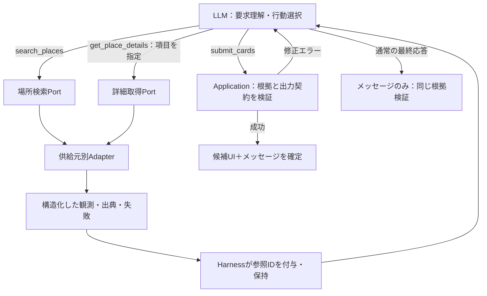

# 初期3操作の詳細設計 v1

> SDK方針の更新: [ADR 0011](../adr/0011-cloudflare-led-agent-runtime.md)によりCloudflare側へ実行管理を集約。Thinkを第一候補として検証し、不適合ならAIChatAgent + streamTextを使用する。独立したToolLoopAgentを重ねず、AI SDKは必要な下位依存として扱う。Coreの契約と外側のSDK Adapterは分離する。

- **Date:** 2026-09-08
- **Status:** Review-ready design proposal。ユーザー依頼に基づく具体設計。以下の新しい型・数値・出力検証条件は提案であり、Accepted ADRに自動昇格させない。
- **決定済み:** [0006](../adr/0006-lightweight-frontend-hexagonal-backend.md)の構成、[0007](../adr/0007-llm-led-tool-orchestration.md)のLLM主導、[0008](../adr/0008-initial-tool-catalog.md)の3操作、[0009](../adr/0009-contextual-response-presentation.md)の提示。
- **関連:** [自律応答ループ](./0004-autonomous-response-loop.md)。Toolの未決部分は本書で具体化する。本番コード・ライブAPI検証は未実施。

## 1. プロダクトから導く原則

ima.は、大切にしたい人と外出中のユーザーが、次の行き先を短時間で決めるためのアプリ。モデルが要求を理解し、必要な調査と回答形式を選ぶ。毎回の検索・3候補・確認質問は強制しない。

- LLM: 検索語、条件の解釈、調査項目、追加検索、比較、主提案と別案、説明を選ぶ。
- Application: 文脈・能力の提供、実行・権限・予算・状態・根拠検証を支える。
- Tool/Adapter: 明示された能力を実行し、観測を返す。自分で探索意図・ランキング・表示状態を変更しない。
- 求められていない条件緩和や代替検索はToolの失敗処理に混ぜない。
- 個々の操作はなくならない契約として設計し、内部の供給元と実装は交換可能にする。



## 2. モデル公開面と内部境界

モデルへ見せるのは3つの名前とスキーマ、および実際に有効な能力一覧。汎用HTTP、SQL、生URL取得、ブラウジング、任意コード実行は公開しない。

Coreに置く出力Port:

- `PlaceSearchPort.search`: 位置条件と検索語から候補を取得。
- `PlaceDetailsPort.read`: 候補に関する要求項目を取得。
- `WalkingRoutePort.compute`: 方向のある徒歩経路を計算。
- `LastTrainJourneyPort.read`: 対応駅・営業日について終電経路を取得。
- `ModelPort.next`: Tool callsまたは最終メッセージを返す。
- 状態保存・Clock・TelemetryのPort。

`get_place_details`のBindingは要求項目を上記のPortへ接続する。last_trainの要求を実現するための徒歩経路取得など、能力仕様に明記した依存I/Oは許す。未要求の別能力の調査は行わない。

AdapterはApplication状態へ書き込まない。候補・観測の登録、公開用IDの生成、呼び出し記録はHarnessが行う。キャッシュを使う場合も保存先・許容範囲を注入し、EnvやSearchAgent全体を渡さない。

## 3. 共通契約

### 3.1 IDとスコープ

- `placeRef`: アプリ内部の永続識別子。provider名とprovider IDの対応を別管理する。
- `candidateId`: スレッド内で使う不透明な候補ID。同じprovider IDは同一候補へ解決する。
- `observationId`: 不変な観測のID。再取得は新しいIDを作る。
- `callId` / `turnId` / `responseId`: Applicationが発行・所有する。モデル引数として自由に指定させない。
- 別providerの同名店を自動的に同一店舗へ統合しない。複数支店や移転も区別し、照合が曖昧な補足情報は採用しない。
- 過去ターン・保存店は、アクセス確認済みのplaceRefからcandidateIdを文脈へ登録できる。今回検索で得たIDだけに限定しない。
- 他スレッドのcandidateIdは、所有者が同じでも明示的な登録を経ずに使わない。

### 3.2 モデルと実行文脈

モデル: query、検索対象エリア、調査項目、選ぶ候補、説明。
Harness: tenant/device scope、実際の現在地、信頼できる現在時刻、残予算、AbortSignal、明示UI状態、能力バージョン。

モデルへGPSの生座標・秘密鍵・DBハンドルを渡さない。位置の精度・取得時刻とエリア名は渡す。位置が取得できないときにWorkerのIPを代用しない。

現在時刻はserver clockを基準にする。clientNowとのずれは記録し、施設のIANAタイムゾーンで営業時間を解釈する。JSTの翌日05:00はスレッドの表示窓であり、鉄道の運行日判定と同一視しない。

### 3.3 結果と観測

```ts
// 概念型。実装時はvalibot strict schemaから型を生成する。
type Result<T> =
  | { status: "ok" | "partial"; data: T; warnings: Issue[] }
  | { status: "error"; error: Issue };

type FieldResult<T> =
  | { status: "known"; observations: Observation<T>[] }
  | { status: "unknown" | "unsupported" | "not_applicable";
      reason: string }
  | { status: "error"; error: Issue };

type Observation<T> = {
  observationId: string;
  candidateId: string;
  field: string;
  value: T;
  basis: "provider_reported" | "computed";
  fetchedAt: string;
  sourceUpdatedAt: string | null;
  expiresAt: string;
  contextKey: string;
  sources: SourceRef[];
};

type SourceRef = {
  provider: string;
  recordRef: string;
  attribution: string | null;
  publicUrl: string | null;
};

type Issue = {
  code: string;
  path: string | null;
  retryable: boolean;
  retryAfterMs: number | null;
  message: string;
  missingFields: string[];
};
```

- knownは「取得できた」意味で、現実の絶対保証ではない。掲載情報と実地確認を区別する。
- 不明はデータ欠損、未対応は能力なし、not_applicableは駅移動不要等、errorは取得失敗。
- 一部成功はpartial。検索0件はokで空配列。タイムアウトを0件に変換しない。
- フィールド間の出典を混ぜない。矛盾する情報は複数観測＋SOURCE_CONFLICTを返す。違う店の情報をマージしない。
- 取得時刻と元情報の更新時刻を区別する。直前に取得した古い時刻表を最新として扱わない。
- Tool出力の業務内容はデータとして扱う。店の紹介文を上位指示に昇格させない。

## 4. search_places

### 4.1 説明文案

> 新しい店・スポットの候補を探す。検索語と対象エリアを指定する。既存の候補について知りたいだけならget_place_detailsを使う。関連度順の候補を返すが、徒歩・終電・空席の保証はしない。検索を広げるかは結果を見て自分で判断する。

### 4.2 入力

```ts
type SearchPlacesInput =
  | {
      mode: "search";
      query: string; // 1〜200文字
      area:
        | { kind: "current_location"; radiusMeters: number }
        | { kind: "named_area"; name: string };
      openNow: boolean; // falseは営業時間で絞らない意味
      limit: number; // 1〜10、例示の既定6
      excludeCandidateIds: string[]; // 最大50
    }
  | { mode: "continue"; cursor: string };
```

- radiusは100〜3,000mの直線的な検索範囲の目安。徒歩上限ではない。範囲を広げるときはLLMが新しい呼び出しをする。
- current_locationで位置がない場合はLOCATION_REQUIRED。モデルはnamed_areaへ切り替えるか短く質問する。
- named_areaではLLMが地名を明示。検索queryと対象エリアの整合もLLMが担う。Applicationが原文から地名を削除・推測しない。
- openNowを常時trueにしない。ユーザーが特定店の情報を求める場合に閉店中の候補を消さないため。trueは粗い検索条件であり、到着時営業の根拠ではない。
- 「安め」「静か」等はqueryで探索に使えるが、検索に一致しただけで事実へ変換しない。初期は数値予算フィルターを追加せず、取得したprice情報とLLMの判断で扱う。
- ユーザーが明示UIで除外したIDはHarnessが除外集合へ加え、その適用内容を返す。プロンプトからApplicationが独自に除外を推定しない。

### 4.3 出力

```ts
type SearchPlacesOutput = {
  searchId: string;
  candidates: Array<{
    candidateId: string;
    identity: FieldResult<PlaceIdentity>;
    openingHours: FieldResult<OpeningHours>;
    price: FieldResult<PriceInfo>;
  }>;
  applied: { areaDescription: string; openNow: boolean; excludedCount: number };
  nextCursor: string | null;
  coverage: "provider_results";
};
```

PlaceIdentityは名称・エリア・種別・住所・営業施設の状態・公開出典リンク。生座標・providerレスポンス全文は内部に置く。

検索ではidentity、営業時間、priceを必要なfield maskで一緒に取得する案。これらは検索能力の明示された返却内容であり、別の自律調査ではない。写真バイト、徒歩経路、終電、レビューは検索時に取得しない。

- providerの関連度順を保持し、Application独自のおすすめスコアを付けない。
- 重複・明示除外は除くが、営業不明・高価格を黙って落とさない。最終提案の適合性は別契約。
- 除外後に少数でも自動的なページ取得はしない。残件とcursorを返す。
- cursorはサーバ署名つき、不透明、scope・検索条件・位置revision・期限へbind。5分有効、条件を変えた継続は新検索。provider tokenを直接公開しない。
- areaはbiasであって厳密な到達可能範囲とは限らない。返された候補の地理的な広がりを明示する。

## 5. get_place_details

### 5.1 説明文案

> 既知の候補について必要な項目だけを取得する。1回で複数候補を比較調査できる。情報がすでに有効なら再利用できる。不明・未対応・失敗は値で返る。空席・待ち時間・現時点の静かさは初期には取得できない。

### 5.2 入力

```ts
type DetailField =
  | "identity" | "opening_hours" | "price" | "photos" | "contact"
  | "facilities" | "walking_route" | "last_train";

type GetPlaceDetailsInput = {
  requests: Array<{ // 1〜5候補、ID重複は引数エラー
    candidateId: string;
    fields: DetailField[]; // 1項目以上、重複禁止
  }>;
  freshness: "reuse_valid" | "refresh";
  travelContext?: {
    departure: "now";
    homeStationRef?: string;
    minimumStayMinutes?: number; // 1〜180、既定20
  };
};
```

施設情報は時刻を指定せず取得できる。経路・終電は今からの外出に限定する。明日など将来時点の経路を初期対応済みにしない。店舗の週間営業時間を答えることは可能。

homeStationRefは文脈の対応駅一覧から選ぶ。未指定は保存条件を使い、その使用値を結果へ明示する。知らない駅名をコードで推測しない。保存駅がなく指定もない場合は対象項目のMISSING_CONTEXT。

### 5.3 取得項目・Port・提供範囲

| field | 初期内容 | 実装先案 | 制約 |
|---|---|---|---|
| identity | 名称・エリア・住所・種別・移転/閉業状態 | Place Details | 移転時は新IDを知らせ、無断で別店舗へ差し替えない |
| opening_hours | タイムゾーン付き期間、掲載営業、次の境界、判読できるLO | Places、必要ならHP | openNowを入店保証にしない。LOを閉店時刻から推測しない |
| price | 価格帯・通貨・原文表示・人数/単位が分かればその単位 | Places / HP | priceLevelから円を発明しない。競合を平均しない |
| photos | 写真の表示ハンドルと帰属 | Places photo metadata / renderer | モデルへ写真バイトや署名URLを渡さない。写真を見ていないモデルに雰囲気判断をさせない |
| contact | 公式サイト・電話・公開地図リンク | Places | リンクを取得するだけ。サイト閲覧や電話発信を行わない |
| facilities | 確認可能なwifi/禁煙等の項目・元表現 | HPの対応項目 | 設定された項目のみ。静かさや空席に読み替えない |
| walking_route | 現在地→各店の時間・距離・計算元 | WalkingRoutePort / Routes | 正確な位置が必要。経路要素ごとに成功判定 |
| last_train | 店→駅→帰宅先の最終経路、退出期限、滞在余地 | LastTrainJourneyPort + WalkingRoutePort | 対応駅・運行日・有効期間が揃う場合だけ |

同一call内の要求をfield maskごとにまとめ、walkingは必要なorigin/destination集合でバッチ化する。未要求の写真や連絡先をついでに取得しない。返却はrequestsに対応する配列＋項目ごとのFieldResult。1店失敗でも他店の成功を保持する。

### 5.4 徒歩と終電の計算

- 徒歩の根拠は距離÷速度ではなく経路計算。GPSは取得から2分以内・accuracy≤100mを初期閾値案とし、未達ならLOCATION_IMPRECISE。直線距離を徒歩分に変換しない。
- 内部時間は秒。表示分は切り上げ、予算判定は秒で行う。店→駅と駅→店を同じ経路と仮定しない。
- 終電データは運行日、出発駅、到着駅、乗換、最終出発、有効期間、検証元を持つ。未登録・失効した組み合わせはunsupported/unknown。一般のTRANSIT応答が最終便であると推測しない。
- 初期の終電供給は検証済みの限定駅journeyテーブル。既存案の恵比寿・代官山・中目黒・渋谷→対応帰宅駅を上限とし、実データ未投入ならcapabilityをdisabledにする。架空のseedを本番に使わない。
- 最寄駅候補は対象駅集合から距離で機械的に決め、実際の店→駅を計算。これが地域の全経路中の最良・最終であるとは表示しない。
- 同じ駅でも店→駅の移動情報は必要。電車不要はnot_applicableで、他の移動まで検証済みにしない。

```text
arrivePlaceAt = evaluatedAt + userToPlaceSeconds
leaveBy = lastDepartureAt - placeToStationSeconds - 180秒
availableStaySeconds = leaveBy - arrivePlaceAt
usable = availableStaySeconds >= minimumStayMinutes * 60
```

閉店・ラストオーダーは終電の退出期限とは別の事実。LOを退店時刻として扱わない。営業と滞在条件を合わせる場合はclosedAtとleaveByの早い方を使い、LOは到着前注文可否として別判定する。単一の「入れる」boolに潰さない。

### 5.5 能力不足と部分取得

runtimeは対応fields・地域・駅・制約をモデル文脈へ公開する。未対応の要求は明示的なUNSUPPORTED_FIELD/SCOPE。初期に空席・混雑・現時点の騒がしさ・予約・天気の能力はない。

facilitiesがdisabledでも入力の既知enumは受理しunsupportedを返せる。一方、存在しないfield文字列はINVALID_ARGUMENT。未知のfieldを無視して成功にしない。

## 6. 根拠・鮮度・再利用

| 情報 | 意味的な再利用上限の初期案 | 無効化要因 |
|---|---|---|
| identity / price / contact / facilities | 取得から30分 | 移転、データ更新・競合、scope変更 |
| 営業掲載データ | 取得から5分 | 期間境界、特別営業日の変更、タイムゾーン不明 |
| 営業判定 | submit時に観測済み期間から再計算 | 現在時刻・到着時刻の変化 |
| 徒歩 | 取得から5分 | origin位置revision、移動100m超、位置精度悪化 |
| 終電の可否 | submit時に同じ経路事実から再計算 | 時刻・運行日・帰宅駅・最低滞在の変更 |
| 終電テーブル | レコードのvalidFrom/validThrough、検証から7日以内 | ダイヤ改定・適用日外・情報の失効 |
| 写真 | アクティブ描画の取得単位 | providerの写真参照失効・レスポンスの寿命 |

この表は**正しさのための上限**であって保存許諾ではない。実際の保存期間はprovider契約で許される範囲との短い方。expiresAtの延長だけで古い観測を新規取得にしない。

reuse_validは参照可能・同じcontextKey・鮮度内でのみ再利用。refreshは取得を要求し、同時実行中の同じ取得への合流だけを許す。取得失敗時に過去値を現在値として返さない。必要なら過去観測の参照を別に示しexpiredとする。

キャッシュキーはprovider、schema/capability version、候補、field、位置revision、時刻条件、駅、scopeを含む必要な部分で構成。初期はユーザー間の検索キャッシュを無効にし、原文や原文のhashを共有キャッシュへ入れない。

provider内容の保存可否はretention policyで分類する。ID・ユーザー自身の保存操作と、店舗内容・派生したメッセージ本文を別扱いにする。全SearchResponseを無条件に永続化しない。永続化できない部分は参照と取得要否だけ残し、復元時に取得または未取得表示にする。旧案の全カードをオフライン復元できる保証は見直しが必要。

## 7. submit_cards

### 7.1 説明文案

> 主提案と別案を選び、説明とともに候補UIとして回答を確定する。登録済み候補と根拠を参照する。単なる説明・比較・確認なら呼ばずにメッセージで回答してよい。成功するとこのターンは終了する。検証エラーなら不足情報を調べるか選択を修正する。

### 7.2 入力

```ts
type EvidenceText = {
  text: string;
  evidenceIds: string[];
  basis: "grounded" | "inference" | "conversational";
};

type SubmitCardsInput = {
  message: EvidenceText[]; // 1〜4ブロック、各1〜300文字
  hero: CardSelection;
  alts: CardSelection[]; // 0〜2
};

type CardSelection = {
  candidateId: string;
  evidenceIds: string[];
  why: EvidenceText; // text 1〜80文字
  diff?: EvidenceText; // 別案は必須、text 1〜40文字
};
```

- LLMは名前・写真URL・価格・徒歩分をカードの事実として再入力しない。Applicationが参照された観測から描画用データを組み立てる。
- why/diffの自由文は保持し、Application独自の説明へ書き換えない。推定ならinferenceとしてUIが区別できるようにする。
- conversationalは確認質問や会話上の受け答え用。店舗の事実をこのラベルで無根拠に主張してよい意味ではない。
- 重複候補を拒否する。写真なしを理由に候補を拒否しない。placeholderはUIの責務。
- 候補0件はsubmitしない。メッセージ経路で説明する。1〜2件はそのまま出し、3件に水増ししない。

### 7.3 検証することと、LLMへ残す判断

提案UIは「今からの行き先候補」の意味を保つ案。単に閉店時刻を答える等はメッセージ経路を使い、閉店店を今行く候補として見せない。

| 条件 | submit検証案 | 根拠不足時 |
|---|---|---|
| ID・scope・根拠 | 登録済み、同一対象、参照可能、期限内 | UNKNOWN_CANDIDATE / INVALID_EVIDENCE / STALE_EVIDENCE |
| 営業 | 掲載営業時間内で、既知の到着時刻でも開いている。閉業状態と矛盾しない | MISSING_EVIDENCE / NOT_OPEN |
| 徒歩上限 | 有効な明示条件がある場合、方向・originが一致する経路で秒単位評価 | MISSING_EVIDENCE / CONSTRAINT_VIOLATION |
| 終電 | 有効な帰宅駅条件がある場合、journeyと必要経路が揃い滞在条件を満たす | MISSING_EVIDENCE / CONSTRAINT_VIOLATION |
| 除外 | 明示UIの今夜除外を尊重 | EXCLUDED_CANDIDATE |
| 価格 | 数値があるなら元の単位・通貨・範囲を守る | 数値を捏造せず不明表示 |
| 静かさ・雰囲気 | LLMの比較判断。観測根拠を求め、推定を区別 | 自由文の完全検証をコードで保証しない |

検証で不足が見つかってもApplicationは自動でToolを実行しない。LLMへ構造化エラーを返し、LLMが調査・選び直し・説明を選ぶ。全候補が検証を通らなければ一部だけを勝手に確定しない。

プロンプト内の条件をApplicationがregexで抽出しない。保存条件は文脈へ渡し、今回の明示的な変更はLLMが構造化されたturnConstraints案として返す。モデルのaction envelopeのメタデータとして扱い、4つ目のToolにはしない。

turnConstraintsの対象はmaxWalkMinutes、homeStationRef、minimumStayMinutes。各変更はsourceTurnIdと原文の該当引用を添える。引用存在は検証できるが、変更意図の正確な理解までは機械検証で保証できないため評価対象。ユーザー発話に根拠のない条件解除は禁止指針とする。変更は今回のスレッドのみで、保存設定を自動変更しない。capabilityが不足しているだけでは条件を解除しない。

曖昧な「安め」「疲れた」を数値の必須条件に自動変換しない。LLMが探索・比較の希望として扱う。数値の希望を新たにhard constraintとして一般化する契約はv1で増やさず、発話の要求充足として評価する。

位置拒否・エリア検索でも営業時間付きの候補は取得できるが、徒歩/終電が必須のままならsubmitは通らない。LLMは未確認理由を説明し、位置許可や条件変更を提案できる。Applicationが勝手に許可や設定を変更しない。

### 7.4 失敗例

```json
{
  "status": "error",
  "error": {
    "code": "MISSING_EVIDENCE",
    "path": "hero",
    "retryable": false,
    "retryAfterMs": null,
    "message": "選択候補の徒歩上限を確認する根拠がありません。",
    "missingFields": ["walking_route"]
  }
}
```

retryableは同じ入力の通信再試行可否。モデルが追加調査後に修正して再提出できることとは区別する。

### 7.5 成功とUI

- `submit_cards`成功は「提案を表示する」ことであり、「ユーザーがここに決めた」「訪問した」「共有した」ではない。
- messageとcardSetを単一responseIdで確定。保存は冪等・revision一致で一度だけ行う。
- message-onlyの最終応答もEvidenceText[]を使い、presentation=keep。submit成功はreplace。
- 候補UIを複数ブロック追加する、比較専用UI、生HTML、メッセージによる自動保存・予約・共有はv1に含めない。
- 同じ応答を再配送しても重複バブルや二重カードを作らない。既存候補を参照するメッセージはcardSetIdと対応させる。
- 検証成功後にLLMをもう一度呼んで文章を作らせない。メッセージを同じ入力に含める。
- メッセージの意味的な真偽は型・ID検証だけでは保証できない。LLM指針と評価で補う。自由文の数字を単純regexで排除するとユーザーの質問や比較を壊すため採用しない。

## 8. 実行制御・失敗・冪等性

初期値案。ベンチマーク前の設定値で、性能保証ではない。

| 項目 | 初期案 |
|---|---|
| ターンのwall-clock上限 | 12秒。残り2秒を最終回答用として確保 |
| モデル呼び出し | 最大6回（ユーザー会話回数ではない） |
| 読取Tool呼び出し | 合計8回、同時2。続き検索も1回として数える |
| search / detailsの期限 | 各最大3秒 / 4秒、残予算で短縮 |
| provider HTTP試行数 | ターン合計20。バッチ内の各HTTPも数える |
| 自動再試行 | 読取の一時的な通信・5xxのみ最大1回、残予算内 |
| 429 | Retry-Afterが予算内なら待機、無理ならそのまま返す |
| 引数・参照エラー | 自動再試行せずモデルへ返す |
| submit再提出 | 全体予算内で最大2回修正。無限修正ループを避ける |

Tool metadataにreadOnly、timeout、costUnits、schemaVersionを持たせる。costUnitsとproviderごとのrequest/route-element上限を実行前に予約し、並列実行で上限を超えない。価格単価は設定で更新し、モデルに金額を推測させない。

同一scope・入力・文脈・鮮度の同時readはsingle-flight。callId再配送は同じ結果を返す。結果キャッシュの利用は保存ポリシーに従う。

新しい発話は新revisionで開始し、古い処理へcancelを通知。到着済みの古い観測を使う場合もscope・鮮度を検査し、旧応答で画面を上書きしない。最終確定はrevisionのcompare-and-set相当で行う。

submitと未完了readを同じアクションバッチで確定しない。バッチ全体を実行前検査しMIXED_TERMINAL_ACTIONを返す。2つのsubmitやfinalとToolの同時出力もプロトコル違反としてモデルへ返す。

失敗コード群:

- 引数/参照: INVALID_ARGUMENT、UNKNOWN_CANDIDATE、CURSOR_EXPIRED、INVALID_EVIDENCE。
- 文脈/能力: LOCATION_REQUIRED、LOCATION_IMPRECISE、MISSING_CONTEXT、UNSUPPORTED_FIELD、UNSUPPORTED_SCOPE。
- 外部取得: TIMEOUT、RATE_LIMITED、UPSTREAM_UNAVAILABLE、SOURCE_CONFLICT。
- 確定: MISSING_EVIDENCE、STALE_EVIDENCE、NOT_OPEN、CONSTRAINT_VIOLATION、EXCLUDED_CANDIDATE。
- 実行: CANCELLED、BUDGET_EXCEEDED、STALE_TURN、MIXED_TERMINAL_ACTION。

予期しない例外は境界で正規化し、秘密情報やスタックをモデルへ返さない。認証・権限エラーはHTTP/App側で処理し、Toolの再試行で認証を回避しない。

期限到達前にモデルが説明を作れるなら最終応答へ。不可能ならアプリの失敗表示。未検証カード・古いカードを新しい成功として返さない。固定検索パイプラインや架空データへ自動フォールバックしない。

## 9. 出典・写真・保存の実装条件

公式仕様を確認した結果、旧Draftの写真name/バイトの一律キャッシュや全レスポンス保存を、そのまま採用しない。取得・表示・保持はprovider契約で分ける。

- Placesのfield maskは返却項目と課金に関係する。Adapterで項目別に明示する。[S1][S2]
- 写真参照は期限切れがあり、写真nameをキャッシュできない旨が公式に記載されている。v1は写真用ハンドルをplaceRefに結び、描画要求時に許可された方法で現在のmetadataを取得して画像へ接続する。永続写真nameを署名して再利用する設計にはしない。[S5]
- 帰属はカードとメッセージ内の該当情報に関連づけて表示。小さく消してよい扱いにしない。表示先地図・保存・LLMへのデータ送信を含む利用条件は、契約アカウントで実装前に確認する。[S6]
- provider内容を保持できない場合はIDとユーザー操作を残す。オフラインでも店舗内容全体が必ず見えるとは約束しない。

これは一般的な保存許諾の判断ではなく、Adapter接続時の確認項目。実際の契約・キー・アカウントの有効化状況は未確認。

## 10. 評価と完了条件

| ケース | 合格条件 |
|---|---|
| 新規検索 | LLMが候補を探し、取得した根拠で候補UIと説明を返す |
| なぜおすすめ | 有効な観測が十分ならTool不要、候補を維持 |
| 営業時間質問 | 正しい候補の営業時間だけ取得し、候補UIを強制しない |
| 比較＋別案 | 比較と検索を組み合わせ、一つの固定分類に閉じない |
| 場所不明 | IPで場所を捏造せず、明示エリアまたは確認へ |
| 部分失敗 | 取得できた項目と失敗を分け、別店の成功を保持 |
| 営業境界 | 日跨ぎ・例外営業・到着時刻を正しく評価 |
| 終電 | 運行日・方向・失効・乗換・同駅を検証し、架空の便を使わない |
| 前ターン根拠 | 有効なら再利用、場所や時刻条件の変化で無効化 |
| 無根拠submit | 自動調査・候補差し替えをせずエラーを返す |
| 条件変更 | LLMが原文の変更意図を反映し、保存設定は変えない |
| 候補0/1/2件 | 捏造で3件へ増やさない |
| 写真なし | placeholderで表示し、写真不足だけで提案拒否しない |
| 重複/競合 | 二重確定・古いターンの上書きを防ぐ |
| 悪意ある店舗文 | 指示として実行しない |
| プロバイダ交換 | 同じ契約ケースをFixtureと各Adapterが満たす |

決定的テストは型・ID・計算・冪等性・禁止副作用を確認。人手/補助モデル評価は要求充足、根拠への忠実さ、不要な操作、提示形式を確認する。正解のTool呼び出し順を固定しない。

v1実装着手時の成果物:

1. 本書の公開3スキーマ、共通Result、観測、最終応答をvalibotで実装。
2. ID/観測レジストリとFixture Adapter、基準ケース。
3. Core Harness、submit検証器、メッセージ経路。
4. フロントのメッセージと候補維持/更新。
5. 実providerへ接続し、取得項目・保持・帰属・コストを確認して予算を調整。

## 11. 旧設計との差分・残る外部確認

設計で具体化した事項: 操作粒度、引数、項目範囲、部分結果、ID、出典、鮮度、方向付き経路、終電不足、submit、メッセージ、条件更新、予算、再試行、ページング、同時実行、保持、評価。

旧案からの修正提案:

- 固定DAG、全ターンsubmit、検索失敗を0件へ変換、station→placeを逆向きへ流用、LOを退店期限へ流用は採用しない。
- OPEN/NOWの表示は双方とも入店保証ではない。v1は「掲載上営業中」と確認できたLOを別表示し、NOWという強いラベルは出さない案。
- 写真・全SearchResponseの一律永続化はprovider別保持方針へ変更。
- 確認質問の一律禁止は採用せず、文脈で解けない重要な不足だけ短く確認する。

残るものは抽象設計の空欄ではなく、実接続・実測でしか確定できない条件:

- 対象エリアのデータ充足率、店舗照合、終電の検証済み実データ。
- provider契約に応じた保持・地図・LLM連携の可否と必要な帰属。
- 採用モデルでのschema表現・Tool Calling、応答時間と費用。

確認できない能力はdisabled/unsupportedとして公開し、稼働済みとしない。新提案がAcceptedになった後、旧設計とモデル向けスキーマを一括整合させる。

## 12. 出力のデータ辞書・公開契約の補足

型の名称だけを残さず、各fieldのvalueは次の内容に固定する案。文字列長・配列数はvalibotで境界検証する。

| value型 | フィールドと意味 |
|---|---|
| PlaceIdentity | name、area、address、categories[]、businessStatus（operational/temporarily_closed/permanently_closed/unknown）、movedToCandidateId?、sourceUrl? |
| OpeningHours | timeZone、intervals[{startAt,endAt}]（絶対時刻）、weeklyText[]、evaluatedAt、listedOpenAtEvaluation（true/false/null）、nextBoundaryAt?、lastOrderAt?、lastOrderRaw?。不明なLOはnull、推定で埋めない |
| PriceInfo | level?、range?{currency,min,max,unit}、rawLabel?。unitはper_person/per_item/unknown。金額かlevelか原文の少なくとも1つ。出典競合は複数観測 |
| PhotoInfo | photos[{photoHandle,attributions[],sourceUrl?}]。モデル向けには件数・帰属有無だけ返し、画像内容を観測済みにしない |
| ContactInfo | websiteUrl?、phone?、mapUrl?。protocolと供給元を検証し、任意URLへのサーバ取得はしない |
| FacilitiesInfo | wifi/nonSmoking/privateRoom/parkingの項目ごとにyes/no/partial/unknownとsourceText。初期提供元が持つ項目だけ |
| WalkingRoute | originRef、destinationCandidateId、originRevision、evaluatedAt、durationSeconds、distanceMeters、warnings[]。経路の順方向を保持 |
| LastTrainInfo | serviceDate、fromStationRef、homeStationRef、journeyRef、lastDepartureAt、arrivesHomeAt、transfers[]、placeToStationSeconds、arrivePlaceAt、leaveBy、availableStaySeconds、minimumStayMinutes、usable。根拠が一つでも不足すれば完成したknown値にしない |

内部だけに持つものはproviderRef、生座標、プロキシ秘密鍵、providerの生レスポンス。モデル向けの出典は安全なリンクと名称へ射影する。snapshotをそのままモデルへ渡して内部情報を漏らさない。

```ts
type DetailValues = {
  identity: PlaceIdentity;
  opening_hours: OpeningHours;
  price: PriceInfo;
  photos: PhotoInfo;
  contact: ContactInfo;
  facilities: FacilitiesInfo;
  walking_route: WalkingRoute;
  last_train: LastTrainInfo;
};

type DetailsOutput = {
  items: Array<{
    candidateId: string;
    fields: { [K in DetailField]?: FieldResult<DetailValues[K]> };
  }>;
};
```

要求されたfieldは必ず応答に存在し、未取得をundefinedで隠さない。要求されていないfieldは返さない。LastTrainInfo作成に必要な内部経路は根拠として保持するが、別fieldを要求されたと見なさない。

認識済みcandidateIdの写真が複数ある場合、最大3枚をprovider順で返す。写真要求なしでもsubmitは可能でplaceholder表示。画像バイト取得は描画のための配信処理であり、LLMによる別調査や4つ目のToolではない。

出力予算は1 Tool結果あたり概ね12KB/UTF-8を初期目安とする。必須の根拠・時刻・エラーを黙って切らず、候補/写真などの配列の後方を切り、truncatedと返却件数をwarningsへ明示。1候補の必要な根拠だけでも収まらない場合はRESULT_TOO_LARGEを返す。生レビュー・長い店舗紹介は初期に返さない。

schemaVersionとcapabilityVersionは応答メタデータへ付け、互換性のない変更は保存済み観測を移行または失効させる。providerの違いを型キャストで隠さない。

### 応答例の読み方

- 初回の「静かで甘いもの」: 検索→必要なら詳細→submitが一例。静かさを取得できなければ断定せず、取れる根拠と推定を区別する。
- 「この店の営業時間だけ」: opening_hoursを取得→通常メッセージ。徒歩・終電は呼ばず、カードも更新しない。
- 「もっと近く」: 有効な既存徒歩観測だけで比較できれば再検索不要。足りなければLLMが取得・検索を選ぶ。
- 「終電に間に合う？」: last_trainを要求。実行側が定義された必要経路を取得し計算結果を返す。未対応ならLLMがその限界を説明する。

## 13. 公式資料（2026-09-08確認）

- [S1: Text Search New](https://developers.google.com/maps/documentation/places/web-service/text-search): テキスト検索、field mask、位置biasと範囲の違い。
- [S2: Place Details New](https://developers.google.com/maps/documentation/places/web-service/place-details): 候補IDから必要項目を取得。
- [S3: Routes Compute Route Matrix](https://developers.google.com/maps/documentation/routes/compute_route_matrix): origin/destination別の距離・時間と要素単位の結果。
- [S4: Hot Pepper API](https://webservice.recruit.co.jp/doc/hotpepper/reference.html): openは営業時間、closeは定休日。予算・設備等の項目。
- [S5: Place Photos New](https://developers.google.com/maps/documentation/places/web-service/place-photos): 写真の取得・帰属・参照の失効とキャッシュ制限。
- [S6: Places policies](https://developers.google.com/maps/documentation/places/web-service/policies): コンテンツの保存制限・IDの例外・帰属。

資料の項目が存在しても、個々の店で値が返ることや契約アカウントで利用可能なことは保証しない。
