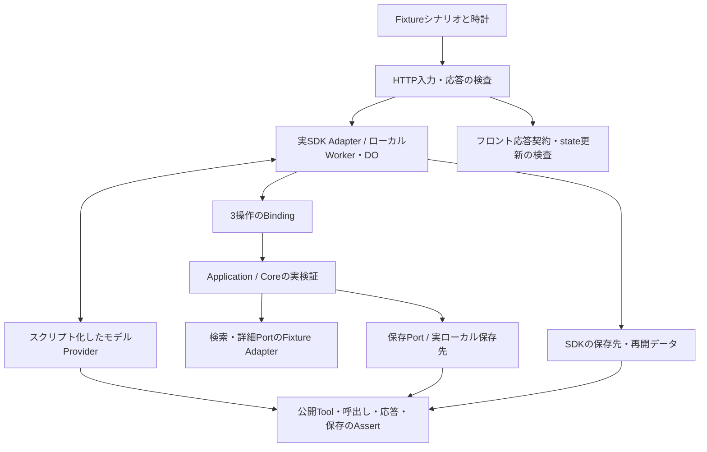
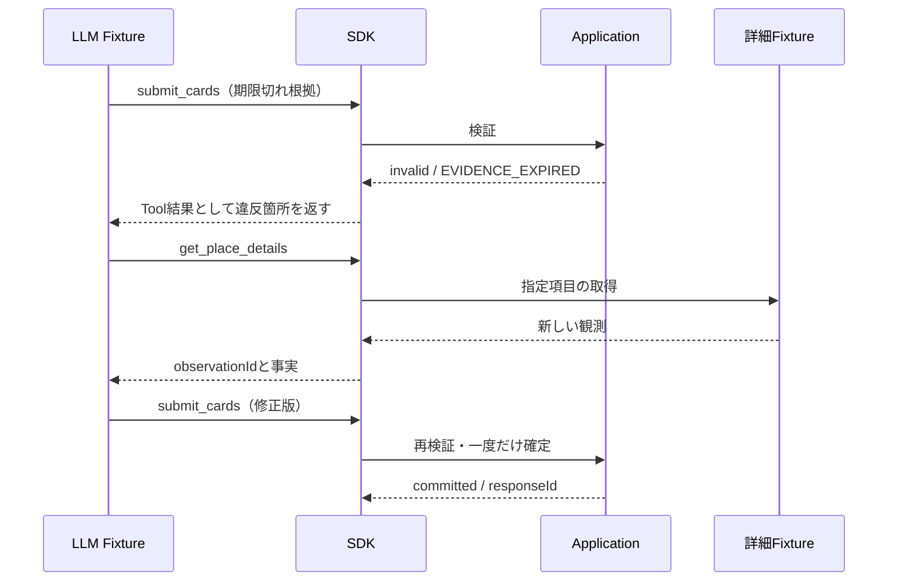

# FixtureによるAgent実行・応答・保存の設計案

- Date: 2026-09-08
- Status: Proposed。以下の詳細・数値は提案であり、採択・実装・SDK検証は未実施。
- 前提: [ADR 0011](../adr/0011-cloudflare-led-agent-runtime.md)、[3操作の契約案](./0005-tool-contracts-v1.md)。既存の詳細案を検証可能な条件へ具体化する。

## 結論

実SDKをローカルWorkers / Durable Objects上で動かし、LLMと外部検索先をFixtureへ差し替える。3操作の限定、応答、修正、保存を同じテスト群で検証する。Thinkを第一候補とし、公開APIでは満たせない要件があればADR 0011の第二候補へ移る。

Fixtureは入力・モデル出力・外部データ・時計を固定したシナリオである。LLMの意図理解の正しさは証明しない。実行基盤の契約検証と実モデルの品質評価を分ける。

SDKのループ、Tool Binding、Core検証、保存処理はテスト対象として実行する。SDK自体を成功するMockに置き換えない。Cloudflareの公式テスト手順を基に構成し、SDK・AI SDK・テストランナーの互換バージョンを固定する。[S3]

シナリオは初期thread/revision、userPrompt、modelSteps、providerResults、clockEvents、expectedResponse、expectedEffects、expectedPersistenceを持つ。モデル要求を捕捉し、予定した結果だけでなく実際に渡されたTool定義・Tool結果を検査する。外部ネットワークは拒否し、シナリオ外の呼出しはテスト失敗とする。

## 1. モデル向け操作を3つに限定する

**提案: 公開する操作の許可リストと、実行時の許可リストを両方置く。質問ごとにToolを出し分けない。**

- 通常の各モデルステップで `search_places` / `get_place_details` / `submit_cards` の3定義を提供する。Tool不要の回答も許容し、呼出しを強制しない。
- Thinkでは `getTools()` は追加登録であり、組み込みToolがある。[S1]
- 公開APIの `beforeTurn` / `beforeStep` の `activeTools` を使う設計とする。実行前には `beforeToolCall` で許可リスト外を拒否する。[S2]
- MCP、client tools、extensions、skillsを追加の実行経路として接続しない。Tool名や引数から任意Adapterを解決しない。
- 公開制限はSDK Adapterの責務。CoreはSDKのToolSet型を参照しない。

| Fixture | 合格条件 |
|---|---|
| 直接メッセージ・複数ステップ・継続turn | モデルProviderが受け取る操作名が毎回3つだけ |
| `bash`、`read`、未知Tool名をモデルが返す | 実行されず、外部通信・workspace・アプリ状態の副作用が0 |
| 型不正の既知Tool引数 | Portを呼ばず、モデルに入力エラーが返る |
| 再接続・DO再生成後 | 同じ許可リストを維持する |
| 制限を外した対照ケース | 組み込みToolの混入を検査器が検出する |

`activeTools`の設定値を確認するだけでは合格にしない。実際のモデル要求と、不正呼出し時に実行されないことの両方を検査する。公開APIによる実現可能性は文書上確認できるが、このアプリでの動作は未検証。

## 2. メッセージと候補UIの応答

**提案: フロントへ渡す確定応答は2種類に絞り、LLMが選択する。**

| kind | 内容 | 既存候補への作用 |
|---|---|---|
| `message` | message、必要な根拠・帰属 | `keep`。既存候補を維持 |
| `cards` | message + hero 1件 + alts 0〜2件 | `replace`。全候補をまとめて置換 |

共通メタデータはschemaVersion、threadId、turnId、responseId、revision。ID・revisionはApplicationが発行する。候補UIは型付きデータを既存UIへマッピングし、LLMにHTMLを生成させない。

- `submit_cards`成功時は入力中のmessageと検証済みカードを同一応答として確定する。追加の最終文章生成を必須にしない。
- submitを使わない最終回答はmessage経路で検証・確定する。最終回答は4つ目のToolにしない。
- v1は未確定テキストを最終メッセージ欄へ流さず、待機表示の後に確定応答を表示する案。SDK内部のstreamはAdapterが処理する。途中のTool思考文と確定メッセージを二重表示しない。
- ユーザー質問をApplicationが分類してkindを固定しない。応答パターンはモデル指針・評価ケースとして使用する。

| Fixture | 合格条件 |
|---|---|
| 「ありがとう」→直接回答 | Tool呼出し0、messageのみ |
| 「2つ目の良いところは？」→既存根拠で説明 | message、既存候補・順番を維持 |
| 新規検索→submit | messageと最大3候補を一度だけ置換 |
| 検索0件 | message。候補を捏造しない。既存候補があれば今回の検索結果ではないと説明する |
| 候補1件・2件 | 件数を水増しせず描画できる |
| 提案後に条件変更→再検索 | 新しい確定応答だけで置換する |
| submit成功後、SDKの最終textが空 | 正常なcards応答として完了し、空応答エラーにしない |
| 応答の再配送・古いrevision | 二重追加・新しいUIの巻き戻しがない |
| malformed final・中断 | 未検証応答を確定せず、既存候補維持と再試行可能な状態を返す |

HTTP境界からJSONを受け取り、フロントのservices→state更新を通す契約テストまでを対象とする。React Native実機での描画・アクセシビリティ検証は別途行う。保存禁止のカード内容は後述のとおり、永続commitと一時的な表示を区別する。

## 3. 検証エラー後の修正

**提案: Applicationは修正に必要な違反内容を返し、追加取得・再提出はLLMが判断する。**

エラー契約案: `status: invalid`、`issues: [{code, path, candidateId?, evidenceIds?, message}]`、`repairable`、`remainingRepairs`。内部例外・Secrets・他threadの情報は含めない。違反した条件と不足フィールドは伝えるが、次に呼ぶToolや候補を強制しない。

| 問題 | 挙動 |
|---|---|
| 不足・期限切れ根拠、重複候補、型不正 | 修正可能な結果を返す。候補UIの変更は0 |
| 他threadの候補ID・架空ID | 拒否。対象の存在有無や中身を他threadへ開示しない |
| old revision・キャンセル | 当該turnを終了。自動で新しいturnへ再提出しない |
| 修正上限・時間上限 | 未確定カードを出さず終了。既存候補維持と失敗状態を返す |
| submit成功後の同一要求再配送 | 冪等キーから同じresponseIdを返し、確定回数は1 |
| 同じ冪等キーで異なる内容 | conflictとして拒否 |

再提出は初回に加えて最大2回、既存案の全体12秒・最大6モデルステップ内とする。これは計測前の仮値。通信再試行と意味的な修正を別カウンタで記録する。予算が残っていればLLMがmessageのみで説明して終了できるが、予算切れ後に追加モデル呼出しをしない。

検査は「invalid→details→valid」だけでなく、修正なしの反復、messageへ切替、タイムアウト、並行submit、readとsubmitの同一バッチ、成功直後の切断・再送を含める。モデルFixtureの次ステップでは、前のエラー内容がモデル入力に含まれていることをassertする。

合格条件は、失敗時の確定0、成功時の確定1、Applicationによる自動追加調査0。SDK上のTool実行成功と、業務上の`invalid`を混同しない。単にsubmitが呼ばれたことを終了条件にせず、`committed`を条件にする。成功後にSDKが余分な生成をする場合も、追加の状態変更・二重配信を防ぎ、停止方法を公開APIで検証する。

## 4. 保存方針

**提案: 会話の継続に必要な参照情報と、取得した店舗コンテンツを分離する。SDKの全履歴自動保存を正としない。**

| データ | 保存案 |
|---|---|
| ユーザー原文・スレッド内条件 | セッション期限まで。ただし外部内容の引用が判明した部分はその保持制約を継承 |
| 通常の会話メッセージ | provider由来の内容がないと判定できるものだけセッション期限まで |
| Tool入出力・店舗事実・それを含む生成文章 | provider/field別の明示的な許可範囲のみ。未確認は永続化しない |
| candidateId・placeRef・表示順・応答ID | 保存許可された識別子だけセッション期限まで。名称・住所等を埋め込まない |
| 保存リスト・ユーザー設定 | ユーザーが明示操作した内容を削除まで。providerコンテンツは別の期限に従う |
| 冪等性・revision記録 | セッション期限まで。保存禁止の応答本文を重複保存しない |
| ログ | call/turn ID、操作名、結果コード、所要時間など本文を含まない情報。初期保持7日案 |

セッション期限は作成後最初に到来する05:00 JST（05:00ちょうどの作成は翌日）を初期案とする。延長は自動で行わず、期限後は新スレッドとする。「今の外出」の文脈を翌日に持ち越さないための提案。保存リストはこの期限と独立する。

保持期限は `min(sessionExpiresAt, providerRetentionUntil)`。事実として使える鮮度は別の`freshUntil`で管理する。保存できても鮮度切れなら根拠として使わない。ユーザー由来のデータでも、位置など不要な詳細は保存しない。

LLMによる言い換えや要約で保持制約を解除しない。由来を確実に追えない生成文章は、当該turnで参照したデータの最も厳しい制約を適用する。一時的なLLM送信・表示の許諾も、永続化の許諾とは別にprovider接続前に確認する。Placesにはコンテンツ保持制限とplace IDの例外があるが、全データ・全用途の許諾を意味しない。[S5]

### 保存禁止データを含む場合

- 同一turnの実行メモリで検証・表示する。SDKの自動会話保存、stream再開用buffer、Tool結果、compaction、workspace、ログへ書き込まない。
- 候補公開の確定は「応答ID・revision・許可された参照」の原子的な記録と、一時的な表示payloadの配信へ分ける。禁止payloadの永続保存を確定の条件にしない。
- 切断・再起動後は同じresponseIdの確定状態を返せても、禁止payloadの完全再送は保証しない。表示情報を復元できない状態を明示し、必要なら新turnでLLMが再取得する。
- 次turnへ渡せる履歴は許可された内容と候補参照。情報不足は明示する。完全な会話復元を約束しない。
- フロントの永続キャッシュも同じ規則に従う。期限切れは直ちに参照不可とし、稼働中は期限処理で削除、停止中は再開時に利用前削除する。

### SDKの検証と削除

Thinkの`onChatResponse`は保存後に呼ばれるため、ここで削除するだけでは「保存禁止」を満たさない。[S2] 保存前制御・自動保存停止の公開APIを固定バージョンの実装で確認する。第二候補のAIChatAgentにも会話保存があるため、同じ検証を省略しない。[S4]

保存先の一覧を先に作成し、実際のローカルDB・SDK管理領域・ログ・再開bufferに一意なFixture文字列が残っていないか確認する。RepositoryのMock呼出しだけで判定しない。

| Fixture | 合格条件 |
|---|---|
| 永続保存禁止の店舗名・Tool結果・生成文 | 正常終了・失敗・切断のどの経路でも書込み0 |
| 許可期間付きデータ | 期限前だけ復元可。期限境界からモデル入力・UI復元に使用不可 |
| 鮮度切れ、保持期限前 | 保存は残せても根拠検証で拒否 |
| 日付境界・05:00・DO再生成 | 同じexpiresAtで判定し、再起動で延長しない |
| ユーザー削除 | 自前保存とSDK履歴・再開領域から削除、以降の復元不可 |
| 保存リスト操作なしのsubmit | 保存リスト変更0 |
| 保存許可不明・由来不明の文章 | 永続保存0。要約にも伝播 |
| 他ユーザーから同一IDアクセス | 読出し・再送・削除不可 |

期限切れ後の参照拒否と物理削除を区別する。サーバーは期限に合わせた削除を予約し、遅延時も読出し時判定で利用を拒否する。回収遅延の目標は15分以内とし、Fixtureでは時計・削除処理を進めて確認する。本番のalarm遅延やバックアップ保持はFixtureでは証明できないため運用確認事項とする。保存期限が厳密なproviderデータは、その要件を満たせる保管方法が確認できなければ永続化しない。

## 実施順序・成果物・終了条件

1. SDK互換版を固定し、公開APIでの3操作限定と保存前制御を最初に検証する。主要な不適合を早期に判定する。
2. 2種類の確定応答とHTTP→フロントstate契約を実装・検証する。
3. submit失敗→修正、予算、二重確定防止、切断を検証する。
4. 期限・再生成・削除・全保存先を含む保存シナリオを検証する。
5. 同じケースをSDK更新時に再実行する。Thinkが公開APIで満たせなければAIChatAgent + streamTextへ同じテストを適用する。どちらも不適合なら制約と証拠を示し設計を再検討する。

実装時の成果物案: Fixtureシナリオ、モデルProvider Fixture、外部Port Fixture、Runtime契約テスト、フロント応答契約テスト、保存先一覧、SDKバージョンと実行結果。実行管理の汎用ループは新設しない。

4領域の必須ケース合格をRuntime採用条件とする。現時点の結果はすべて未実施。Fixture合格後、実モデルで「意図に合うToolと提示形式」「不要な検索をしない」「修正できる」「根拠に沿った文章」を複数プロンプトで評価する。呼出し順の完全一致を実モデルの品質基準にしない。

## 公式資料（2026-09-08確認）

- [S1: Think Tools](https://developers.cloudflare.com/agents/harnesses/think/tools/)
- [S2: Think Lifecycle hooks](https://developers.cloudflare.com/agents/harnesses/think/lifecycle-hooks/)
- [S3: Testing your Agents](https://developers.cloudflare.com/agents/getting-started/testing-your-agent/)
- [S4: Chat agents](https://developers.cloudflare.com/agents/communication-channels/chat/chat-agents/)
- [S5: Places policies](https://developers.google.com/maps/documentation/places/web-service/policies)
