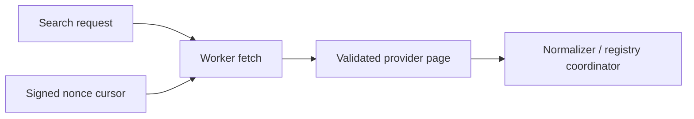

# M11 Places Text Search Adapter

## 範囲

M11の初回単位は、Google Places Text Search (New) へのWorker HTTP境界と、継続検索用のopaque cursorです。Provider応答のCore値への正規化、候補・観測のregistry登録、Tool Bindingは後続Adapter単位です。この単位は入力済みのProvider requestを送受信するだけで、current/named locationの入力変換やregistry接続をまだ保証しません。CoreにはGoogle SDK、HTTP、Cloudflare APIを持ち込みません。



## Googleリクエスト

既定endpointは`https://places.googleapis.com/v1/places:searchText`です。field maskは次の固定値を使い、wildcardを許可しません。

```text
places.id,places.displayName,places.formattedAddress,places.primaryType,
places.businessStatus,places.currentOpeningHours,places.timeZone,
places.priceLevel,places.googleMapsUri,places.attributions,nextPageToken
```

Text Searchはfield maskが必須で、`pageSize`の上限は20です。M11のCore入力上限は10なので、AdapterはCoreのlimitをそのまま`pageSize`へ渡します。自動ページング、半径拡大、独自ランキング、写真・経路・終電の先読みは行いません。

- 後続Adapterは`current_location`をHarnessが供給した座標だけで`locationBias.circle`へ変換し、locationがavailableでない場合は呼出しません。
- 後続Adapterは`named_area`を検索文へ明示的な地名labelとして含めます。IPや暗黙の位置推測はしません。
- cursor接続側は、最初の検索条件とlocation revisionをserver-side stateへ保存し、Googleの`pageToken`を外へ返しません。
- API keyは`X-Goog-Api-Key`、field maskは`X-Goog-FieldMask`へ設定します。keyをURL、cursor、エラー本文、ログへ入れません。

参照: [Text Search (New)](https://developers.google.com/maps/documentation/places/web-service/text-search)、[searchText REST reference](https://developers.google.com/maps/documentation/places/web-service/reference/rest/v1/places/searchText)、[Choose fields](https://developers.google.com/maps/documentation/places/web-service/choose-fields)

## Provider応答境界

`transport.ts`はJSON envelope（`places`配列と`nextPageToken`）だけを検証し、各Place itemは`unknown`として後続のM12共有wire/field正規化へ渡します。これにより、一つのPlaceのpriceやhoursが不正でも同じpageの他候補を捨てず、後続Adapterが候補単位・field単位でpartial/unknown/errorを分類できます。応答envelope全体が不正な場合は`SCHEMA_MISMATCH`です。Transport単位ではProvider itemをCoreやmodelへ返しません。

取得失敗は次の分類を維持します。

| 条件                   | Transport error        | 再試行判断                                   |
| ---------------------- | ---------------------- | -------------------------------------------- |
| API keyなし            | `MISSING_API_KEY`      | 設定修正が必要                               |
| 不正な要求・4xx        | `INVALID_REQUEST`      | しない                                       |
| 429                    | `RATE_LIMITED`         | `Retry-After`がある場合のみ上位runtimeが判断 |
| timeout                | `TIMEOUT`              | 上位runtimeの予算内で判断                    |
| caller abort           | `CANCELLED`            | しない                                       |
| 5xx・network           | `UPSTREAM_UNAVAILABLE` | 上位runtimeが判断                            |
| 200だがJSON/schema不正 | `SCHEMA_MISMATCH`      | しない                                       |

空の`places`はProviderが返した成功結果として扱えます。HTTPエラーやschema不一致を空配列へ変換しません。

## Cursor

cursorは`v1.<nonce>.<HMAC>`の形式ですが、payloadに検索条件やProvider tokenを含めません。nonceをMapのkeyにして、次をWorker isolate内のserver-side stateへ保存します。

- `ownerScopeRef`、`threadId`
- query、area、openNow、limit、除外候補ID集合
- location revision
- Providerのpage token
- 発行時刻から5分の有効期限

HMAC検証後もstateが存在しなければinvalidとします。期限境界では`CURSOR_EXPIRED`を返し、stateを削除します。scope、query、openNow、area、limit、除外候補、location revisionのいずれかが変われば`INVALID_CURSOR`です。Mapは5分の有効期限を保てるsession/Thread所有のstoreへ後続Hostで接続し、Thread dispose時に破棄します。Provider本文を永続化せず、Worker isolate再起動後のcursorが無効になる点はHostのDurable Object接続で明示的に扱います。

## 保留中の接続

Googleの`id`はProvider `recordRef`に限り使用し、Coreの`candidateId`、`observationId`、`searchId`はHarness/Application注入値を使います。候補登録とObservation retentionはM06/M31のApplication境界で行います。Google本文の保存可否・attribution・freshnessはProvider policyが確定するまでallowにしません。

`timeZone`はPlace直下のResource field、`attributions`はprovider/providerUriのobject配列です。営業時間のperiodは曜日・ローカル時刻で表現され、Coreの絶対RFC3339 intervalへ変換する規則はM12共有正規化単位で定義します。M11 Transportは共有wireへ依存せず、M12側がitemごとにそのwire schemaを適用します。

API key、billing、実Provider応答、実データのlive検証はこの単位では行いません。[Places usage and billing](https://developers.google.com/maps/documentation/places/web-service/usage-and-billing)
