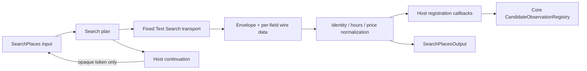

# M11 Places Text Search Adapter

## 範囲

M11は、Google Places Text Search (New) のWorker transport、opaque cursor、Core
`PlaceSearchPort`への接続を担当します。Provider HTTPとcursorはWorker内に閉じ、候補・観測のID発行とretention判定はHostが注入する登録callbackを通ります。



`createPlacesSearchAdapter`はCore `PlaceSearchPort`を実装します。`registration`にはraw
registryを渡さず、Hostが所有するCandidate/Observation登録とpolicyをcallbackで注入します。
`nextSearchId`もWorker境界から注入し、transport自身はCore状態を変更しません。

## Googleリクエスト

既定endpointは`https://places.googleapis.com/v1/places:searchText`です。field maskは次の固定値を使い、wildcardを許可しません。

```text
places.id,places.displayName,places.formattedAddress,places.primaryType,
places.businessStatus,places.currentOpeningHours,places.timeZone,
places.priceLevel,places.googleMapsUri,places.attributions,nextPageToken
```

Text Searchはfield maskを要求し、`pageSize`のProvider上限は20です。Core入力上限は10なので、Adapterはlimitをそのまま`pageSize`へ渡します。自動ページング、半径拡大、独自ランキング、写真・経路・終電の先読みは行いません。

- `current_location`はHarnessが供給した座標だけを`locationBias.circle`へ変換し、locationがavailableでない場合は呼び出しません。
- `named_area`は元のqueryと地名labelを空白で連結します。Coreのquery 200文字とarea 160文字を受けられるよう、transportの合成textQuery上限は512文字です。cursorには元のquery/areaを保存します。
- C1のtransportはresponse envelopeだけを検証し、各Place itemは後段のfield単位parseへ渡します。
- API keyは`X-Goog-Api-Key`、field maskは`X-Goog-FieldMask`へ設定します。keyをURL、cursor、エラー本文、ログへ入れません。

参照: [Text Search (New)](https://developers.google.com/maps/documentation/places/web-service/text-search)、[searchText REST reference](https://developers.google.com/maps/documentation/places/web-service/reference/rest/v1/places/searchText)、[Choose fields](https://developers.google.com/maps/documentation/places/web-service/choose-fields)

## Provider応答とCore登録

identity、opening hours、priceは独立してparseします。priceが壊れていてもidentity候補とvalidなhoursは残し、該当fieldだけ`SCHEMA_MISMATCH`として`partial`にします。hoursが欠落した場合は`unknown`、明示されたhours fragmentが不正な場合は`SCHEMA_MISMATCH`です。attributionは全て`SourceRef[]`へ保持し、attribution形状が不正な場合は帰属済みURLとして表示しません。

候補はProvider record identity（provider + recordRef）で重複除去し、Core登録callbackの返却値についてowner、thread、provider、recordRef、candidate IDを再検証します。callbackが別scopeの候補や無効な登録を返した場合は成功結果へ流しません。除外候補は登録済みrecordのexcluded状態または入力の除外IDと照合して出力から除きます。

Observation登録にはHostが決めた`freshUntil`、`expiresAt`、`RetentionMetadata`を必須で渡します。明示的denyは観測を参照用に保持し、後段projectorが本文を隠します。policyが未設定の場合は`MISSING_CONTEXT` field errorとして表現し、`unknown`や成功に置き換えません。Coreのclockとhours normalizerはWorkerから注入し、Provider取得完了後のclock値を`evaluatedAt`に使います。

取得失敗は次の分類を維持します。

| 条件                   | Transport error        | 再試行判断                               |
| ---------------------- | ---------------------- | ---------------------------------------- |
| API keyなし            | `MISSING_API_KEY`      | 設定修正が必要                           |
| 不正な要求・4xx        | `INVALID_REQUEST`      | しない                                   |
| 429                    | `RATE_LIMITED`         | `Retry-After`を保持して上位runtimeが判断 |
| timeout                | `TIMEOUT`              | 上位runtimeの予算内で判断                |
| caller abort           | `CANCELLED`            | しない                                   |
| 5xx・network           | `UPSTREAM_UNAVAILABLE` | 上位runtimeが判断                        |
| 200だがJSON/schema不正 | `SCHEMA_MISMATCH`      | しない                                   |

空の`places`はProviderが返した成功結果として扱い、HTTPエラーやenvelope不一致を空配列へ変換しません。

## Cursorと継続検索

cursorは`v1.<nonce>.<HMAC>`ですが、payloadに検索条件やProvider tokenを含めません。Hostの`createPlacesSearchContinuation`がC1 `PlacesSearchCursorStore`を包み、bindingとProvider `pageToken`をserver-side stateへ保持します。

- ownerScopeRef、threadId、query、area、openNow、limit、除外候補ID、location revisionを発行時に固定します。
- modelへ返すのは署名済みopaque tokenだけで、Provider `pageToken`は返しません。
- 継続時はcursorから復元したbindingを現在のowner/thread/location revisionと照合してからtransportへ渡します。
- C1の5分期限に加えHost側stateも期限管理し、期限境界は`CURSOR_EXPIRED`、scopeや条件不一致は`INVALID_ARGUMENT`です。
- Host stateは最大512エントリに制限し、Thread dispose時はcontinuationとC1 storeを破棄します。

継続用Provider token、API key、raw responseは公開DTOへ含めません。Worker isolate再起動後にcursorが無効になる場合は、永続化を追加せずThread/Host lifecycle側の契約として扱います。

## 保留中の接続

Googleの`id`はProvider `recordRef`に限り使用し、Coreの`candidateId`、`observationId`、`searchId`はHarness/Application注入値を使います。営業時間はM12の共有normalizerを使い、実transport・実cursor・実Core Registryとの統合fixtureで確認しています。

本番Hostへの構成はM16で接続します。候補登録は観測policy判定より先に起きるため、候補のdisplayNameもprovider由来データとして永続化のdeny-by-default判定が必要です。policy未設定でも候補本文を保存してよいという契約ではありません。SDK履歴やDO storageへの保存可否はこのadapter単体では保証しません。

API key、billing、実Provider応答、実データのlive検証はこの単位では行いません。[Places usage and billing](https://developers.google.com/maps/documentation/places/web-service/usage-and-billing)
