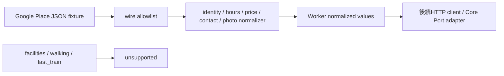

# M12 Places Details Adapter：C1〜C3境界

## 状態

この文書は、M12で最初にレビュー可能にする単位を定める。fixtureは生成データであり、Googleのアカウント・API key・課金設定・本番帰属設定の承認を意味しない。

## C1の責務

`workers/api/src/providers/places/wire.ts` は、M11検索とM12詳細取得が共有するGoogle Places REST `Place` のraw境界である。必要なsubsetだけを読み、未知propertyはstripする。Google応答はnormalizerへ渡す前にparseし、正規化結果にはCoreが扱わないprovider payloadを残さない。`parseGooglePlaceWireField` は要求field単位でparseするため、無関係fieldの不正値が有効な結果を消さない。

`identity.ts` はdisplay name、Hostが注入したarea label、住所、primary type、business status、HTTPSのGoogle Maps source URLを既存Core `PlaceIdentity`へ変換する。areaは`formattedAddress`から推測しない。`FUTURE_OPENING`はCoreに対応する状態がないため`unknown`へ変換し、元statusはWorker内部metadataだけに残す。移転先も内部resolver用metadataに保持するが、自動追跡や候補差し替えは行わない。

例外として、threadlessの `GET /v1/saved/:savedPlaceRef/refresh` 専用adapterは、同じDetails identity応答で検証済みの非空`formattedAddress`（160文字以内）を、そのまま一時的な所在地表示の`PlaceIdentity.area`へ渡せる。これは検索範囲のareaではなく、providerが返した所在地の表示である。文字列の切り出し・切捨て・地域名の推測・永続保存は行わず、欠損・上限超過・不正な値はknown結果にしない。通常のsearch/details adapterのarea意味論は変わらない。

`values.ts` はGoogleのprice level、完全な同一通貨のprice range、contact link/phone、photo metadataを変換する。有限な上限がないprice rangeはknown rangeにせず、levelだけを保持できる。円換算や金額の推測はしない。写真はCoreのphoto referenceと帰属だけを最大3件保持し、表示可能なauthor attributionがない写真はwithholdする。photo referenceはprovider内部handleであり、公開`photoToken`への変換はWorker response/M15境界の責務である。

normalizerは`known`、`unknown`、明示的なschema/source-conflict errorを返す。Observation生成、Registry書込み、SDK呼出し、Application state変更は行わない。Observation ID、`fetchedAt`、freshness、retention、`reuse_valid`は後続のM06/M07 compositionが注入する。

## 契約の引き継ぎ

Coreのdetails契約は候補1〜5件と要求field集合の完全一致を要求する（`GetPlaceDetailsInputSchema`、`matchesDetailsRequest`）。後続adapterは正規化値をCore `FieldResult` observationへ変換し、候補単位のpartial resultを保持する。`facilities`、`walking_route`、`last_train`はGoogle adapterでは明示的なunsupported結果にする。

M11はGoogle root attributionの別型を持たず、共有wire shapeを使う。特にGoogleの`attributions`は`{provider, providerUri}` object配列であり、`timeZone`はPlace root fieldである。営業時間の検索transportはraw itemを保持せず、M12の共有wireから正規化する。

## C2 営業時間の正規化

`workers/api/src/providers/places/hours.ts` は `currentOpeningHours.periods` を主入力とする。M11 adapterからはserver clockのRFC3339文字列を受け取り、単体検証では同じ値を`{ evaluatedAt }`として渡せる。各periodの日時をPlace rootのIANA `timeZone`で解決し、Coreの `OpeningHours.intervals` へ絶対RFC3339の半開区間として出力する。close省略の24時間periodは`endAt: null`で表し、翌0時を実閉店として生成しない。入力のperiod順や `weekdayDescriptions` のロケール順を曜日順と解釈しない。通常週の表示文がある場合は`regularOpeningHours`を優先し、`currentOpeningHours.specialDays`や特殊日periodで通常週を上書きしない。

Googleのprotobuf scalar省略値（`day`、`hour`、`minute`）は0として扱う。`close`なしの`day=0/hour=0/minute=0`だけを公式の常時営業マーカーとして`endAt: null`へ変換し、日付が省略されている場合は評価時刻のPlace現地日を開始日にする。日付のない非24時間period、無効な日付、IANA timezone不在は`unknown`とする。DSTの不存在時刻と重複時刻は一意に解決できないため`unknown`とする。

`truncated`なopen端点はGoogleが返した有効な窓の開始境界として扱えるが、`truncated`なclose端点を実閉店時刻として保存しない。そのperiodを`unknown`にして、切詰めによる閉店時刻の捏造を防ぐ。`nextOpenTime`/`nextCloseTime`はRFC3339として検証し、`openNow`と反対側の境界、過去の境界、現在periodの境界、空periodとの不整合は`SOURCE_CONFLICT`とする。

`hours.test.ts` は東京の通常週・特殊日・跨日・24時間、protobuf省略値、切詰め、空period、欠落/不正timezone、DSTの不存在/重複時刻、境界不整合を2026年固定fixtureで検証する。実API・API key・Secretsは使用しない。

## C3 Place Details transport

`workers/api/src/providers/places-details/transport.ts` は、Provider IDを1件ずつ受け取り、`GET https://places.googleapis.com/v1/places/{placeId}`へ送る。リダイレクトは`error`、リクエストbodyは空、API keyは`X-Goog-Api-Key` headerだけに置き、URL・例外・ログへ複製しない。`X-Goog-FieldMask`は論理fieldから固定のallowlistへ変換し、wildcardや未対応fieldを使わない。`id`、`googleMapsUri`、`attributions`は各fieldの出典とrecord metadataに必要な共通補助fieldとして含め、`timeZone`、`currentOpeningHours`、`regularOpeningHours`は`opening_hours`だけで取得する。

| Core field      | Google maskの主項目                                      | 境界で保持する補助metadata            |
| --------------- | -------------------------------------------------------- | ------------------------------------- |
| `identity`      | `displayName`、住所、種別、営業状態、移転情報            | `id`、`googleMapsUri`、`attributions` |
| `opening_hours` | `currentOpeningHours`、`regularOpeningHours`、`timeZone` | `id`、`googleMapsUri`、`attributions` |
| `price`         | `priceLevel`、`priceRange`                               | `id`、`googleMapsUri`、`attributions` |
| `photos`        | `photos`                                                 | `id`、`googleMapsUri`、`attributions` |
| `contact`       | 地図、公式サイト、電話                                   | `id`、`attributions`                  |

`facilities`、`walking_route`、`last_train`はGoogle Details transportから取得しない。後続C4がCore Portの要求を項目ごとに分け、未提供能力を`unsupported`として返す。transportはHTTP成功bodyをJSON objectとしてだけ検査し、全Place schemaへ一括parseしない。bodyは`unknown`のままC1のfield parserとnormalizerへ渡すため、要求fieldと無関係な不正値が別fieldの成功を消さない。Providerが返した`movedPlace`/`movedPlaceId`はnormalizerへ渡すが、transportが移転先を追跡して別GETすることはない。

timeoutはresponse bodyの読み取り完了まで適用し、呼出側の`AbortSignal`はfetchへだけ転送する。404、429（`Retry-After`）、5xx、malformed body、timeout、cancelはupstream本文を含まないtyped errorへ変換する。retry判断と再試行はRuntimeが所有し、transportは一度のGETだけを行う。

## C4 Core Port adapter

`workers/api/src/providers/places-details/adapter.ts` は `PlaceDetailsPort.read` を実装し、候補の `ownerScopeRef` と `threadId` をCore Registryで照合してから、Google候補だけをC3 transportへ渡す。`facilities`、`walking_route`、`last_train`、および別providerの既知候補は、Googleの未取得や不明候補とは区別した `unsupported` として返す。候補ID、Providerが返した `id`、要求field集合は三者を突き合わせ、異なる応答を観測として登録しない。

`reuse_valid` は現在の `ObservationContext` と有効期限が一致する観測だけを返す。`refresh`、または期限切れ観測の再取得では、providerへリクエストする前に対象fieldの古いreuseを無効化する。そのためHTTP失敗、応答field集合の不一致、帰属メタデータの不正、取消しのいずれでも古い値を再利用できない。新しい値は `PlacesDetailsObservationPolicy` が返す有限の `freshUntil`、`expiresAt`、`RetentionMetadata` とともに登録し、policyが未注入ならknown値を返さない。

出典の共通整形は `workers/api/src/providers/places/source.ts` に集約する。M11検索とC4詳細取得は共通の検証結果が不正なら該当fieldをerrorにし、正常な候補・fieldはpartialとして維持する。area labelは住所から導出せず、Hostの `areaLabelFor` 注入がないidentityをknownにしない。C4のfixtureは実Google APIやSecretを使わず、C3の実transportを通したHTTP境界、Registry登録、再利用無効化、provider失敗、field mask、取消しを検証する。

保存参照のthreadless refreshだけは上記の表示目的の限定例外を持つ。owner-scopedな保存行を再読し、provider identityと帰属を検証した後に一時的な公開DTOを生成するが、住所その他のprovider payloadをDOやThreadへ保存しない。候補ID・evidence IDもrequest-scopedに発行し、元threadのcandidate IDを再利用しない。

## 参照

- [M12 issue #13](https://github.com/takapom/ima-app/issues/13)
- [Place Details (New)](https://developers.google.com/maps/documentation/places/web-service/place-details)
- [Places REST resource](https://developers.google.com/maps/documentation/places/web-service/reference/rest/v1/places)
- [Place Photos (New)](https://developers.google.com/maps/documentation/places/web-service/place-photos)
- [Place Details (New) field masks](https://developers.google.com/maps/documentation/places/web-service/choose-fields)
- [Places policies](https://developers.google.com/maps/documentation/places/web-service/policies)
- [Core details Port](../../packages/core/src/ports/operations.ts:104)
