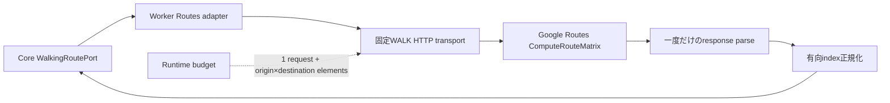

# M13 Routes ComputeRouteMatrix 境界

2026-09-10。M13の最初の実装単位は、WorkerからGoogle Routes ComputeRouteMatrixへ送るWALKリクエストと、返却された有向行列をCoreへ渡せる形へ正規化する責務に限定する。店舗候補の採用、位置の鮮度・精度、滞在条件、表示文言はCoreが所有する次の単位で扱う。

## リクエスト

`POST https://routes.googleapis.com/distanceMatrix/v2:computeRouteMatrix`へ、`travelMode: WALK`と緯度経度のwaypoint配列を送る。endpointとfield maskは固定し、redirectは`error`にする。field maskは`originIndex,destinationIndex,status,condition,distanceMeters,duration`に限定する。現在位置から候補、候補から帰宅駅という方向を保つため、配列の順序とindexを入れ替えない。origin内、destination内のrefは一意でなければならないが、同じ場所が両配列に出現することは許可する。

呼出元は実行前に`routeElementCount(request)`で`origins.length * destinations.length`を求め、provider HTTP request 1件と同数のroute elementsをRuntime budgetへ予約する。transportはretryを実行せず、Retry-Afterを型付きエラーへ渡して再試行判断をRuntime側へ残す。

## レスポンスと正規化

Googleのレスポンス配列はpairの到着順を保証しないため、`originIndex`と`destinationIndex`で再構成し、Coreへはorigin-major/destination-majorの全requested pairを返す。RESTのper-element failureは行列全体を捨てず、次の結果へ分類する。

| provider結果                      | 正規化結果                  |
| --------------------------------- | --------------------------- |
| `ROUTE_EXISTS`かつ有効なduration  | `route`                     |
| `ROUTE_NOT_FOUND`                 | `unreachable`               |
| 非0 status、型不正のindexed field | `element_error`             |
| requested pairに要素がない        | `missing`                   |
| duplicate/index範囲外など構造不正 | 行列全体を`SCHEMA_MISMATCH` |

`originIndex`と`destinationIndex`はProtoJSONのimplicit scalar defaultに合わせて省略時を0として扱う。`duration`はpresenceを持つprotobuf Duration messageなので、`ROUTE_EXISTS`で省略・不正なら`element_error`とする。距離はscalarのため省略時を0として扱う。durationの小数秒はCoreの安全な整数秒を下回らないようceilする。表示上の分への変換はこのadapterでは行わず、公開/Core側で`ceil(seconds / 60)`を適用する。

parserはproviderの未許可フィールドや本文を保持せず、pair単位で検出したstatus・distance・durationの型不正だけを`parseError`として残す。normalizerは検証済みのparsed responseを受け取り、raw JSONを再parseしない。raw入力を受ける補助関数もparseを一度だけ行ってから同じnormalizerへ渡すため、要素エラーが成功routeへ変わらない。

## 期限・取消と次の境界

timeoutはfetchだけでなくresponse bodyの読取とJSON parseまで含む。呼出元の`AbortSignal`は同じ処理へ伝播し、期限切れ・取消・HTTP失敗・schema失敗を型付きエラーへ変換する。upstream本文やAPI keyはエラーへ含めない。

## C2a：Coreの方向契約と位置検証

`packages/core/src/ports/walking-route.ts`は現在地→候補と候補→駅を別のlegとして定義し、同じ方向・候補の重複要求を拒否する。既存の`WalkingRoutePort`は維持する。Provider SDKやHTTP型をCoreへ持ち込まない。

`packages/core/src/application/walking-route-policy.ts`は、現在地がavailableかつprecise、取得から120秒以内、accuracyが100m以下であることを検査する。将来の取得時刻、位置revisionの不一致、経路起点から100m超の移動は拒否する。100m以内の確認に使う直線距離は徒歩時間の推定には使わず、浮動小数の丸めや不正値から有効な位置判定を作らない。

方向契約2件・位置検証5件のテストで境界を確認する。これらの閾値はMVPの初期設定であり、実機精度や実API性能の測定結果ではない。WorkerによるPort接続、取得後の再検証、Runtime budgetへの実予約は続くC2bで扱う。C2aだけでM13全体の完了とはしない。

## C2b：Worker adapterと予算予約

Worker adapterは方向別に行列を取得し、要求したpairのみを返す。一方の行列が失敗しても、他方の成功結果は保持する。現在地の鮮度・精度・revisionを取得前後に検査し、取得中の移動は実際にHTTPへ送った起点から判定する。WALKではdepartureTimeを送らず、Googleのリクエスト時刻を使う。

`RuntimeBudget.reserveRoute`はHTTP件数と行列全体のelementsを予約する。同じleaseのconsumeは一度だけ成功し、取消・期限・完了状態も再検査する。releaseは冪等で、使用済み予算は返却しない。外側で予約済みの場合も同じleaseを渡す。

経路と既存Runtime budgetの関連35テストで、有向pair、部分失敗、取得中の位置変更、二重consumeを確認した。既存Portへの橋渡しは座標resolverを注入する段階であり、実Registryからprovider参照を解決するC3と、M16の本番構成での予算・観測登録の接続は未完了。fixtureのresolverを本番接続の証拠とはしない。

## 公式仕様

- [Compute Route Matrix REST reference](https://developers.google.com/maps/documentation/routes/reference/rest/v2/TopLevel/computeRouteMatrix)
- [Compute Route Matrix guide](https://developers.google.com/maps/documentation/routes/compute_route_matrix)
- [Choose fields to return](https://developers.google.com/maps/documentation/routes/choose_fields)
- [ProtoJSON format and implicit scalar defaults](https://protobuf.dev/programming-guides/json/)
