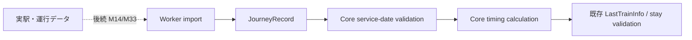

# M14 終電 journey の Core C1 境界

M14 C1 は、検証済み終電 journey の Core 契約・運行日判定・純粋な時刻計算を定義する。Worker の取込、更新、rollback、expiry、実駅データ投入は後続単位であり、この段階では本番データをseedしない。

## C1契約

`serviceDate` は日本の運行日として扱い、ISO timestampをAsia/Tokyoの暦日に変換して同日または翌日だけを許可する。したがって深夜跨ぎは許可するが、運行日から離れた年月日の出発・到着は拒否する。weekdayは`serviceDate`からCoreで導出し、入力contextのweekdayが一致しなければ運行可能としない。日時の`Z`と`+09:00`の表記差は同じ瞬間として検証する。

`transfers`は全乗車区間を表す有向列である。最初の区間は`fromStationRef`から始まり、各区間の到着駅と次区間の出発駅を連結し、最後は`homeStationRef`へ到着しなければならない。時刻は非減少で、最終区間の到着時刻は`arrivesHomeAt`と一致させる。乗継がない直通journeyでは、出発から到着までの時刻関係のみを検証する。

`validFrom`と`validThrough`は両端を含み、`serviceDate`をその範囲外に置いたrecordはimport時点で`INVALID_EVIDENCE`として拒否する。`verifiedAt`からの検証可能期間は7日未満で、ちょうど7日経過したrecordは`STALE_EVIDENCE`となる。

同駅の終電計算は`not_applicable`として扱えるが、店から駅までの徒歩検証済みを意味しない。availabilityには徒歩検証が必要であることを残す。

## 独立した時刻計算

`arrivePlaceAt`は評価時刻に現在地から店舗までの実経路秒数を加える。`leaveBy`は最終出発から店→駅の経路秒数と180秒bufferを引く。`availableStaySeconds`は既存`LastTrainInfo`契約どおり、`leaveBy - arrivePlaceAt`を秒単位でfloorする。`usable`はこの終電基準の滞在条件だけで判定する。

閉店時刻は`availableStayUntilClosingSeconds`および早い退出境界として別に保持し、既存の営業時間・minimum-stay validatorが閉店と終電の早い方を検証する。ラストオーダーは到着時の注文可否だけを判定し、退店時刻や終電退出時刻へ変換しない。

Core C1の公開入口は`packages/core/src/domain/index.ts`と`packages/core/src/application/index.ts`から提供する。Workerの実provider、駅resolver、取込・保存・更新処理はこの契約へ接続する後続単位で実装する。

## C2 Worker dataset boundary

Worker C2は、取込・更新・rollback・expiryを`validateJourneyRecord`へ通し、active datasetを一つのDurable Object SQLite transactionでrevision CASする。revision履歴を先に挿入してからactive pointerを別操作で更新する構成は採用しない。transactionが途中で失敗した場合はactive pointerと履歴の双方を変更しない。

KVは現在、既存datasetを読むためのread-only adapterとしてのみ用意する。KVへのpublish経路や本番の運用入口は未接続であり、実駅・時刻表データのseedもしない。C3で本番のdataset所有DO、管理入口、`LastTrainJourneyPort`/Routes取得との接続を定義する。
