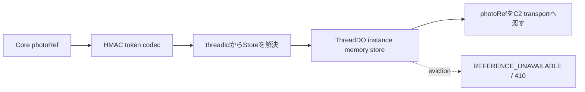

# M15 写真配信：C1 token境界

## 状態

C1は写真の公開tokenと、ThreadDO単位の期限付き参照を定義する。実HTTP配信、写真provider呼出し、DO RPC/bootstrapへの接続はC2の未完了範囲である。

## C1契約

`workers/api/src/providers/photo/token.ts` は、最大30分のTTLとHMAC署名を持つ短いtokenを発行する。tokenにはproviderの`photoRef`、owner credential、deviceの原文を入れない。`threadId`は公開opaque IDとして対象ThreadDOを解決するために署名payloadへ含める。ownerとdeviceは短いdigestでscopeを検証する。

token発行・検証は`PhotoReferenceStoreResolver.resolve(threadId)`でThreadDO単位のstoreを選ぶ。storeにはtoken handle、owner、thread、device digest、provider `photoRef`、expiryだけを保持する。worker global MapやHTTP requestごとのstoreを前提にしない。

`workers/api/src/providers/photo/reference-store.ts` のmemory実装はThreadDOインスタンスへの注入を想定し、最大256件を保持する。evictionまたはDO再起動で参照が失われた場合は`REFERENCE_UNAVAILABLE`として扱い、C2のHTTP境界で410へ変換して最新Detailsから再発行する。provider bytesはこのstoreへ保存しない。

Base64URLはdecode後の再encode一致を検証し、非canonical表現を受け付けない。最大長のGoogle photo nameと最大scopeでもtoken上限512文字以内に収まることを回帰テストで確認する。

## C2への引き継ぎ

`workers/api/src/providers/photo/media.ts` と `transport.ts` はC2所有であり、C1のstage対象に含めない。C2では、authenticated owner/deviceとtoken scopeの確認、対象ThreadDOの実resolver接続、Google photo endpointのstreaming、size/timeout/cancel、redirect先へのAPI key非転送、410/429/error envelope、帰属metadataを実HTTP/bootstrap境界で検証する。

## 参照

- [M15 issue #16](https://github.com/takapom/ima-app/issues/16)
- [Place Photos (New)](https://developers.google.com/maps/documentation/places/web-service/place-photos)
- [Photo token source](../../workers/api/src/providers/photo/token.ts)
- [Photo reference store source](../../workers/api/src/providers/photo/reference-store.ts)
