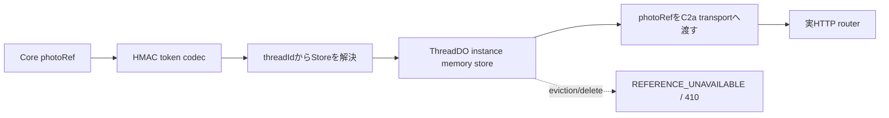

# M15 写真配信：C1/C2

## 状態

C1は写真の公開tokenと、ThreadDO単位の期限付き参照を定義する。C2aはproviderの実HTTP取得とWorker内stream境界まで実装済み、C2bはThreadDO RPCと実router接続まで実装済みである。Core観測からのruntime token事前発行は別の接続点として残る。

## C1契約

`workers/api/src/providers/photo/token.ts` は、最大30分のTTLとHMAC署名を持つ短いtokenを発行する。tokenにはproviderの`photoRef`、owner credential、deviceの原文を入れない。`threadId`は公開opaque IDとして対象ThreadDOを解決するために署名payloadへ含める。ownerとdeviceは短いdigestでscopeを検証する。

token発行・検証は`PhotoReferenceStoreResolver.resolve(threadId)`でThreadDO単位のstoreを選ぶ。storeにはtoken handle、owner、thread、device digest、provider `photoRef`、expiryだけを保持する。worker global MapやHTTP requestごとのstoreを前提にしない。

`workers/api/src/providers/photo/reference-store.ts` のmemory実装はThreadDOインスタンスへの注入を想定し、最大256件を保持する。evictionまたはDO再起動で参照が失われた場合は`REFERENCE_UNAVAILABLE`として扱い、C2のHTTP境界で410へ変換して最新Detailsから再発行する。provider bytesはこのstoreへ保存しない。

Base64URLはdecode後の再encode一致を検証し、非canonical表現を受け付けない。最大長のGoogle photo nameと最大scopeでもtoken上限512文字以内に収まることを回帰テストで確認する。

## C2への引き継ぎ

`workers/api/src/providers/photo/media.ts` と `transport.ts` はC2所有であり、C1のstage対象に含めない。C2では、authenticated owner/deviceとtoken scopeの確認、対象ThreadDOの実resolver接続、Google photo endpointのstreaming、size/timeout/cancel、redirect先へのAPI key非転送、410/429/error envelope、帰属metadataを実HTTP/bootstrap境界で検証する。

## C2a検証済み範囲

`transport.ts` はmetadata取得と画像取得を一つのdeadlineで管理し、API keyをmetadataリクエストのheaderだけへ設定する。画像URLは `https://lh3.googleusercontent.com` のHTTPS・標準port・認証情報なしに限定し、URL redirectと任意hostを受け付けない。metadata JSON、画像のContent-Type、Content-Length、stream読取の各上限を検査し、timeout/cancel時はAbortControllerだけに依存せずreader.cancel()まで実行する。レスポンス到着とabortが競合する場合もreader/listener登録直後の状態を再確認する。

`photo/http.ts` は認証済みowner/deviceと署名tokenを検証してからprovider streamを返し、`router.ts` は公開descriptorと期限を検証する。期限切れまたはdescriptor不正時には未消費streamをcancelし、レスポンスは `private, no-store` とする。Cloudflareのredirect実装差に依存しないようtransportは`redirect: manual`で3xxを即時拒否する。transport・adapter・HTTP routerの関連テストをローカルNodeで実行済みである。

## C2b実装範囲

`providers/photo/thread-references.ts` がscope・expiry・DO時計・await後のdeleted再確認を担当し、`ThreadDO` はowner bindingとdelete cleanupをRPCへ接続する。`providers/photo/rpc.ts` はtoken codecからThreadDOを解決し、provider bytesをDOへ保存しない。bootstrapは設定済み時だけcodec/transport/handlerを構成し、設定未完了時は既存resource判定を通して未知tokenを404にする。実DO RPCと実routerのfixtureは、異owner/device、削除後、DO eviction後の410/拒否を検証する。

Coreの写真観測から公開DTOへ渡すtokenは、providerの`photoRef`をDTOへ直接写さず、server contextを束縛した非同期事前発行結果を同期mapper lookupへ渡す。`issuance.ts` は観測ごとの `display` 用policy snapshotを解決し、`llm_input`/`persistence` のdenyを表示判定へ継承しない。`displayPolicyStatus` と source・session・display・providerの期限は別々に検証する。表示許可と `sessionExpiresAt`、`displayUntil`、provider期限の最短値でtoken期限を制限し、期限切れ・表示不可の観測を発行しない。provider期限が明示されない場合は、30分・session・displayの有限境界で制限する。重複観測は短い期限を採用し、表示不可が一つでもあれば発行しない。公開DTOは、観測自体が空なら `known/photos:[]`、全token失敗なら `unknown` と理由、一部失敗なら発行済み写真と `partialReason` を返して候補を維持する。runtime compositionには事前発行フックを接続済みで、production factoryは`RuntimeProductionThinkHost`の検証済みdisplay policyを受け取ったturnだけへcodec・registry・DO RPCを構成する。Hostがpolicyを供給しない通常の`ThreadDO`は`photos`能力を公開せず、M35の確認前にfixtureのallow profileや任意環境値で有効化しない。参照失効・DO eviction・削除後は410として再取得へ戻る。

## 参照

- [M15 issue #16](https://github.com/takapom/ima-app/issues/16)
- [Place Photos (New)](https://developers.google.com/maps/documentation/places/web-service/place-photos)
- [Photo token source](../../workers/api/src/providers/photo/token.ts)
- [Photo reference store source](../../workers/api/src/providers/photo/reference-store.ts)
- [Photo ThreadDO RPC source](../../workers/api/src/providers/photo/thread-references.ts)
