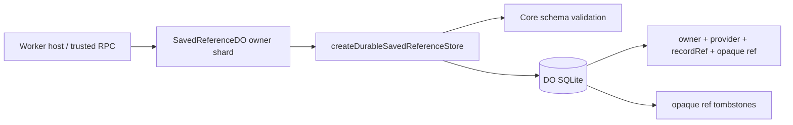

# M16 保存参照の Durable Object adapter

## 結論

この実装は、ユーザーが明示的に保存した場所の **owner-scoped な provider identity** を
Durable Object の SQLite に保持する。C1のstorage adapterと、C2aのThread期限から独立した
`SavedReferenceDO` / trusted Worker RPCまでを含む。公開 HTTP と Core の同期
`SavedPlaceReferencePort` はまだ接続しない。

## 保存境界

`m16_saved_place_reference` の列は次の4つに限定する。

| 列                | 意味                                             |
| ----------------- | ------------------------------------------------ |
| `saved_place_ref` | Worker が発行する opaque identifier              |
| `owner_scope_ref` | 所有者の scope identifier                        |
| `provider`        | provider の固定識別子                            |
| `record_ref`      | provider 側の再取得用 identity（例: `place_id`） |

provider の名称、住所、座標、写真、経路、観測、生成文、raw payload は保存しない。
同一 owner・provider・recordRef は既存行を返して重複登録しない。削除後の opaque ref は
`m16_saved_place_reference_used` に ref だけを tombstone として残し、別 owner を含めて
再発行しない。この tombstone は旧 ref の再利用防止以外の情報を持たない。

入力は Core の `SavedPlaceRegistrationSchema` / `SavedPlaceRefSchema` で SQL より前に検証
する。保存行の読み出し時も `SavedPlaceReferenceSchema` を再検証し、壊れた行を成功や
`reference_only` に変換せず `CORRUPT_ROW` として返す。DB の予期しない例外は握りつぶさず
呼び出し元へ伝播する。

## 実装と検証

`workers/api/src/saved-references/store.ts` の `createDurableSavedReferenceStore` は
`DurableObjectStorage` と ref factory を受け取る。`saved-reference-do.ts` の
`SavedReferenceDO` はこのadapterを一度だけDO初期化時に構成し、owner rowを同じSQLiteへ
固定する。`savedReferenceOwnerName(ownerScopeRef)` が namespace key を作り、
`createOwnerSavedReferenceRpc` が全RPCへ同じownerを束縛する。DO shard の選択、認証、
provider の再取得、候補・観測登録は host の責務であり、このadapterはそれらを推測しない。

本番の `SAVED_REFERENCES` binding は `workers/api/wrangler.jsonc` の dev/staging/production
へ登録し、migration `v5` で `SavedReferenceDO` を作成する。owner shard は ThreadDO と
別のライフサイクルを持つため、Threadの期限切れ・削除では保存参照を消去しない。

`workers/api/tests/http/integration/saved-reference-store.test.ts` は既存 `THREADS`
Durable Object の SQLite を実際に使い、次を検証する。

- DO eviction 後も identity が復元されること
- owner 間で read/delete が漏れず、同一 identity の重複登録を抑止すること
- 削除後の旧 ref を拒否し、別 ref による再登録だけを許すこと
- 同じ ref を返す並行登録が部分行を作らず、conflict を返すこと
- provider payload を含む strict-invalid input が write 前に拒否されること
- 壊れた保存行を `CORRUPT_ROW` として扱うこと

このC1テストは既存 ThreadDO をstorage hostとして使う。C2aテストは本物の
`SAVED_REFERENCES` bindingを使い、owner初期化の競合、異owner拒否、eviction後復元、
ThreadDO削除後の参照存続、RPC境界のpayload拒否を確認する。ThreadDOをstorage hostに
借用したC1テストを、本番構成の証拠に読み替えない。

## 後続接続

次単位で owner 認証済みの DO/RPC 境界を決め、親で検討中の POST/DELETE 操作へ接続する。
別 thread で使う場合も旧 candidate・観測を復元せず、保存 identity から現行 provider policy
で新しい candidate と観測を再取得する。再取得できない場合は `reference_only` として扱い、
provider payload の offline 復元を約束しない。
