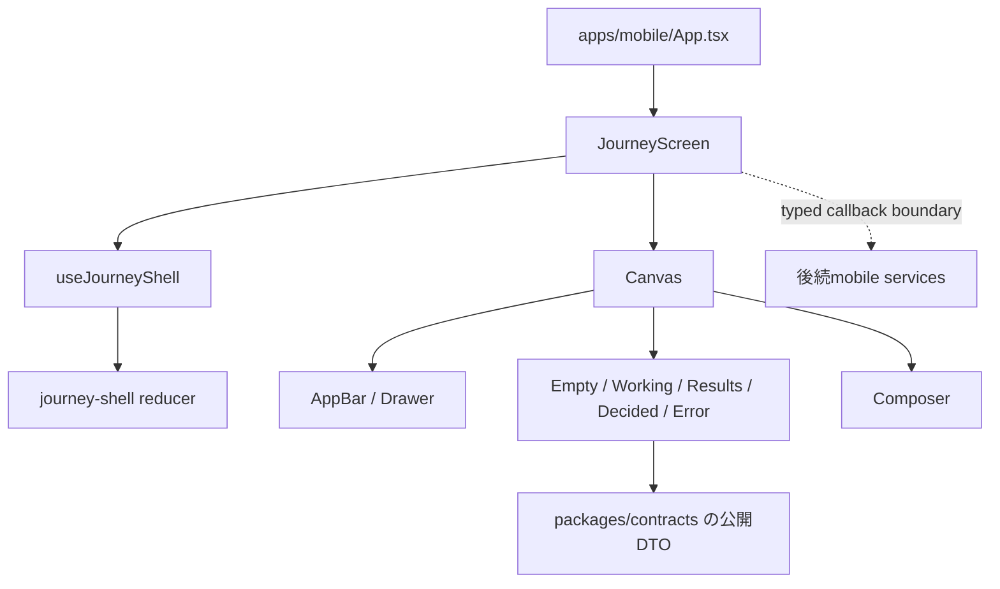

# M17 mobile画面基盤 C1

2026-09-10時点のM17 C1実装記録。参照元はルートの[`index.html`](../../index.html)、[ADR0006](../adr/0006-lightweight-frontend-hexagonal-backend.md)、[ADR0012](../adr/0012-package-dependency-boundaries.md)、[ADR0013](../adr/0013-quality-harness-and-size-limits.md)である。

## C1の構造

`App.tsx`は`JourneyScreen`を描画するだけで、HTTP・SQLite・位置情報・共有・Worker/Coreを直接参照しない。応答は既存の`AssistantResponseState`を画面入力として受け取り、JSONの検証と適用は既存の`src/services/assistant-response.ts`に残す。`JourneyScreen`の`onSubmit`、`onRetry`、`onPromote`は後続のservice接続用の型付き境界であり、C1ではAppから渡していない。公開shellは`threadId`をReact keyとしてstate ownerを再mountするため、スレッド変更時に前スレッドのdraft・選択・応答を持ち越さない。

Appからrequest callbackを渡さない初期状態では、入力を編集でき、送信ボタンは無効になる。これにより架空の結果・固定進捗・実行中に見せる偽状態を画面へ置かない。実際のpendingは`requestStatus="pending"`または実処理を開始したshell actionからWorkingへ反映する。カードなしの完了応答は`ResultsState`のmessage-only表示へ終端し、Workingに残さない。controlledな`responseState`を使う接続側は、reset時に`onNewSearch`で応答をクリアする。

## 画面とトークン

- `#0c0c0d`をcanvas、`#171719`をcard、`#ecebe6`を本文、`#b7c97a`を強調、`#e7e2d6`を主操作に使う。
- 共通の大きな角丸は24pt、主操作とdrawerの新規検索は48pt以上。drawer幅は`min(86%, 320)`で計算する。
- Resultsは主提案1件を大きく配置し、別案は行形式で最大2件を受け取る。カードの`why`、identity、徒歩、写真状態は公開contractsの値だけを表示する。`photoToken`はURLではないため、C1では実画像を捏造せず、写真の有無・未確認・表示不可を区別したプレースホルダーとする。
- Drawerは今夜の履歴と保存した店の2機能を持ち、データがない場合は空状態を表示する。第三の機能や机ビューは追加しない。
- Composerは日本語IMEの誤送信を避けるため、改行を送信操作に割り当てず、明示的な送信ボタンだけを送信境界とする。例文は自動送信せずdraftへ入れる。

## C2前半の依存なし対応

`Canvas`は標準React Nativeの`KeyboardAvoidingView`でiOS/Androidのキーボード表示時にレイアウトを追従させる。`scaleForDynamicType`は端末の`fontScale`に応じて入力欄と写真枠の最小寸法を広げ、2倍を超える文字サイズでも枠だけを上限で止めない。本文や写真状態ラベルはfont scalingを維持し、装飾アイコンだけを固定する。Drawerの閉じる・戻る操作はVoiceOverのbuttonラベルと48pt領域を持ち、一覧はScrollViewで大きい文字でも到達できる。

フォントのライセンス同梱と読み込み、splash、safe-area SDKの接続、VoiceOver/Dynamic Type/キーボードの実機確認、390ptスクリーンショット比較はC2後半に残す。`expo-font`、`expo-splash-screen`、`react-native-safe-area-context`のExpo 57互換版の導入は後半で行う。install完了確認前のimportは行わず、lockfileも手書きしない。Dela Gothic One/Noto Sans JPのバイナリは正式配布元から取得してライセンス・SHA-256・サイズを対応付けるまで同梱しない。Expo起動・iPhone実機・実APIのpending/response接続は未実測である。

フォントの取得元候補は[Google FontsのDela Gothic One](https://fonts.google.com/specimen/Dela%2BGothic%2BOne)と[Noto Sans Japanese](https://fonts.google.com/noto/specimen/Noto%2BSans%2BJP)で、同梱時は[Google FontsのOFLガイド](https://googlefonts.github.io/gf-guide/license-file.html)に従って`OFL.txt`と著作権表示を対応させる。現時点ではバイナリを取得していないため、SHA-256とサイズは未確定である。

## 検証

`bun run --cwd apps/mobile typecheck` と、`apps/mobile/src/state/journey-shell.test.ts`を含むmobile unit testを実行する。lint/formatの結果と差分行数は担当ターンのREADY報告に記録し、git stage・commit・pushは行わない。
