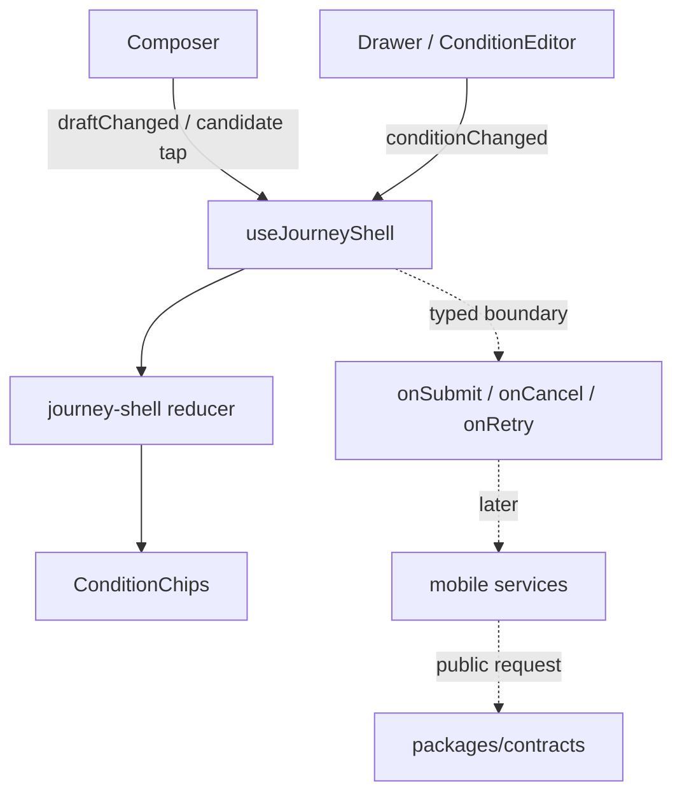

# M18 mobile入力と条件編集 C1

M18 #19のC1実装記録。M17の画面shellを土台に、入力候補・送信状態・条件編集の端末側状態だけを追加する。参照元は[ADR0006](../adr/0006-lightweight-frontend-hexagonal-backend.md)、[ADR0012](../adr/0012-package-dependency-boundaries.md)、[ADR0013](../adr/0013-quality-harness-and-size-limits.md)、ルートの[`index.html`](../../index.html)である。

## 責務とデータの流れ

UIは入力・表示と操作受付を担当し、HTTP・位置SDK・Core判定をimportしない。`journey-input.ts`は候補・chip・条件表示の純粋な端末側整形だけを持つ。条件の意味付け、位置の利用可否、検索クエリの解釈は後続のservice/API境界で行う。

## 入力

- Composerは日本語IMEの改行を送信操作に割り当てず、明示的な送信ボタンだけを送信境界にする。
- 空白を除く空入力だけを送信不可とし、送信callbackへは入力文字列をtrimせず渡す。`TextInput.maxLength`は公開契約の`Text(500)`と揃える。
- 候補タップは`appendSuggestion`でdraftへ追加するだけで、送信しない。既存語を含む場合はdraftを変更せず、候補表示は重複を除いた最大4件とする。
- `beginRequest`は原文を`query`へ保持し、`cancelRequest`・`requestFailed`・再送でもdraft/queryを捨てない。失敗時の再送は同じ原文をcallbackへ渡す。
- `onSubmit`/`onRetry`の型付きcontextには、原文とは別に実効`conditions`と`removedChipLabels`を渡す。後続serviceはこの解除intentを公開requestへ投影できるが、C1ではquery文字列を編集しない。

## 条件とchip

`JourneyShellState`はこのスレッドの条件と保存設定を別々に持つ。帰宅駅は自由入力とし、対応状況は`supported`・`unsupported`・`unknown`の値で表示する。実際の対応駅判定や駅IDの生成は未接続で、初期値を対応済みとして扱わない。`reset`では保存設定を保持して新しい空検索へ適用し、別threadへは`initialSavedConditions`境界から同じメモリ値を渡せる。永続化はM21の責務である。

chipは最大4件で、徒歩条件や終電条件の意味重複を抑止する。徒歩の数値は原文に明示された場合だけ表示し、「歩きたい」などの表現から`徒歩10分`を推測しない。chip解除は表示配列から消すだけでなく`removedChipLabels`へ記録し、後続APIが明示条件の解除として送れる境界を残す。chip抽出は表示補助であり、Coreの条件解析や契約構築を代替しない。

## 位置情報と後続依存

位置許可要求、直近位置の再利用、精度・取得時刻の有効性判定はC1へ実装していない。`expo-location`のExpo 57互換候補は`~57.0.16`だが、M17で追加した`expo-font`・`expo-splash-screen`・`react-native-safe-area-context`と同様、ユーザーのinstall確認前にmanifestへ追加せず、位置をfixtureや固定座標で偽装しない。

## 検証

純粋な候補/chip/条件初期値、reducerの送信・取消・失敗・再送・解除意図をunit testで検証する。SDK import、位置許可、実機IME、実APIのpending/response接続は未実測であり、後続unit/実機ゲートへ引き継ぐ。
