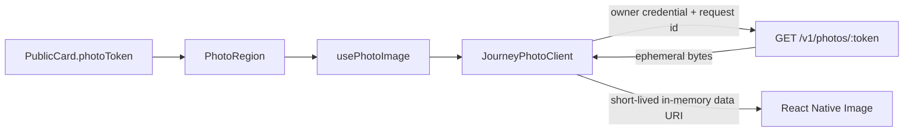

# M19 写真表示接続

M19/#20 の公開カードに含まれる写真ハンドルを、認証済みの Worker 写真 route へ接続する。写真の状態・帰属・保持期限は公開 `contracts` だけで決め、provider の写真名・URL・バイトをモデルや端末保存へ渡さない。

## 経路

`CandidateCard` は `PhotoRegion` を使い、主提案と別案の写真表示を同じ経路に揃える。写真領域だけを横 paging し、候補カードの選択操作とは分離する。主提案は `onLayout` で得た表示幅を各ページへ渡し、別案は固定サムネイル幅を使う。active page だけを読み込み、未選択ページの写真を先行取得しない。

## 出典リンク

カードの出典は `CandidateCard` から `JourneyScreen` のservice境界へ渡す。既定の `JourneySourceLinkService` は `http:` / `https:` とhostだけを許可し、URL内のusername/password、危険scheme、不正URLを `Linking` より前に拒否する。許可後も `Linking.canOpenURL` と `Linking.openURL` を通し、開けない場合とnative例外を別の失敗結果へ変換して画面通知へ表示する。公開contractsの通常出典はHTTPSであり、serviceのhttp対応は入力境界の安全検査として保持する。実端末のLinking画面遷移とcanOpenURLのOS設定は未実測である。

## 認証・応答検証

- `photoToken` は `parsePhotoPath` で検証し、URL へ provider の参照を組み立てない。
- `APP_TOKEN_HEADER`、`DEVICE_ID_HEADER`、`OWNER_CREDENTIAL_HEADER`、`REQUEST_ID_HEADER`、`APP_VERSION_HEADER` は `packages/contracts/src/http.ts` の定数を使う。資格情報は注入された provider から取得し、SecureStore未接続時に保存や成功を偽装しない。
- live は HTTPS を必須とし、HTTP は fixture の localhost に限る。redirect は拒否し、レスポンスの `X-Ima-Request-Id`、許可済み画像 Content-Type、HTTP-date の `Expires` を検証する。
- server expiry、公開 evidence の `displayUntil` の短い方を適用し、資格取得後と画像 body 読取後にも期限を再確認する。期限切れや `410` は `expired`、その他の失敗は `unavailable` として表示する。
- 写真 body は 8 MiB を上限に stream の実受信量を検査し、超過・不正応答・期限拒否時は body を cancel する。reader の lock は `finally` で解放する。reader を提供しない端末 fetch の `arrayBuffer` fallback は読取後に上限を検査するだけで、受信中のメモリ上限までは実機で証明していない。

## 表示と保持

表示可能な `known` 写真だけを `Image` に渡し、欠損・`unknown`・`unsupported`・`error`・期限切れはそれぞれ公開状態に応じた文言へ落とす。`Image.onError` も `unavailable` へ遷移させ、壊れたバイトを成功表示しない。写真ごとの `authorAttributions` は該当カードの帰属一覧へ追加し、重複だけを除く。

画像 URI はメモリ上の短命 data URI であり、SQLite・SecureStore・ファイル・永続 cache へ保存しない。hook は token・client・display deadline の request identity を照合し、切替直後に前の画像を表示しない。期限到来の timer と AppState 復帰時の検査で再表示を抑止する。

## 検証範囲

`apps/mobile/src/services/api/photo-client.test.ts` は認証 header、opaque token、request ID 相関、期限、`retry-after`、credentials/body timeout、8 MiB の content-length と未知長 stream を検証する。`photo-image-state.test.ts` は token/client/deadline の切替、late response、期限境界と時計逆行後の失効保持を検証し、`candidate-card-model.test.ts` は写真ごとの帰属を検証する。実 Worker/外部 provider への接続、React Native hook の実mount、実端末の視覚表示、端末 fetch の受信中メモリ上限はこの単位では未実測である。
