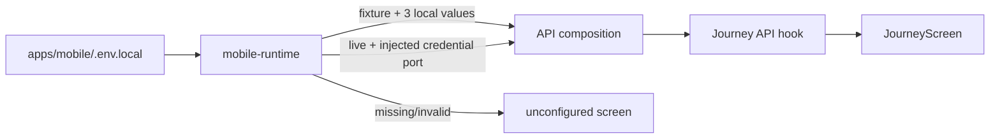

# M22 mobile API runtime boundary

`apps/mobile` は起動時に `EXPO_PUBLIC_API_MODE` を明示的に読み、fixture、live、unconfigured のいずれかを選ぶ。未設定・`disabled`・不正値は unconfigured として画面に設定エラーを表示する。fixture へ暗黙に切り替えない。



開発用fixtureは、`EXPO_PUBLIC_API_MODE=fixture`、`EXPO_PUBLIC_API_BASE_URL=http://localhost:8787`、`EXPO_PUBLIC_FIXTURE_APP_TOKEN`、`EXPO_PUBLIC_FIXTURE_DEVICE_ID`、`EXPO_PUBLIC_FIXTURE_OWNER_CREDENTIAL`をすべて設定した場合だけ生成される。空欄の example 値、推測したcredential、端末保存を代用する固定値は接続条件を満たさない。
`EXPO_PUBLIC_ENVIRONMENT`を明示する場合、fixtureは`dev`でのみ許可する。

live は HTTPS endpoint と、将来の native credential store が注入する `ApiCredentialProvider` が必要である。現時点の `App` は SecureStore を選択しないため、live credential が無い起動は unconfigured になる。`APP_TOKEN`、provider key、owner credential の実値をリポジトリやfixture exampleへ書かない。

EAS の development profile は `disabled`、internal/external profile は `live` を明示する。live profileへfixture credentialを設定する経路はなく、資格ポートが未注入なら接続しない。ローカルfixtureは `apps/mobile/.env.local` で明示的に選ぶ。

Expo の環境変数は `apps/mobile` を作業ディレクトリにして読み込む。`apps/mobile/.env.example` は名前だけを示すテンプレートであり、実行時は追跡されない `.env.local` を作成する。root の `.env.example` や Wrangler の `IMA_RUNTIME_MODE` は Worker preflight 用で、mobile bundleのruntime modeを暗黙には変更しない。

```sh
cd apps/mobile
cp .env.example .env.local
# .env.local で fixture の3値をローカルWorker用に設定する
bun run start
```

`mobile-runtime.ts` は `process.env.EXPO_PUBLIC_*` の静的なプロパティ参照を使う。Expo bundlerが置換できない動的な `process.env[name]` lookup や、liveへのfixture fallbackは実装しない。

## 実Workerとの表示コンテキスト検証

HTTP接続の候補表示コンテキストは `workers/api/tests/runtime-production-http.test.ts` で検証する。`SELF.fetch` から実HTTP router、`ProductionThreadDO`、同じproduction factoryへ到達し、`cardSetId`、選択候補、主提案順、除外候補がモデルへ渡ることを観測する。旧cardSetはHTTP `409 CONFLICT`となり、`evictDurableObject` 後もowner/threadに束縛された除外IDをSQL参照から復元する。

この検証は固定fixtureのモデル・providerを使うため、実OpenAI/Placesや実機の成功を意味しない。通常のruntime-native globから分離した専用configを `test:runtime-native` の後段で実行し、`bun run test:runtime-production-http` で単独再実行できる。
