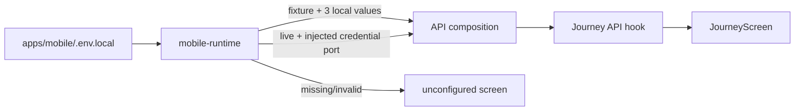

# M22 mobile API runtime boundary

`apps/mobile` は起動時に `EXPO_PUBLIC_API_MODE` を明示的に読み、fixture、live、unconfigured のいずれかを選ぶ。未設定・`disabled`・不正値は unconfigured として画面に設定エラーを表示する。fixture へ暗黙に切り替えない。



開発用fixtureは、`EXPO_PUBLIC_API_MODE=fixture`、`EXPO_PUBLIC_API_BASE_URL=http://localhost:8787`、`EXPO_PUBLIC_FIXTURE_APP_TOKEN`、`EXPO_PUBLIC_FIXTURE_DEVICE_ID`、`EXPO_PUBLIC_FIXTURE_OWNER_CREDENTIAL`をすべて設定した場合だけ生成される。空欄の example 値、推測したcredential、端末保存を代用する固定値は接続条件を満たさない。
`EXPO_PUBLIC_ENVIRONMENT`を明示する場合、fixtureは`dev`でのみ許可する。

live は HTTPS endpoint と `ApiCredentialProvider` が必要である。`App` は `useNativeMobileRuntime` から非同期に初期化し、hostが `nativeAuthority` を明示した場合にSecureStoreを選択する。環境・API origin・storage scopeを照合し、資格が未登録・破損・取得不能なら接続しない。資格の発行やApp Attest bootstrapは別の未完了実装であり、SDKの導入だけではlive接続は有効にならない。`APP_TOKEN`、provider key、owner credential の実値をリポジトリやfixture exampleへ書かない。

EAS の development profile は `disabled`、internal/external profile は `live` を明示する。live profileへfixture credentialを設定する経路はなく、資格ポートが未注入なら接続しない。ローカルfixtureは `apps/mobile/.env.local` で明示的に選ぶ。

Expo の環境変数は `apps/mobile` を作業ディレクトリにして読み込む。`apps/mobile/.env.example` は名前だけを示すテンプレートであり、実行時は追跡されない `.env.local` を作成する。root の `.env.example` や Wrangler の `IMA_RUNTIME_MODE` は Worker preflight 用で、mobile bundleのruntime modeを暗黙には変更しない。

```sh
cd apps/mobile
cp .env.example .env.local
# .env.local で fixture の3値をローカルWorker用に設定する
bun run start
```

`mobile-runtime.ts` は `process.env.EXPO_PUBLIC_*` の静的なプロパティ参照を使う。Expo bundlerが置換できない動的な `process.env[name]` lookup や、liveへのfixture fallbackは実装しない。

## 実Workerとの表示コンテキスト検証

HTTP接続の候補表示コンテキストは `workers/api/tests/runtime-production-http.test.ts` で検証する。`SELF.fetch` から実HTTP router、`ProductionThreadDO`、同じproduction factoryへ到達し、`cardSetId`、選択候補、主提案順、除外候補がモデルへ渡ることを観測する。旧cardSetはHTTP `409 CONFLICT`となり、`evictDurableObject` 後もowner/threadに束縛された除外IDをSQL参照から復元する。

この検証は固定fixtureのモデル・providerを使うため、実OpenAI/Placesや実機の成功を意味しない。通常のruntime-native globから分離した専用configを `test:runtime-native` の後段で実行し、`bun run test:runtime-production-http` で単独再実行できる。

## 端末SDKの初期化

`native-mobile-runtime.ts` がSecureStore、位置service、必要時のSQLiteを順に構成する。初期化全体に共通の期限を設け、取消・遅着結果を破棄する。SQLite名は環境・API origin・storage scopeの組から作り、同じownerラベルを別環境で再利用しても共有しない。取得したcredentialをファイル名や公開環境変数へ入れない。

SQLiteは明示された `nativeAuthority` を確認した後、`sqlite: null` で無効化されていない場合に開く。`referenceRetentionFor` がない状態で保存可能なpolicyを作らない。hostから `journeyApi` を渡した場合はnative初期化をバイパスし、host所有の接続を使う。位置serviceの生成時には権限要求せず、送信操作で初めて取得する。

`729d547` では固定SDK境界を使う初期化・取消・期限・close試験と型/lintを検証した。実Expo SDK、React mount、端末の再起動、署名付きiOS起動は未検証である。

`3af2b9c`で同じSQLiteのlocal restoreとcontrollerの参照保存を接続した。保存するのはthread/responseのID、revision、期限と端末の初観測時刻であり、サーバー作成時刻や本文を補わない。実controllerとNode SQLiteファイルDBで再接続と期限拒否を検証した。履歴一覧の読み出しは`2b42b96`で追加した。

`da61def`で同一runtimeのSQLiteから設定・履歴serviceを構成し、Appから画面へ渡す。履歴は検索原文を持たない参照一覧として表示し、取得不能と0件を区別する。controller更新・foreground復帰・最短期限で再読込し、購読の再開後も旧callbackを採用しない。保存設定は予算・徒歩・ユーザー入力の駅名を復元し、駅の対応判定はunknownのままにする。
