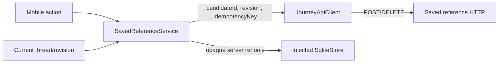

# M22 mobile saved-reference service

保存操作は、公開候補IDだけをWorkerへ渡すAPI clientと、owner-scoped referenceだけを端末SQLiteへ保存するserviceを分ける。

`createSavedReference` は `POST /v1/threads/:threadId/saved` を使い、request bodyは `candidateId`、現在の `revision`、`idempotencyKey` に限る。provider ID、provider payload、表示名、座標はmobileから送らない。clientは成功レスポンスの `requestId`、schema、candidate ID、server refを検証し、request candidateと異なるcandidateの応答を契約エラーにする。

serviceは保存前に owner-scoped reference retention を確認し、処理前後で `threadId` と `revision` の現在scopeを再確認する。hostはsession expiry後に `currentScope()` が `null` を返すことで期限切れ応答を拒否する。service自身は時計からexpiryを再計算しないため、この単位ではclock境界を直接検証しない。scope変更、取消、期限切れ応答は端末SQLiteへ反映しない。同じidempotency keyの再試行はserverの結果を再利用でき、端末側もserver refで重複を抑える。

`remove` は `DELETE /v1/saved/:savedPlaceRef` の冪等操作である。local IDを受け取る場合も、SQLite行のserver refが一致することを確認してから削除する。scope変更後にserver削除が先に成功する可能性はあるため、遅着抑止はmobileのlocal/UI反映を止める責務として扱い、server側の副作用を取り消すとは解釈しない。同じkeyのretryでserver状態を再同期する。

端末側の保存対象は期限付きmetadataとopaque server refだけで、provider名、provider record ref、候補表示名、座標、観測値は保存しない。SQLite接続は正式な `SqliteStore` portで注入し、Expo SQLiteやSecureStoreをこの単位で追加しない。`createMobileJourneyRuntime` に `savedReference` を渡すと、同じAPI client/controllerの現在scopeを使うstorageが `binding.storage` として構成され、`JourneyScreen` のhookへ伝播する。SQLite adapterまたはreference policyが未注入の場合は保存不可のままで、一覧refreshと実端末adapterの組み立ては後続単位である。
