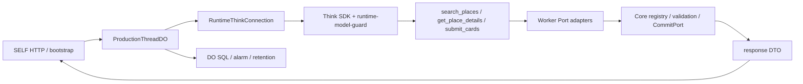

# M23 / #24 実SDK・HTTP・DO 統合対応表

2026-09-11時点の実装とテストの対応表。対象は `workers/api` の本番runtime factory、Cloudflare Worker HTTP、Think SDK、Durable Object である。テスト用に注入したモデルと外部HTTP応答は固定fixtureであり、実OpenAI・実Google API・実機の成功を示さない。未確認事項は合格として扱わない。

## 実行経路



`runtime-production-*` は実Think SDKを実行するテスト用DOであり、モデルは `RuntimeGateModel` のfixture、Places応答は注入fetcherである。`runtime-native-http.test.ts` は `SELF.fetch` からruntime route、DO、同じfactoryへ到達する。bootstrap単体は入力・再送・取消のHTTP境界を直接検査する。

## 4領域の対応

### 1. Tool制限

| 要件                                                  | 実経路とテストID                                                                                                                                    | 状態・証拠                                                                                                                        |
| ----------------------------------------------------- | --------------------------------------------------------------------------------------------------------------------------------------------------- | --------------------------------------------------------------------------------------------------------------------------------- |
| 公開Toolを3つに限定し、毎step・再生成で同じ定義を渡す | `workers/api/tests/runtime-native/runtime-native.test.ts` / `runs invalid submit, details repair, and valid submit through the production ThreadDO` | 実SDK/DOの各model requestが `get_place_details`, `search_places`, `submit_cards` の完全一致。Tool定義名の包含だけでは判定しない。 |
| final-onlyでreadを実行しない                          | `workers/api/tests/runtime-native/runtime-production-default.test.ts` / `returns a typed failure when final-only output tries to call a tool`       | final-only modelが `search_places` を返してもfetch 0・確定0・replay不可。                                                         |
| final-onlyでsubmitを実行しない                        | 同 / `blocks a final-only submit before the CommitPort can run`                                                                                     | submitを返してもCommitPort前にtyped failure、確定0。                                                                              |
| 既定Toolの再生成・不正入力                            | `workers/api/tests/runtime/runtime-model-guard.test.ts` / mixed provider step, arbitrary provider rejection                                         | SDK guardの単体証拠。未知Tool名を実ProductionThreadDOから返すケースは未実測であり、単体guardを本番経路の代替にはしない。          |

### 2. 応答

| 要件                                         | 実経路とテストID                                                                                                                          | 状態・証拠                                                                                                                                                                               |
| -------------------------------------------- | ----------------------------------------------------------------------------------------------------------------------------------------- | ---------------------------------------------------------------------------------------------------------------------------------------------------------------------------------------- |
| search→details→submit→response→replay→次turn | `workers/api/tests/runtime-native/runtime-production-default.test.ts` / `runs default search, details, submit, replay, and the next turn` | 実Think/DOでcards、responseId/revision、reference-only replay、次revisionを確認。                                                                                                        |
| 候補0件                                      | `workers/api/tests/runtime-native/runtime-production-candidate-count.test.ts` / `returns a completed no-result message...`                | 実SDK/DOの検索応答 `places: []`、model context候補0、details/submit 0、message完了。候補を捏造しない。                                                                                   |
| 候補1件                                      | 同defaultテスト                                                                                                                           | provider fixtureの1件をcardsへ確定する既存経路。                                                                                                                                         |
| 候補2件                                      | `runtime-production-candidate-count.test.ts` / `carries two provider candidates...`                                                       | 実検索応答2件、次model stepの候補数2、両候補details→hero+alt submit→cards 2件を確認。                                                                                                    |
| 空final・既存cards                           | `workers/api/tests/runtime-native/runtime-native.test.ts` / `returns the committed cards when the SDK emits an empty final response`      | submit後の空finalをエラーにせず、確定cardsを一度だけ返す。                                                                                                                               |
| HTTP初回・GET replay・duplicate・旧revision  | `workers/api/tests/runtime-native/runtime-native-http.test.ts` / initial response, same-body duplicate, old revision                      | SELF→HTTP→DOの公開schema、reference-only replay、CONFLICT/STALEを確認。 `workers/api/tests/http/bootstrap-runtime.test.ts` はbootstrap入力・metadata-only replay・cancel境界の補助証拠。 |

### 3. 修正

| 要件                                | 実経路とテストID                                                                                                                                                    | 状態・証拠                                                                                                                 |
| ----------------------------------- | ------------------------------------------------------------------------------------------------------------------------------------------------------------------- | -------------------------------------------------------------------------------------------------------------------------- |
| invalid submit→details→valid submit | `workers/api/tests/runtime-native/runtime-native.test.ts` / `runs invalid submit, details repair, and valid submit...`                                              | 実DOでdetailsのみを追加取得し、最後のCommitPort確定1回を確認。                                                             |
| readとsubmitの混在                  | 同 / `rejects a mixed read and submit batch...`                                                                                                                     | guard段階で拒否し、両Portの副作用0。                                                                                       |
| provider failure                    | `runtime-native.test.ts` / `returns a typed provider failure without a commit`、`runtime-native-http.test.ts` / `maps a scripted provider failure...`               | 任意provider本文を再throwせず固定 `RUNTIME_FAILED` / HTTP `PROVIDER_UNAVAILABLE`へ変換。raw provider本文は結果へ出さない。 |
| cancel・遅着・旧turn                | `runtime-native-cancellation.test.ts` / waiting model, stale lifecycle turn; `http/integration/thread-runtime-admission.test.ts` / late completion                  | response・commit・Tool副作用を残さない。                                                                                   |
| 予算終了・修正上限                  | `runtime-production-default.test.ts` / `returns a typed failure without another model call after budget exhaustion`; `runtime-model-guard.test.ts` / zero allowance | 追加model call 0。意味的修正上限と通信retryを別扱いする。                                                                  |

### 4. 保持

| 要件                                      | 実経路とテストID                                                                                                                                            | 状態・証拠                                                                                                                                                                             |
| ----------------------------------------- | ----------------------------------------------------------------------------------------------------------------------------------------------------------- | -------------------------------------------------------------------------------------------------------------------------------------------------------------------------------------- |
| history/cardSet/originalTurnsの次turn復元 | `runtime-production-default.test.ts` / `carries committed history and cards across a follow-up...`                                                          | 実DOの次turnでhistory/cardSetをmodelへ渡し、追質問は追加検索なし、条件変更はcardSetを置換。                                                                                            |
| DO eviction後の参照復元・期限・削除       | `runtime-production-context.test.ts` / reference restore, clear/delete, fixed expiry admission; `runtime-production-default.test.ts` / durable 05:00 anchor | anchorを延長せず、期限後admission拒否、削除後replay/context/photo参照を失効。alarm遅延は別fixture。                                                                                    |
| alarm・削除再試行                         | `runtime-production-alarm.test.ts` / retry・corrupt anchor・遅延計測                                                                                        | SDK lifecycleのalarmを上書きせず、失敗時retry状態を保持。                                                                                                                              |
| 保存前/失敗経路のcanary                   | `runtime-production-retention-audit.test.ts` / before-write inventory, typed failed turn                                                                    | 観測できるSQL/SDK公開面でprovider canaryの残存を検査。許可されたユーザー原文と禁止provider payloadを分ける。                                                                           |
| 未監視保存面                              | 同保存監査                                                                                                                                                  | `thread_state`、`runtime_turn`、FTSの一部はCAS/索引副作用のため保存後監査、`_cf_KV` と `_cf_METADATA` は公開SQLから未観測。CAS/FTS/platformを含む「全保存先の保存前書込み0」は未証明。 |

## 失敗分類とログの境界

`UPSTREAM_UNAVAILABLE` はSDK/fixture内部で観測される固定失敗コードとして記録する。公開runtime結果は `RUNTIME_FAILED`、HTTPは `PROVIDER_UNAVAILABLE` へ変換し、providerの例外本文・canary・secretを結果や固定分類メッセージへコピーしない。`native-result.test.ts` は任意文字列 `provider-secret-canary` がtyped failure本文に現れないことを確認する。

SDK自身がstderrへ出す固定 `UPSTREAM_UNAVAILABLE` の出力と、raw provider本文がstderrへ流れないことは別の主張である。過去の実行では前者を観測したが、2026-09-11の親実行では再現していない。後者のSDK内部stderrを捕捉する証拠はまだない。このため「SDKログ全体の非漏出」は未確認として残す。

## 実行と残件

この単位の実行対象は次の通り。

```sh
bunx vitest run --config vitest.runtime-native.config.ts
bunx eslint workers/api/tests/runtime-native/runtime-native.test.ts \
  workers/api/tests/runtime-native/runtime-production-worker.ts \
  workers/api/tests/runtime-native/runtime-production-provider-fixture.ts \
  workers/api/tests/runtime-native/runtime-production-candidate-count.test.ts
bunx prettier --check workers/api/tests/runtime-native/runtime-native.test.ts \
  workers/api/tests/runtime-native/runtime-production-worker.ts \
  workers/api/tests/runtime-native/runtime-production-provider-fixture.ts \
  workers/api/tests/runtime-native/runtime-production-candidate-count.test.ts \
  docs/design/m23-runtime-integration.md
```

bootstrapの初回作成・router/security境界、実OpenAI/Google API、実機、SDK内部stderr捕捉、CAS/FTS/platformの全保存前監査は別担当または未確認である。これらを本表のfixture合格から推測して完了扱いにしない。
