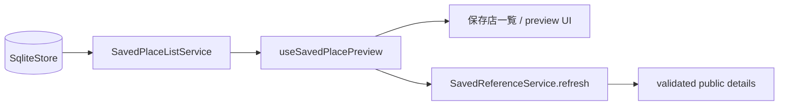

# M23 保存店一覧・preview 境界

## 結論

保存店の一覧は端末 SQLite の owner-scoped opaque reference と表示用メタデータを投影し、
ユーザーが選択した1件だけを既存の threadless refresh API で再取得する。provider payload、
座標、観測値はこの一覧状態へ保存しない。SQLite または refresh service が未注入なら、空一覧
として扱わず `unavailable` を返す。

## 境界と期限

`SavedPlaceListService` は `starred` かつ有効な opaque `serverSavedPlaceRef` の行だけを返す。
`full` 行は session/display/retention/deletion の期限をすべて表示判定に使い、
`reference_only` 行は session を越えて参照自体を残す。ただし表示・保持・削除期限を越えた
行は返さない。reference-only の名称・地域は SQLite 行が壊れていても再公開しない。
不正な日時、壊れた ref、unavailable 行は fail closed とする。時計の実測値が一度でも
過去へ逆行した場合は時計を `clock_unavailable` としてラッチし、一覧・preview・期限
timer の再評価と遅着応答を同じく拒否する。

preview controller は選択時に1件だけ refresh を開始する。close、reload、別選択、外部 abort、
unmount 後に返った結果は状態へ反映しない。選択中の最も早い期限に再確認を予約し、期限到来
または応答受信時の期限超過で preview を閉じる。refresh 応答の各 public field に付く evidence
の session/display/retention/deletion 期限も同じ再確認対象に含める。refresh の失敗は一覧の空状態へ変換せず、
`api`、`aborted`、`retention_denied` などの typed failure として保持する。
foreground復帰時は公開 `recheck` を呼び、background中に止まったtimerだけへ期限判定を依存しない。

## 実装範囲

`apps/mobile/src/services/saved-place-list.ts`、`state/saved-place-preview.ts`、
`hooks/useSavedPlacePreview.ts` が一覧投影、選択世代、期限、取消、遅着抑止を担当する。
既存 `Drawer`/`JourneyScreen` への描画配線と、保存店を次の相談 turn の
`savedPlaceRefs` へ渡す操作は後続単位で行う。
