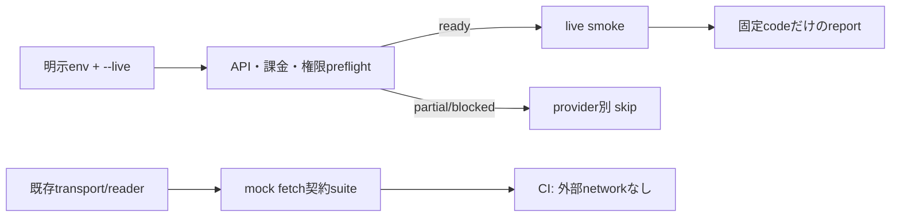

# M24 Provider検証

## 目的

M24はPlaces Text Search、Place Details、Routes、Photo、終電datasetの契約境界を、外部課金なしで再現できるテストと、明示実行だけを許すlive smoke runnerに分ける。Fixtureの成功は実provider・アカウント・課金・権限の成功を意味しない。HPの契約suiteはM32（#33）の担当であり、この単位へ混ぜない。



## 契約suite

既存のprovider transport試験を正規の境界検証として再利用し、新規の
`workers/api/tests/providers/provider-smoke.test.ts` は5系統を同じmock fetch境界から実行する。検索・Details・Routes・Photoは実transportへ接続し、終電はWorker側の`createJourneyReader`（Coreの公開schemaを利用）へ生成fixtureと空datasetを渡す。実dataset adapterはCLIへ未接続であり、fixtureはlive成功に数えない。

| provider | 契約境界                                                 | 不成立時の扱い                                              |
| -------- | -------------------------------------------------------- | ----------------------------------------------------------- |
| Places   | 明示field mask、1 request、空配列とschema                | `NO_DATA`はprovider応答として区別し、malformedは失敗        |
| Details  | identityの`id`と`displayName.text`、要求fieldのみ        | ID echoだけは`IDENTITY_INCOMPLETE`                          |
| Routes   | 1×1 directed matrix、condition、duration/distance        | `ROUTE_NOT_FOUND`は`NO_ROUTE`（no_data）、不正elementは失敗 |
| Photo    | metadata→許可hostの画像stream、body上限・timeout・cancel | keyをURLへ出さず、stream失敗は固定code                      |
| Journey  | 合成recordのknown、active datasetなしのdisabled          | 未投入は成功にせずdisabled/skip                             |

429、5xx、timeout、redirect、malformed response、field mask、取消は各transportの既存試験で検査する。集約試験は同じ実装を再実装せず、これらの入口が一つのmock fetchから組み合わさることを確認する。

## live smoke

runnerは本番bootstrapへimportしない`workers/api/tooling/provider-smoke/runner.ts`に置く。`workers/api`の`typecheck` scriptにはtooling用tsconfigも含め、live smoke自体は次で明示実行する。

```sh
bun run workers/api/tooling/provider-smoke/runner.ts --live --json
```

`--live`がない実行は`LIVE_FLAG_REQUIRED`、設定不足は終了コード2である。終了コードは次の意味を持つ。

- `0`: 実live sourceとして実行したproviderが契約を満たした。Routesのno-routeは`outcome=no_data`として明示される。
- `1`: upstream failure、schema failure、fixture sourceの混入など、実行した検査が失敗した。
- `2`: preflight未完了またはdataset未設定によるskip。未設定をpassへ変換しない。

runnerが読む設定名は次の通り。値そのものはreportへ出さない。

| 区分       | 環境変数                                                                        | 用途                             |
| ---------- | ------------------------------------------------------------------------------- | -------------------------------- |
| 実行確認   | `IMA_PROVIDER_LIVE_CONFIRM=YES`                                                 | 有料live実行の明示opt-in         |
| 課金確認   | `IMA_PROVIDER_BILLING_CONFIRM=YES`                                              | operatorが課金設定を確認した宣言 |
| 権限確認   | `IMA_PROVIDER_PERMISSION_CONFIRM=YES`                                           | API有効化・権限を確認した宣言    |
| key        | `GOOGLE_PLACES_API_KEY`, `GOOGLE_ROUTES_API_KEY`                                | Worker secret名。ログへ出さない  |
| 入力       | `GOOGLE_SMOKE_SEARCH_QUERY`, `GOOGLE_SMOKE_PLACE_ID`, `GOOGLE_SMOKE_PHOTO_REF`  | 実アカウントで検証する対象       |
| Routes入力 | `GOOGLE_SMOKE_ROUTE_ORIGIN_PLACE_ID`, `GOOGLE_SMOKE_ROUTE_DESTINATION_PLACE_ID` | 1×1 matrixの対象                 |
| 終電       | `JOURNEY_DATASET_LIVE_REF`                                                      | 実datasetの選択を示す参照名      |

課金・権限のpreflightはoperator宣言の検査であり、Google側のアカウント合格を遠隔確認するものではない。終電の実dataset adapterはM35（GitHub #36）/runtime validation ownerが`journeyProbe`として注入する。CLIでdataset adapterが未接続なら、APIの結果をfixtureで補わず終電だけ`DATASET_NOT_CONFIGURED`としてskipする。live dataset adapterをCLIから設定・実行する検収は未完了である。

CIはkeyを設定せず、外部fetcherを呼ばない契約suiteだけを実行する。keyを設定したlive検収、API有効化、請求地域、帰属設定の証跡はM35が所有する。HTTPの`redirect: manual`、固定field mask、secretをURLへ入れない境界は、実装の [Places Search transport](../../workers/api/src/providers/places-search/transport.ts)、[Place Details transport](../../workers/api/src/providers/places-details/transport.ts)、[Routes transport](../../workers/api/src/providers/routes/transport.ts)、[Photo transport](../../workers/api/src/providers/photo/transport.ts) と各契約試験で確認する。Cloudflareの一般的な運用設定やplatform invocation logの検収はこの単位に含めない。

## 検証コマンド

```sh
bunx vitest run workers/api/tests/providers/provider-smoke.test.ts
bun run --cwd workers/api typecheck
bunx tsc -p workers/api/tooling/tsconfig.json --noEmit
bunx eslint workers/api/tooling/provider-smoke workers/api/tests/providers/provider-smoke.test.ts
bunx prettier --check workers/api/tooling/provider-smoke workers/api/tooling/tsconfig.json workers/api/tests/providers/provider-smoke.test.ts
```

`workers/api/tooling/tsconfig.json`はCLI entryをWorker本番tsconfigへ混ぜずに型検査するための検証用設定である。toolingからproduction bootstrapを参照せず、provider transportの依存だけを注入する。
