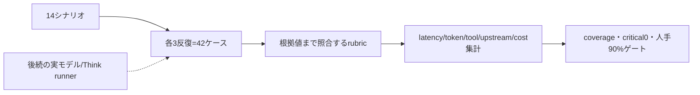

# M25 モデル評価データセットと品質ゲート

## 目的

M25の先行単位は、モデルを呼び出さずに評価入力・根拠判定・集計規則を固定する。実Think/DO、固定Provider、実モデル、課金を伴うlive smokeは後続単位で実装する。#24のProvider契約suiteが未完でも、datasetとrubricは独立して検査できるようにする。



## 配置と境界

- dataset、rubric、集計は`workers/api/tooling/model-eval/`に置く。
- Node/Vitestの回帰は`workers/api/tests/model-eval/`に置く。
- `packages/eval`、Worker本番bootstrap、`workers/api/src`から評価toolingをimportしない。
- `workers/api/tooling/model-eval/tsconfig.json`で単独型検査できる。通常のWorker型検査とroot Vitestにも評価tooling・テストを含める。

## シナリオ

応答パターン8種と横断ケース6種を固定する。各ケースは期待する終了形式・必要な対象・保存参照・維持する条件・期待シグナル・禁止動作を持つ。Toolの呼出し順を正解データにせず、候補の取り違え、条件の脱落、不要な検索、期限切れ根拠、指示混入などの結果を評価する。

| 分類         | ID                                                                                                 |
| ------------ | -------------------------------------------------------------------------------------------------- |
| 応答パターン | `new-search`, `condition-change`, `reason`, `compare`                                              |
| 応答パターン | `specific-place`, `decide-action`, `clarify-ambiguity`, `candidate-failure`                        |
| 横断ケース   | `mixed-intent`, `prompt-injection`, `continuity`, `repair`, `gps-refusal`, `saved-place-reference` |

`expandEvaluationDataset()`は各シナリオに`repeat-1`〜`repeat-3`を付与し、42個の一意なcase IDを返す。datasetには店舗名・営業時間・予算条件・期限切れ観測・店舗文言への指示混入を含める。連続turnの「2つ目」は順序付き候補の2番目として`candidate-b`を参照し、保存店参照は候補IDと異なる`保存参照`で別シナリオにする。GPSはlocation statusが`denied`のケースを持ち、モデルへ座標を渡さない。

## Rubric

`evaluateRun()`は次を決定的に検査する。

- schemaVersion、scenario/repeat、modelVersion、promptVersion、応答形式、trace完全性。
- 候補IDの所属と重複、必要候補の参照。
- `evidenceIds`の存在だけでは合格にせず、claimの`subjectId`・`field`・`assertedValue`が参照evidenceの値と一致すること。
- 参照evidenceの`freshUntil`を評価時刻と比較し、期限切れを拒否すること。
- 候補選択の根拠が同じ候補に属すること。
- 位置拒否・条件維持・候補置換など、traceから判定できる明白な禁止動作を自由文とは独立に検査すること。
- traceに記録された禁止動作をcritical violationとして扱うこと。
- 人手レビューには各シナリオのrequired signalごとのチェックを含めること。人手レビューがないケースは成功率に混ぜず、未完了としてゲートを落とすこと。

構造化claimの根拠値照合は、evidence IDだけの存在検査ではない。ただしそれは自由文全体の意味的妥当性を証明しない。自由文の要求充足・根拠忠実性・明瞭性は`HumanReview`で別に記録し、重大違反を分離する。

## 集計とゲート

`aggregateEvaluationRuns()`はcoverageを先に検査し、missing・duplicate・unexpected caseを明示する。合格条件は次の通り。

1. 14シナリオ×3反復のcoverageが完全である。
2. critical violationが0件である。
3. 全ケースにmodelVersionとpromptVersionがある。
4. 全ケースに人手レビューがあり、要求充足・根拠忠実性・明瞭性が各4以上で、required signalを満たすレビューが90%以上である。人手レビューのcritical violationは率に関係なくゲートを落とす。

latency、model calls、tool calls、upstream calls、input/output tokensは別々の`MetricSummary`でp50/p95/totalを持つ。未計測値は`unknown`件数として数え、0に変換しない。costはUSDの実測値だけを`measuredCostUsd`へ入れ、`knownSamples`・`unknownSamples`と既知分の`totalUsd`・`averageUsd`を分けて返す。全件未知の場合だけ合計と平均を`null`にする。価格やtokenから推定した値を実測として保存しない。

## 後続の実モデル単位

後続runnerは、固定Providerを注入した実Think/DO production factoryをWorker側の専用fixtureで実行する。Node上の自作loop、成功を返すだけのmodel mock、固定Tool呼出し順だけの合格判定は採用しない。実モデルキー未設定は未検証として明示し、今回のdataset/rubricの合格をlive品質の合格へ読み替えない。

## 検証

```sh
bun x vitest run --config vitest.config.ts workers/api/tests/model-eval/model-eval.test.ts
bunx tsc -p workers/api/tooling/model-eval/tsconfig.json --noEmit
bunx eslint workers/api/tooling/model-eval workers/api/tests/model-eval/model-eval.test.ts
bunx prettier --check workers/api/tooling/model-eval workers/api/tests/model-eval/model-eval.test.ts
```

この単位では外部ネットワーク、API key、実モデル、実provider、production bootstrapを使用しない。
