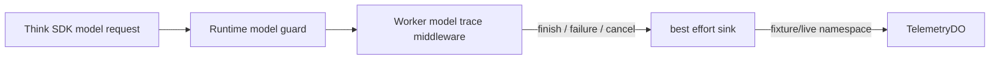

# M26 model call trace

この単位では、実際にAI SDKのV3モデルへ渡った `doStream` / `doGenerate` の呼出しを、1回につき1件の `operation: "call"` として記録する。既存のturn traceは最終的なDO結果を記録するため、両者を同じレコードへ混ぜない。

`runtime-production-factory` は、production hostからsinkを受け取ったときだけ実モデルをこのmiddlewareで包む。通常の呼出しでは既存のguardが予約・取消・期限・出力検証を担当し、trace middlewareはモデル呼出しの開始と結果だけを観測する。retryで実際に2回モデルを呼べば2件、reference replayでモデルを呼ばなければ追加0件になる。

V3の `inputTokens.total` と `outputTokens.total` がどちらも有限な安全整数で上限内のときだけ合計を `tokenCount` として保存する。どちらかが欠ける、非有限、範囲外の場合は値を省略する。durationも単調時計が逆行・非有限・上限超過なら省略する。料金、API要素数、prompt、Tool結果、座標、secret、photo token、生のprovider errorは保存しない。

streamは `finish` を受け取って正常完了とし、finishなしの終了や途中のerror partは固定 `INTERNAL`、signal abortまたはconsumer cancelは固定 `CANCELLED` とする。provider例外は元の例外を呼出し元へ伝播し、trace側で安全な固定分類だけを保存するため、例外本文をモデル・Telemetry・ログへ複製しない。

trace IDは owner、thread、turn、revision、call IDを含むSHA-256 digestで作る。call IDは呼出しごとに生成し、同じ入力の再配送を意図せず同一callへまとめない。fixtureとliveは既存の `telemetry-fixture` / `telemetry-live` Durable Object namespaceで分離し、runtime modeだけからprovider名を断定しない。実際にproduction factoryがOpenAI providerを構成した場合だけ `provider: "openai"` を付け、fixtureや注入modelでは省略する。

書込みpipelineはdigest生成からvalidated recordの保存までを構成してから `ctx.waitUntil` へ渡す。保存失敗やschedulerの同期throwはruntime結果へ影響させず、失敗通知も固定分類に限定する。`runtime-model-trace.test.ts` は成功stream、generate、finishless、途中error、consumer cancel、signal abort、retry相当の複数実呼出し、usage欠落、異常duration、遅延sinkを検証する。`runtime-production-trace.test.ts` は実DO・実factory・fixture model・TelemetryDOを通したcall traceとturn traceの一件性、replayの重複排除、禁止payload不在、fixture/live分離を検証する。

AI SDK内部が独自に出すログや、実OpenAIアカウントのtoken使用量はこのfixture単位では証明しない。fixtureのtoken usageはV3結果に明示された値だけを測定し、未提供のproviderメタデータを0や推定値へ変換しない。
