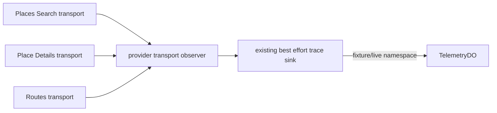

# M26 provider call trace

この単位では、Worker の型付き Places Search、Place Details、Routes transport の実呼出しを、呼出し完了ごとに `operation: "provider"` として記録する。既存の model `operation: "call"` と turn trace は別の記録なので、同じ呼出しを二重に数えない。

各 transport は `fetcher` を実際に開始する直前に observer を開始し、Promise が解決または拒否した時点で一件を出力する。呼出し元へは結果と元の例外をそのまま返す。timeout、rate limit、cancel、既知の provider unavailable は固定 result code へ分類し、未知の例外は `INTERNAL` として記録したうえで元の例外を再送出する。事前の入力・secret・cancel 検査で fetcher を呼ばなかった場合は記録しない。observer の開始・完了フックが失敗しても transport の結果と例外は変えない。

Routes の `apiElementCount` は `GoogleRouteMatrixRequestSchema` を通過した request の `origins.length * destinations.length` だけを記録する。この値は provider request の要素数であり、料金・使用量・請求額の推定値ではない。Search、Details、LastTrain dataset、Photo はこの単位で要素数を作らない。token、料金、検索本文、座標、provider URL、API key、photo token、provider error 本文も trace に含めない。

trace ID は owner、thread、turn、revision、provider、呼出しごとの call ID を SHA-256 で識別する。同じ request を retry すれば実呼出し数だけ別 trace が増え、reference replay のように transport を呼ばなければ増えない。fixture と live の分離は既存 host の `telemetry-fixture` / `telemetry-live` sink に委ね、provider wrapper は namespace を推測しない。

今回の production wiring は、Core の candidate identity 接続と同時編集しないため wrapper、専用テスト、変換 sink の範囲で検証する。親の直列配線では production factory から同じ sink と server-side identity、clock を Search / Details / Routes の三つの wrapper へ渡す。factory が未接続の状態で fixture の成功を live provider の稼働証明として扱わない。

`runtime-provider-trace.test.ts` は実 transport と fixture fetcher を通し、三種類の成功呼出し、Routes 2×3 要素、timeout、cancel、rate limit、未知例外、undefined rejection、retry の call ID 分離、事前拒否時の fetch/要素数0、observer フック失敗の隔離、best effort 保存、禁止 payload 不在を確認する。実 API、料金 meter、SDK 内部ログ、Photo の実 fetch はこの単位の検証範囲外であり、別の接続単位で確認する。
