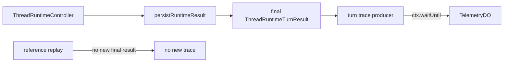

# M26 runtime trace producer

この単位では、実行済みの turn の最終結果を `TelemetryDO` へ best effort で記録する。
SDK の途中結果ではなく、`ThreadRuntimeController` が `persistRuntimeResult` を完了した直後の値を記録元にする。

`traceId` は operation、`threadId`、`turnId`、`revision` を区切って SHA-256 digest にし、保存可能な有界文字列へ変換する。同じ turn の再送や reference replay は同じキーを使うため、TelemetryDO の idempotent write により新しい call として増えない。別 thread または revision は別 trace になる。

記録するのは operation、status、固定 result code、発生時刻、検証可能な duration だけである。duration が時計逆行、非有限、または上限超過になった場合は記録しない。token 数、API 要素数、料金、provider 名はこの単位では未計測として省略し、推定値やゼロ値を作らない。原文、座標、secret、photo token、provider URL も渡さない。

書込みは `TELEMETRY` binding がある production host だけで構成され、binding がない場合は no-op になる。`IMA_RUNTIME_MODE` は `fixture`、`live`、その他を `unknown` に正規化し、`telemetry-fixture`、`telemetry-live`、`telemetry-unknown` の別 Durable Object 名へ分離する。fixture の probe が live 集計へ混ざることはない。同期 throw、非同期 reject、`waitUntil` の失敗は固定分類 `write_failed` へ分類できる sink 境界で吸収し、turn の応答・取消・commit を変更しない。この単位では production 側の失敗通知 callback は接続せず、失敗件数を記録したとは主張しない。保存失敗時の生 error はログや trace payload に含めない。

`runtime-production-trace.test.ts` は production DO、実 SDK composition、fixture model/fetcher、実 `TelemetryDO` を通し、最終結果の一件性、replay の重複排除、fixture/live namespace の分離、禁止 payload の不在を確認する。fixture provider の成功は live provider の稼働証明ではない。provider/model ごとの token・API 要素計測は後続単位で実装する。
