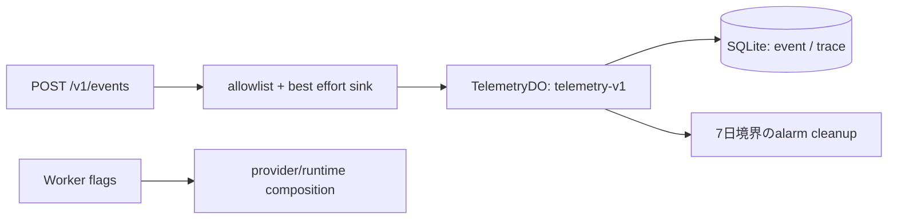

# M26 テレメトリと運用 flags

## 目的と境界

M26 は Worker 内の障害判定と運用停止を支える最小テレメトリを追加する。公開イベント名だけを `packages/contracts` に置き、保存形式、trace、集計、保持処理は `workers/api` が所有する。集計結果を返す公開 HTTP API は追加しない。

`TelemetryDO` の保存キーは `(owner_scope_ref, event_id)` または `(owner_scope_ref, trace_id)` である。同じ owner の同じ ID は同一内容だけ冪等に受け付け、内容が異なる再送は conflict として扱う。別 owner の同じ ID は別スコープの記録になる。

## 保存する値

イベントと trace は固定 schema の allowlist で検証する。任意の error message、検索語、座標、資格情報、photo token、provider URL は保存しない。イベントの未知 `code` は固定 result code へ分類できないため破棄する。保存失敗は固定分類で通知し、生の SQL・provider エラーをレスポンスやイベントへコピーしない。

SQL の時刻列は epoch milliseconds の整数で保持する。入力の ISO 文字列は schema 検証後に payload の再現用値としてのみ残し、期間検索・削除・保持判定には整数列を使う。client 時刻がサーバー時刻より未来、または7日より古い場合は保存しない。読取で古い cutoff が指定されても、サーバー時刻から計算した7日境界より外側は返さない。

trace の `tokenCount` と `apiElementCount` は provider が実測して返した場合だけ集計する。`meteredCostUsd` は外部 billing meter の USD 値だけを受け、token 数や API 要素数から推定しない。未計測値は合計を `0` として測定済みに見せず、`*UnknownCalls` と `costUnknownCalls` で件数を分ける。

## 保持と障害時の動作

保持期間は7日で、DO の alarm が期限を過ぎた event/trace を削除する。DO 再生成時は既存 alarm を後ろへ延ばさず、保存済み最短期限を越えない次回 alarm を設定する。JSON 破損行は `TELEMETRY_ROW_INVALID` に分類し、パーサーの原文を外へ返さない。

イベント sink は best effort である。記録できない場合も検索、候補確定、共有などのプロダクト処理を失敗させない。ただし保存できたことを成功イベントとして偽装せず、内部の固定分類 callback で観測する。共有開始と配信成功、候補決定と訪問成功は同一イベントとして扱わない。

## Operational flags

`IMA_RUNTIME_MODE` は `live`、`fixture`、`disabled` のいずれかを明示する。未設定・不正値は `disabled` になり、live から fixture へ暗黙に切り替わらない。`IMA_KILL_SWITCH` は省略時だけ停止なし（既存設定との互換）とし、`false`/`0`/`off`/`disabled` を明示的な停止なしとして受け付ける。それ以外の不正値は停止側へ倒す。provider flag が無効、kill switch が有効、または mode が disabled の場合、その能力は disabled として composition へ渡す。flags は公開 schema、Core 制約、保存保持境界を無効化しない。

| 環境変数                                          | 対象                 |
| ------------------------------------------------- | -------------------- |
| `IMA_PROVIDER_PLACES` / `IMA_PROVIDER_HOTPEPPER`  | 店舗 provider        |
| `IMA_PROVIDER_LAST_TRAIN` / `IMA_PROVIDER_ROUTES` | 経路・終電 provider  |
| `IMA_PROVIDER_OPENAI`                             | モデル provider      |
| `IMA_SHARE_LINE_SCHEME`                           | 共有方式             |
| `IMA_KILL_SWITCH`                                 | 全 capability の停止 |
| `IMA_QUALITY_ENVELOPE`                            | 実装済み任意品質動作 |

実 API key がない環境では live 成功を生成しない。本番factoryはモデル停止時にruntimeを構成せず、Places停止時は検索・詳細の外部Portを無効にする。Routes/終電はhost設定とflagの両方を要求し、終電停止時はdatasetも読み取らない。写真HTTPはtokenの認可を維持し、有効なtokenでも停止中は外部fetchを行わない。fixtureの既定factoryは注入されたモデル・fetcherを要求し、liveクライアントへ切り替わらない。

Routes・写真の既定host設定、Hot Pepperの本番接続、runtimeからのtrace生成は別の残件である。flagを有効にしただけでは、それらの実装・設定・保持ポリシーが揃ったとは判定しない。

Wrangler の dev/staging/production 初期値と `.dev.vars.example` は各 provider flag と `IMA_KILL_SWITCH` を明示する。値を省略した provider は停止し、停止 switch は上記の互換既定を除き不正値を停止側へ倒す。

## 運用手順

1. provider 障害、予算超過、期限切れデータが疑われる場合は対象 provider flag、必要なら `IMA_KILL_SWITCH` を停止側へ変更する。fixture へ暗黙に切り替えず、live の欠測として扱う。
2. `TelemetryDO` の write result、固定 result code、duration、unknown 件数を確認する。raw error message、検索本文、token 本文をログへ追加しない。
3. SQLite の期限削除と alarm を確認し、必要なら DO を再起動しても保存済み最短期限を越えて保持しないことを確認する。障害中の記録失敗はプロダクト処理の再試行・復旧経路とは分離する。
4. 復旧後は provider を一つずつ有効化し、実 API が設定されている場合だけ live として検証する。キー未設定を fixture 成功で補わない。

`wrangler.jsonc` の `observability` は Cloudflare のプラットフォーム invocation log を制御する設定であり、TelemetryDO の7日削除対象ではない。プラットフォームログに URL、query、token が残る可能性と保持期間は別の運用設定で確認する。自前テレメトリの削除だけを根拠に、全ログが7日・機密情報なしとは報告しない。

## 検証

- Worker fixture: flags の未設定停止、kill switch、イベント allowlist、保存失敗の best effort、実測値と unknown 値の集計、7日境界。
- Worker integration: `POST /v1/events` から named `TelemetryDO` SQLite への保存、owner 別 ID、同一 ID conflict、未来・期限切れ時刻、epoch 時刻の offset 表現、古い cutoff の clamp。
- Migration: `TelemetryDO` は `wrangler.jsonc` の SQLite migration `v3` で登録する。D1 や実 API 呼出は使用しない。
