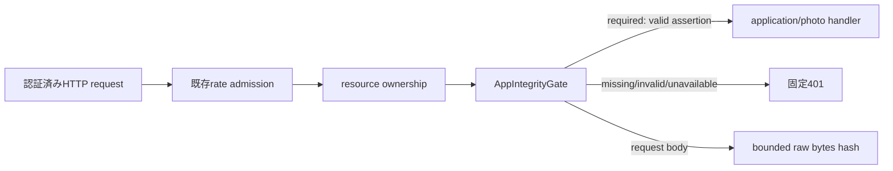

# M27 App Integrity 境界

## この単位の結論

この単位（#28）は、既存の認証済みHTTP入口へApp Attest判定を挿入し、nonce・owner/device bind・単回消費・key counter・request hashを検証する境界までを定義する。外部環境でApple環境が未指定、verifier未接続、store未接続の場合は成功へフォールバックしない。C3aではDurable Object storeをbootstrapで合成し、nonce/enroll/revoke HTTP endpointまで接続した。実Apple verifierとnative client接続は未完了である。

## 実装境界

- [packages/contracts/src/http.ts](../../packages/contracts/src/http.ts) はnonce response、enroll input、assertion headersのDTOとstrict schemaを公開する。attestation/assertion本文はopaque文字列としてWorker verifierへ渡し、公開DTOへ再出力しない。
- [workers/api/src/security/app-integrity.ts](../../workers/api/src/security/app-integrity.ts) は`AppIntegrityChallengeStore`、`AppIntegrityKeyStore`、`AppIntegrityVerifier`を注入する純粋な境界である。nonceは最大5分、consumeはowner/device一致かつ単回、登録済みkeyの再登録はcounterをresetせずconflict、counter更新は単調増加を要求する。
- [workers/api/src/security/app-integrity-http.ts](../../workers/api/src/security/app-integrity-http.ts) は内部failure codeを固定401へ変換する。routerはrate admissionとresource ownershipの後でgateを呼ぶ。
- [workers/api/src/http/input.ts](../../workers/api/src/http/input.ts) はbounded JSON parserから検証済みDTOと同じraw body bytesを返す。request hashは再シリアライズせず、そのbytesを使うため、bodyの1文字変更はassertion検証失敗になる。
- [workers/api/src/bootstrap.ts](../../workers/api/src/bootstrap.ts) は`IMA_ENV`、`APP_ATTEST_MODE`（enforcement）、`APP_ATTEST_ENVIRONMENT`（Apple環境）を分離する。staging/productionではrequired以外をrequiredへ固定し、Apple環境不明はrequired gateで拒否する。

## C2 Durable Object store

- [workers/api/src/security/app-integrity-do.ts](../../workers/api/src/security/app-integrity-do.ts) はSQLite-backed `AppIntegrityDO` と既存gate port adapterを提供する。nonceはowner単位、keyはkeyId単位で名前付きDOへ分散し、keyIdのowner間重複登録を同じSQLite primary keyで拒否する。
- nonceはissued/expiryをサーバー時計で検証し、期限・owner/device/environmentを確認した単回consumeとalarm cleanupを行う。keyはopaqueな`keyRef`だけを保存し、attestation/assertionや公開鍵材料は保存しない。C3aのbootstrap合成は、検証器が注入された場合だけこのadapterをgateへ接続する。
- counter更新・revoke・登録はDO内のSQLite transactionSyncでowner/device/environmentを再確認する。DO eviction後もSQLiteから再読できる。HTTPのnonce/enroll/revoke routeは下記C3aで接続し、実Apple verifierは未接続である。

## C3a lifecycle routes とbootstrap composition

- 公開経路は`GET /v1/attest/nonce`、`POST /v1/attest/enroll`、`POST /v1/attest/revoke`。既存のapp token・owner credential・device認証とrate admissionを通過した後、Worker注入の`AppIntegrityGate`へ委譲する。
- route bodyはstrict schemaかつ上限付きJSONとして検証し、request IDをheaderとbody/responseで一致させる。attestationやkey material、内部failure codeは公開レスポンスへ出さない。
- [workers/api/src/security/app-integrity-bootstrap.ts](../../workers/api/src/security/app-integrity-bootstrap.ts) がpolicyを解決し、`APP_INTEGRITY` bindingのDurable adapterと注入verifierを合成する。verifier、binding、または外部環境の検証可能なApple環境が欠ける場合はstoreを接続せず、required gateをfail-closedにする。
- [workers/api/tests/app-integrity/app-integrity-self.test.ts](../../workers/api/tests/app-integrity/app-integrity-self.test.ts) と専用 [vitest.app-integrity.config.ts](../../vitest.app-integrity.config.ts) は、実`APP_INTEGRITY` DOを使ってnonce→enroll→認証済み保護リクエスト→revokeをSELFで検証する。保護リクエストの下流providerは意図的にdisabledで、認証通過後の固定`502 PROVIDER_UNAVAILABLE`、owner/device不一致、nonce replay、revoke後の拒否を確認する。

## 未完了と検証

Apple App Attestの実検証は、Appleのchallenge、App ID、証明書chain、nonce、counter、request hash検証を満たすWorker verifier接続時に実施する。ExpoのApp Attest APIはsimulator非対応であるため、native実機検証なしに成功扱いにしない。

- Apple: [Validating apps that connect to your server](https://developer.apple.com/documentation/devicecheck/validating-apps-that-connect-to-your-server)
- Expo: [App Integrity](https://docs.expo.dev/versions/latest/sdk/app-integrity/)

Focused tests cover 5-minute/single-use owner binding, key conflict/revocation/counter replay, bounded body handling, required HTTP denial, SELF bootstrap composition, valid search assertion, and body tampering rejection. Production still needs a real Apple verifier, native client evidence, and device-compatible App Attest validation.
