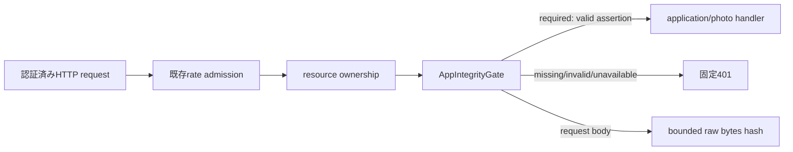

# M27 App Integrity 境界

## この単位の結論

この単位（#28）は、既存の認証済みHTTP入口へApp Attest判定を挿入し、nonce・owner/device bind・単回消費・key counter・request hashを検証する境界までを定義する。外部環境でApple環境が未指定、verifier未接続、store未接続の場合は成功へフォールバックしない。実Apple verifier、Durable Objectの永続store、nonce/enroll HTTP endpoint、native client接続は後続単位である。

## 実装境界

- [packages/contracts/src/http.ts](../../packages/contracts/src/http.ts) はnonce response、enroll input、assertion headersのDTOとstrict schemaを公開する。attestation/assertion本文はopaque文字列としてWorker verifierへ渡し、公開DTOへ再出力しない。
- [workers/api/src/security/app-integrity.ts](../../workers/api/src/security/app-integrity.ts) は`AppIntegrityChallengeStore`、`AppIntegrityKeyStore`、`AppIntegrityVerifier`を注入する純粋な境界である。nonceは最大5分、consumeはowner/device一致かつ単回、登録済みkeyの再登録はcounterをresetせずconflict、counter更新は単調増加を要求する。
- [workers/api/src/security/app-integrity-http.ts](../../workers/api/src/security/app-integrity-http.ts) は内部failure codeを固定401へ変換する。routerはrate admissionとresource ownershipの後でgateを呼ぶ。
- [workers/api/src/http/input.ts](../../workers/api/src/http/input.ts) はbounded JSON parserから検証済みDTOと同じraw body bytesを返す。request hashは再シリアライズせず、そのbytesを使うため、bodyの1文字変更はassertion検証失敗になる。
- [workers/api/src/bootstrap.ts](../../workers/api/src/bootstrap.ts) は`IMA_ENV`、`APP_ATTEST_MODE`（enforcement）、`APP_ATTEST_ENVIRONMENT`（Apple環境）を分離する。staging/productionではrequired以外をrequiredへ固定し、Apple環境不明はrequired gateで拒否する。

## 未完了と検証

Apple App Attestの実検証は、Appleのchallenge、App ID、証明書chain、nonce、counter、request hash検証を満たすWorker verifier接続時に実施する。ExpoのApp Attest APIはsimulator非対応であるため、native実機検証なしに成功扱いにしない。

- Apple: [Validating apps that connect to your server](https://developer.apple.com/documentation/devicecheck/validating-apps-that-connect-to-your-server)
- Expo: [App Integrity](https://docs.expo.dev/versions/latest/sdk/app-integrity/)

Focused tests cover 5-minute/single-use owner binding, key conflict/revocation/counter replay, bounded body handling, required HTTP denial, valid search assertion, and body tampering rejection. Production composition still needs a durable store, verifier, nonce/enroll/revoke routes, and real-device evidence.
