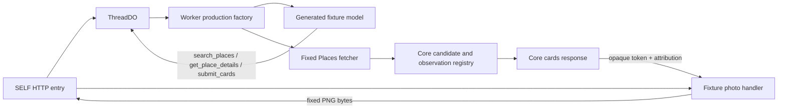

# M28 keyless development fixture

この単位は、既定の HTTP 入口を API key なしで動かす決定的な開発用グラフを
提供する。有効になる条件は `IMA_ENV=dev`、`IMA_RUNTIME_MODE=fixture`、kill
switch 無効の同時成立だけである。live 用 credential が設定された環境は拒否し、
live provider へフォールバックしない。専用 Wrangler config は生成 fixture の
既定値を使うため provider flag を省略している。`IMA_PROVIDER_*` が明示されて
いる場合は `false` や未知値も含めて保持し、fail-closed とする。



model が出力する公開 tool は 3 つだけである。fixture fetcher が受け付けるのは
`https://places.googleapis.com` の `POST /v1/places:searchText` と
`GET /v1/places/dev-fixture-place` だけであり、他の method、host、path、query は
固定 404 になる。synthetic API key と cursor secret はローカル adapter の値で、
外部サービスの credential ではない。営業時間は Google の終日営業 marker を使い、
fetch 境界で注入 clock を検証するため、`openNow` は実時計の揺らぎに依存しない。

focused test は API key なしで `SELF -> ThreadDO -> model -> Places transport ->
Core registry -> cards` を通る。現在地がない状態で徒歩上限を指定した request が、
条件を捨てずに拒否されることも検証する。この単位の対象は cards と Places の
identity/opening-hours fixture と、以下の写真fixtureだけを扱う。Routes、保存参照、
history 復元、live provider の準備完了は別作業である。

写真は `IMA_ENV=dev`、`IMA_RUNTIME_MODE=fixture`、kill switch 無効、Places flag 有効、
かつ live credential 未設定の組合せでだけ有効になる。Details の固定 photo metadata は
合成fixtureの生成元帰属を per-photo で保持し、Worker は本番と同じ owner/device-bound opaque
token、参照DO、30分以内の期限を使う。`GET /v1/photos/:token` は外部fetchを行わず、1px PNGの
合成bytesを返す。staging/live、kill switch、Places停止時は合成成功へフォールバックせず、
写真を提供しない。focused HTTP test はcardsからのtoken発行、PNG応答、owner不一致、Places停止・
kill停止、期限切れを検証する。

Node 24 で単位テストを実行する。

```sh
PATH=/Users/takagiyuuki/.nvm/versions/node/v24.11.1/bin:$PATH \
  bunx vitest run --config vitest.runtime-dev-fixture.config.ts
```

ローカル Worker は専用 config と fixture 専用の `.dev.vars` で起動する。他環境の
credential をコピーしない。

```dotenv
# workers/api/.dev.vars
APP_TOKEN=dev-fixture-app-token
IMA_ENV=dev
IMA_RUNTIME_MODE=fixture
IMA_KILL_SWITCH=false
```

```sh
PATH=/Users/takagiyuuki/.nvm/versions/node/v24.11.1/bin:$PATH \
  bunx wrangler dev --config workers/api/wrangler.runtime-dev-fixture-test.jsonc --local
```

モバイル開発 client は `apps/mobile/.env` に次の fixture 値を明示し、別 terminal で
Expo を起動する。この localhost 設定は同一マシン上の Web / iOS Simulator 用であり、
実機 iPhone では別途 HTTPS の開発用 endpoint が必要になる。client は LAN IP への
平文 HTTP 接続を許可しない。

```dotenv
EXPO_PUBLIC_API_MODE=fixture
EXPO_PUBLIC_ENVIRONMENT=dev
EXPO_PUBLIC_API_BASE_URL=http://localhost:8787
EXPO_PUBLIC_APP_VERSION=m28-dev-fixture
EXPO_PUBLIC_FIXTURE_APP_TOKEN=dev-fixture-app-token
EXPO_PUBLIC_FIXTURE_DEVICE_ID=dev-fixture-device
EXPO_PUBLIC_FIXTURE_OWNER_CREDENTIAL=AAAAAAAAAAAAAAAAAAAAAAAAAAAAAAAAAAAAAAAAAAE
```

```sh
cd apps/mobile
PATH=/Users/takagiyuuki/.nvm/versions/node/v24.11.1/bin:$PATH bun run start
```

cards の成功例では現在地がないため `maxWalkMinutes: null`（UI では徒歩条件を指定解除）
にする。現在地が unavailable のまま `maxWalkMinutes` を指定した request は拒否されなければならず、
focused HTTP test がこの負例を検証する。この fixture は Routes や現在地由来の徒歩
根拠を捏造しない。

root の `bun run test` chain には `bun run test:runtime-dev-fixture` としてこの専用 suite
を追加している。local fixture config は live/staging の Wrangler environment から
分離され、deploy config を変更せず、live provider の準備完了も主張しない。

生成 graph は明示的な development mode 専用である。production profile ではなく、
live environment の credential や provider policy を変更して有効化してはならない。
