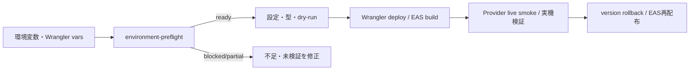

# M28 環境・デプロイ・復旧 runbook

## 結論

このリポジトリは、ローカル開発をfixture、staging/productionの初期値をdisabledとして構成する。外部ID、APIキー、Apple署名資格、EAS project IDはリポジトリへ入れない。`scripts/environment-preflight.ts`は値を表示せず、対象環境・provider mode・endpoint・秘密名の有無・iOS build情報・deploy確認を検査する。

productionは、App Attest（#28）とruntime flags（#27）の接続が未検証の間はdeploy可能と判定しない。dev fixtureは設定が`ready`でも`runtimeVerified=false`かつ`runnable=false`であり、Worker起動の証跡を表さない。preflightが`ready`でも実API、実課金、実機、Cloudflare accountの存在を証明しない。



## 配置と初期値

- `workers/api/wrangler.jsonc` は既存の `ThreadDO`、`RateLimitDO`、`JourneyDatasetDO`、`TelemetryDO` とv1〜v3 migrationを保持する。`env.staging` と `env.production` は別Worker名と4つのDO bindingを明示するが、Cloudflare account、route、binding resource IDは未設定である。
- Wrangler varsはdev=`fixture`、staging/production=`disabled`である。これは安全な初期値であり、現runtimeが全flagsを強制接続済みという意味ではない。
- `apps/mobile/eas.json` はdevelopment/internal/externalのprofileとAPI environmentを定義する。実際のiOS bundle ID、EAS project ID、Apple team・証明書・provisioning profileは環境管理者が設定する。
- `apps/mobile/app.json` の位置情報許可文言はアプリの用途を明示する。`apps/mobile/app.config.ts` がstaging/productionのbuild時だけ、環境変数のbundle IDとEAS project IDを検証して設定する。値がない外部buildは拒否し、bundle IDや署名情報をソースへ固定しない。
- `.env.example` と `.dev.vars.example` は名前と安全な既定値だけを持つ。コピーした`.env.local`/`.dev.vars`は追跡しない。

## 環境値

| 用途          | 値                                         | 保存先                        | 未設定時              |
| ------------- | ------------------------------------------ | ----------------------------- | --------------------- |
| 対象環境      | `IMA_ENV`                                  | Wrangler vars / shell         | preflight blocked     |
| runtime動作   | `IMA_RUNTIME_MODE=fixture\|live\|disabled` | Wrangler vars                 | preflight blocked     |
| Worker認証    | `APP_TOKEN`                                | Wrangler secret / `.dev.vars` | preflight blocked     |
| OpenAI        | `OPENAI_API_KEY`                           | Wrangler secret               | live時 blocked        |
| Places        | `GOOGLE_PLACES_API_KEY`                    | Wrangler secret               | live時 blocked        |
| Routes        | `GOOGLE_ROUTES_API_KEY`                    | Wrangler secret               | live時 blocked        |
| Cursor        | `PLACES_CURSOR_SECRET`                     | Wrangler secret               | live時 blocked        |
| Photo token   | `PHOTO_TOKEN_SECRET`                       | Wrangler secret               | live時 blocked        |
| mobile API    | `EXPO_PUBLIC_API_BASE_URL`                 | EAS env / `.env.local`        | endpoint検査 blocked  |
| runtime flags | `IMA_RUNTIME_FLAGS_CONNECTED`              | Wrangler vars                 | productionは未検証    |
| App Attest    | `APP_ATTEST_MODE`                          | EAS env /運用設定             | productionは#28未完了 |

`IMA_PROVIDER_LIVE_CONFIRM`、`IMA_PROVIDER_BILLING_CONFIRM`、`IMA_PROVIDER_PERMISSION_CONFIRM`は有料live smokeの明示確認である。キーが存在しても`YES`が揃わなければlive呼出しを開始しない。終電datasetはM33/M35の実データ検収までdisabledであり、空の参照値を成功扱いしない。

## preflight

通常のfixture確認:

```sh
IMA_ENV=dev \
IMA_RUNTIME_MODE=fixture \
APP_TOKEN=local-only-token \
EXPO_PUBLIC_API_BASE_URL=http://localhost:8787 \
bun run env:preflight -- --target dev
```

live準備の確認は値をコマンド履歴へ直接書かず、CI secretまたはshellの既存環境から渡す。

```sh
IMA_PREFLIGHT_BUILD=1 IMA_ENV=staging bun run env:preflight -- --target staging
IMA_PREFLIGHT_DEPLOY=1 IMA_ENV=staging bun run env:preflight -- --target staging
```

出力は固定分類とcheck名だけのJSONで、キー値・URL中の資格情報・provider本文を含めない。終了コードは`0=ready`、`1=blocked`、`2=partial/unverified`である。`ready`は設定値の形式と存在だけを示し、API有効化・課金・権限・実データ・署名成功を示さない。runtime compositionの接続証跡を環境変数で自己申告できないため、現状の`runtimeVerified`は常にfalseであり、実行可能判定はWorker smoke testの別ゲートで行う。

必須拒否:

- `IMA_ENV`が`--target`と一致しない。
- `IMA_RUNTIME_MODE`が未知、またはproduction/stagingでfixture。
- `APP_TOKEN`が空または`replace-me`等のplaceholder。
- dev以外のendpointがlocalhost/HTTP、またはcredentialsを含む。
- live modeで3つのconfirmation、5つのprovider secretが揃わない。
- productionでApp Attestがproductionでない、またはruntime flags接続が未検証。
- `IMA_PREFLIGHT_BUILD=1`で`EAS_PROJECT_ID`または実bundle IDがない。
- `IMA_PREFLIGHT_DEPLOY=1`でCloudflare account ID、API token、route、明示deploy確認がない。

## ローカル起動と品質検査

依存の追加や実secretの取得はこのrunbookから自動実行しない。既に同期済みの環境で次を実行する。

```sh
bun install --frozen-lockfile
bun run env:preflight -- --target dev
bun run typecheck
bun run lint
bun run architecture
bun run test
bun run build
bun run dev:worker
```

`wrangler types`をconfig変更後に実行する場合は、workspace rootから次のように対象configと環境を明示し、生成先・差分を確認する。生成型を手書きで修正しない。`wrangler deploy --dry-run`の成功は実deployの証跡ではない。

```sh
(cd workers/api && bunx wrangler types /tmp/ima-worker-configuration.d.ts --config wrangler.jsonc --env staging)
```

## staging / production deploy

外部IDやroute patternはこのリポジトリで仮置きしない。環境管理者がCloudflare dashboard/APIで対象account、Worker名、route、DO migrationの状態を確認し、秘密はWranglerのsecret入力で登録する。

```sh
(cd workers/api && bunx wrangler secret put APP_TOKEN --config wrangler.jsonc --env staging)
(cd workers/api && bunx wrangler secret put OPENAI_API_KEY --config wrangler.jsonc --env staging)
(cd workers/api && bunx wrangler secret put GOOGLE_PLACES_API_KEY --config wrangler.jsonc --env staging)
(cd workers/api && bunx wrangler secret put GOOGLE_ROUTES_API_KEY --config wrangler.jsonc --env staging)
(cd workers/api && bunx wrangler secret put PLACES_CURSOR_SECRET --config wrangler.jsonc --env staging)
(cd workers/api && bunx wrangler secret put PHOTO_TOKEN_SECRET --config wrangler.jsonc --env staging)
```

上記は対話入力の例であり、値を引数、ログ、README、CI artifactへ書かない。Google/ OpenAIのAPI有効化、課金、利用制限、Placesの保持・帰属ポリシーはprovider所有の確認項目である。

deploy前の順序:

1. `IMA_PREFLIGHT_DEPLOY=1`でpreflightを実行する。
2. configとmigrationの差分をレビューし、未確定のresource IDやrouteを埋める。
3. `(cd workers/api && bunx wrangler deploy --config wrangler.jsonc --env staging)`を手動承認付きで実行する。
4. `/health`、認証拒否、provider smokeをstaging endpointで確認する。
5. 実API応答、取得時刻、モデル版、schema結果、費用をraw本文・secretなしで記録する。
6. productionはstaging証跡、App Attest、runtime flags、provider許諾が揃うまで実行しない。

現runtimeはenvironment varsによるprovider停止・切替の接続が未検証であるため、`disabled`を設定しても停止を保証できない。production/stagingはruntime composition、App Attest、runtime flags、provider権限の検証が完了するまで配布・有料呼出しを実行しない。キー登録だけで安全になるとは扱わない。

development profileはlocalhost前提であり、iOS実機から同一LAN上のWorkerへ接続する設定をこの単位では追加していない。internal EAS profileへは、環境管理者が実在するstaging HTTPS endpointをEAS環境変数として注入してからbuild preflightを実行する。

## iOS / EAS

EAS profileは次の3つである。

- `development`: Dev Client、iOS simulator、localhost endpoint。
- `internal`: internal distribution。staging endpointは環境管理者が設定する。
- `external`: store distribution。production endpoint、実bundle ID、署名資格が必要。

bundle IDはApple Developerで予約済みのreverse-DNS値を環境管理者が設定する。実在しない値を例に固定しない。App Attestは#28のnonce/enroll/assertion・replay防止が未検収なので、external profileをproduction成功の証拠にしない。

EAS Buildは`EAS_BUILD=true`を設定してapp configを評価する。profileの`EXPO_PUBLIC_ENVIRONMENT`、EAS環境変数のendpoint、bundle ID、project IDを同じbuildへ渡し、app configがstaging/productionの欠損・不正値を拒否する。

```sh
IMA_PREFLIGHT_BUILD=1 \
IMA_ENV=staging \
EXPO_PUBLIC_API_BASE_URL=https://<staging-host> \
EAS_PROJECT_ID=<configured-project-id> \
EXPO_IOS_BUNDLE_IDENTIFIER=<registered-bundle-id> \
bun run env:preflight -- --target staging

(cd apps/mobile && eas build --profile development --platform ios)
(cd apps/mobile && eas build --profile internal --platform ios)
(cd apps/mobile && eas build --profile external --platform ios)
```

`<...>`は実行可能な値ではない。署名・Apple team・certificate・provisioning profileの成功は、このrepositoryのunit testでは証明できない。端末bundleにはOpenAI/Google/APP_TOKENのsecretを入れず、Worker secretとしてのみ保持する。

## rollback / 復旧

障害時は新しいsecretをログへ出さず、runtimeの実際の停止状態を確認できるまで配布と有料呼出しを停止する。environment varsを変更するだけで停止できるとは扱わない。Cloudflareのversion履歴を確認し、直前の既知versionへ戻す。

```sh
(cd workers/api && bunx wrangler versions list --config wrangler.jsonc)
(cd workers/api && bunx wrangler versions view <version-id> --config wrangler.jsonc)
(cd workers/api && bunx wrangler rollback <version-id> --config wrangler.jsonc)
```

rollback後はhealth、認証、DO migration、保存期限、providerの実停止状態を確認する。DOのデータを手作業で削除して復旧扱いにしない。migrationを戻す必要がある場合は新しい後方互換migrationを作成し、既存snapshotを読めることをFixtureで先に検証する。

EAS配布障害は該当buildを停止し、最後の配布可能なprofile/versionを明示する。Apple署名資格の失効やApp Attestのenrollment不整合は、端末側の再インストールだけで成功扱いにせず、Apple/EASの証跡を残す。

## 未確認事項

- Cloudflare account、Worker route、DO resource、Google/OpenAI account・課金・API有効化は未確認。
- EAS project、iOS bundle ID、Apple team、署名資格、App Attestは未確認。
- `apps/mobile/app.config.ts` は外部build時に上記EAS project IDとbundle IDがなければ拒否するが、実在性・署名・App Attest成功までは証明しない。
- 実deploy、実API、実モデル、実機buildはこの単位で実行しない。
- `IMA_RUNTIME_FLAGS_CONNECTED`は運用上の接続状態を表す検査項目であり、環境変数を設定するだけでruntime側の停止制御が実装されるわけではない。
- #28 App Integrity、#27 runtime flagsの本番接続、#35初期資源作成、#36実API検収は別ゲートである。
