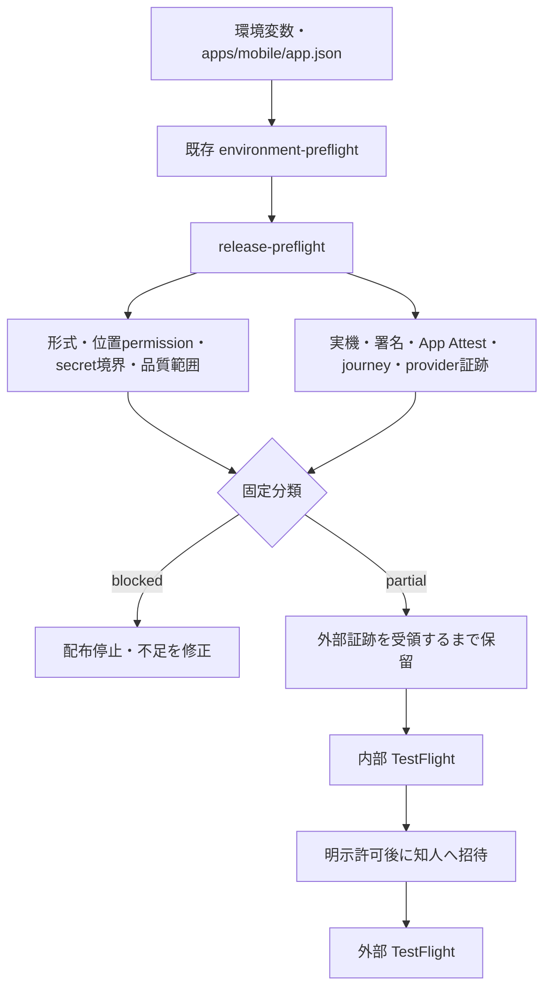

# M30 / #31 TestFlight リリースゲート

## 結論

`scripts/release-preflight.ts` は、既存の `scripts/environment-preflight.ts` を
前提に、内部配布（staging）と外部配布（production）の不足を同じ形式で確認する。
環境変数の存在、Apple 資格情報の自己申告、Fixture の成功、チェックリストの記入だけでは
配布可能にしない。現在は実機、EAS 成果物、Apple App Attest、実終電データ、実 provider
接続の外部証跡がないため、`releaseAllowed` は常に `false` である。



## 実行と出力

リポジトリルートで、secret をコマンド引数へ書かずに実行する。

```sh
bun scripts/release-preflight.ts --track internal
bun scripts/release-preflight.ts --track external
```

`--track internal` は既存の staging preflight、`--track external` は production
preflightを呼ぶ。終了コードは既存preflightと同じく `0=ready`、`1=blocked`、
`2=partial/unverified` である。`ready` になっても配布許可を意味しないが、現行実装は
実外部証跡を常に `unverified` とするため、設定だけで `ready` にはならない。

出力は check 名、固定された状態、短い説明だけを含む。API key、APP_TOKEN、URL の
資格情報、provider本文、位置座標、署名材料は出力しない。`EXPO_PUBLIC_PRIVACY_POLICY_URL`
は HTTPS・資格情報なしという形式だけを検査し、公開ページの存在・内容・App Store
metadataとの一致は外部証跡として残す。

## ゲートの責務

| check                                               | ローカルで確認すること                                             | 外部証跡が必要なこと                                              |
| --------------------------------------------------- | ------------------------------------------------------------------ | ----------------------------------------------------------------- |
| `ENVIRONMENT_PREFLIGHT`                             | target、mode、endpoint、secret名、既存の App Attest/runtime 状態   | account、route、実runtimeの停止・接続                             |
| `TESTFLIGHT_BUILD`                                  | なし                                                               | EAS build ID、profile、artifact、実機起動                         |
| `APPLE_SIGNING`                                     | なし                                                               | Apple team、certificate、provisioning、署名成功                   |
| `REAL_DEVICE`                                       | iOS configの位置permission文言                                     | 実機のpermission、画面、端末OS                                    |
| `APP_ATTEST_EVIDENCE`                               | externalはrequired/production設定、internalは既存staging制約を表示 | Apple verifier、正常・改ざん・replay・別端末の実機結果            |
| `REAL_JOURNEY_EVIDENCE`                             | last-train flagが無効なら停止                                      | M33の出典、検証日、有効期間、更新・rollback                       |
| `LIVE_PROVIDER_EVIDENCE`                            | fixture/disabledを配布経路から拒否                                 | Places/Details/Routes/photo/modelの実応答、権限、課金、帰属、費用 |
| `IMA_PROVIDER_*` / `PHOTO_CAPABILITY`               | 必須能力flagとphoto secretの設定状態                               | runtime factoryへの接続、実呼出し0/成功、保存・表示policy         |
| `SHARE_EVENT_PATH`                                  | OS Share Sheetまたはshare schemeの経路を表示                       | share/events実機動作と送信・保存許可                              |
| `INVITE_CONSENT`                                    | `IMA_TESTFLIGHT_INVITE_CONFIRM=YES` の明示確認                     | 実際の対象者、通知内容、個別の招待許可。自動招待はしない          |
| `PRIVACY_POLICY_HOSTING`                            | public HTTPS URLの形式                                             | 公開ページ、App Store privacy metadata、内容の一致                |
| `PRIVACY_DATA_LIFECYCLE`                            | なし                                                               | 送信項目、保持・削除、ユーザー削除請求、失敗時の挙動              |
| `PRIVACY_DEVICE_LIST`                               | なし                                                               | 端末/アプリ削除で保存店リストが失われる場合の復元案内と削除挙動   |
| `PROVIDER_ATTRIBUTION` / `FONT_LICENSE_ATTRIBUTION` | policy文書と静的configの存在                                       | provider帰属が画面で見えること、font licenseの確認                |
| `QUALITY_SCOPE`                                     | `ebisu-daikanyama` の品質計画だけを受け付ける                      | 少数の夜の実機評価と結果                                          |
| `MOBILE_SECRET_BOUNDARY`                            | app.jsonのsecretらしい値を検出したら停止                           | 実build artifactとbundleのsecret漏出監査                          |
| `PACKAGE_BOUNDARY`                                  | なし                                                               | architecture/build結果とeval・test専用コードの除外                |

`unverified` は「設定済み」または「文書が存在する」という意味に限定し、検証済みを
表さない。`missing`、`invalid`、`blocked` が1件でもあれば配布は停止する。

## 内部・知人・外部の順序

1. **内部**: `internal` profileを staging に対して評価する。既存の staging
   environment preflight が持つ制約を引き継ぐ。M30のコードは内部配布に新しい
   App Attest必須条件を追加しないが、実機でのApp Attest証跡がない状態を合格にしない。
2. **知人**: 内部評価の結果、終電・share・events・privacy・帰属の確認が済んだ後に、
   対象者を限定する。`IMA_TESTFLIGHT_INVITE_CONFIRM=YES` は手動作業の開始条件であり、
   ユーザーの明示許可や招待完了を自動で証明しない。
3. **外部**: production endpoint、production runtime flags、App Attest required、
   実provider許諾、検証済みjourney、署名済み実機buildをすべて外部証跡で確認する。
   いずれかが未確認なら外部招待を行わない。

internal と external の status は別々に保存する。internal の結果を external の
証跡へ流用しない。HP は任意能力なのでこのゲートに含めず、M32で個別検証する。

## Privacy と限定品質範囲

位置情報は `apps/mobile/app.json` の `NSLocationWhenInUseUsageDescription` を静的に
確認する。許可されない位置、精度不足、ユーザーが削除した位置を補完しない。API key、
APP_TOKEN、providerのraw body、写真bytesをmobile bundleへ置かない。送信・保持・削除・
ログ・帰属は [provider policy](./provider-policy.md) と実API検収で確認し、未確認はdeny
または disabled とする。

品質範囲は恵比寿・代官山の少数の夜を評価対象として記録する。これは評価の範囲であり、
地域外を拒否する製品機能ではない。`IMA_RELEASE_QUALITY_SCOPE` が未指定、未知、または
hard lockを示す場合は停止する。全国対応、空席保証、終電保証をこの範囲から推測しない。

font license、Google Maps/Places/Routes/photoの帰属、App Store privacy metadataは、
コード上の文字列や存在だけで合格にしない。表示画面・契約・利用許諾を同じ証跡へ結び付ける。

## 依存と未確認事項

- [#28 / M27 App Attest](https://github.com/takapom/ima-app/issues/28): nonce/key/HTTP境界の
  Fixtureはあるが、Apple verifier・実機・改ざん/replay結果は未確認。
- [#34 / M33 実終電journey](https://github.com/takapom/ima-app/issues/34): 実出典付き
  dataset、検証、投入、更新、rollbackが未確認。flagをtrueにして代用しない。
- [#35 / M34 非本番環境](https://github.com/takapom/ima-app/issues/35): config dry-runと
  preflightは設定検査であり、Cloudflare resource、EAS project、Apple資格を作成しない。
- [#36 / M35 実API検収](https://github.com/takapom/ima-app/issues/36): key、API有効化、課金、
  provider許諾、モデル版、実応答、費用の外部証跡が必要。Fixtureをlive成功に読み替えない。

`wrangler --cwd workers/api` の dry-run、EAS signing/build、TestFlight upload、実機試験、
実API呼出しはこの単位で実行しない。復旧操作は [M28 runbook](./m28-environment-runbook.md)
の `--cwd workers/api` 手順を使い、version・migration・provider停止の実状態を確認してから
手動承認する。CIのformat/lint/typecheck/architecture/test/buildとmain上の証跡は、
`PACKAGE_BOUNDARY` の外部証跡として親の監査へ渡す。

## ローカル検証

```sh
bunx vitest run tests/release-preflight.test.ts --config vitest.config.ts
bunx prettier --check scripts/release-preflight.ts tests/release-preflight.test.ts
```

テストは内部・外部のtarget分離、fixture/disabled拒否、HTTPS URL形式、credentialsの非出力、
位置permission、mobile configのsecret検出、品質範囲のhard lock拒否、explicit invite、
未検証の実機・署名・journey・provider証跡を確認する。テストの成功はTestFlight配布や
実API検収の成功を意味しない。
