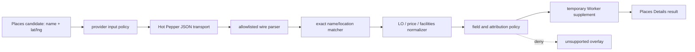

# M32 / #33 Hot Pepper Adapter

この単位は `workers/api` 内の任意 Hot Pepper provider adapter と、既存の Places Details Port へ補足を合成する Worker 境界である。Core の Details Port は維持し、公開 EvidenceRef には provider 非依存の任意複数 attribution を追加した。HP が無効・未設定でも Places の基本経路を組み立てられる。実キー・実アカウント・課金・利用許諾の確認は M35 に残る。

## 境界

- `types.ts` は Worker 内部の request、policy、normalized supplement、typed failure だけを定義する。Hot Pepper SDK 型やレスポンス型を Core / contracts / mobile へ出さない。
- `wire.ts` は Gourmet Search の JSON envelope と必要な店舗項目だけを allowlist parse する。未知 property は捨て、malformed envelope は `SCHEMA_MISMATCH` にする。XML はこの adapter の対象外である。
- `transport.ts` は `GET https://webservice.recruit.co.jp/hotpepper/gourmet/v1/` を一度だけ呼ぶ。API key は Hot Pepper API の要求どおり query parameter に置くが、例外・ログ・返却値には含めない。`redirect: "manual"`、256KB 上限の本文 reader、body read 完了までの timeout、呼出し側の cancel を適用する。上限超過時は本文を cancel して固定 `SCHEMA_MISMATCH` にする。
- `matching.ts` は Places candidate と HP shop の同一性だけを判定する。Haversine はオーバーレイを拒否するフィルタであり、徒歩時間として返さない。
- `normalize.ts` は HP 固有の自由文を Core の営業時間時刻へ推測変換しない。`open` は掲載文、`close` は定休日文として扱い、閉店時刻や日付境界を作らない。`opening-hours.ts` は Google の既存 `opening_hours` の区間・タイムゾーン・評価時刻を保持し、HP が明記した LO 文だけを `lastOrderRaw` へ補足する。
- `composition.ts` は `PlaceDetailsPort` の Worker-only overlay であり、`facilities` と、Places の価格が known でない場合だけ `price.rawLabel` を補う。既知の Places 価格を上書きしない。営業時間の補足は Google 観測との atomic replacement が成功した場合だけ登録し、Google と HP の source ref を両方保持する。HP の provider input policy、field policy、観測期限 policy、候補 identity resolver がすべて明示された場合だけ production factory へ接続する。
- HP の読み取り後に候補の所有・除外状態と response の `candidateId` を再確認する。照合失敗、policy deny、期限切れ、遅着は Places の結果を落とさず、HP field を `unsupported` または既存の partial outcome として扱う。HP 観測の retention は Google Places policy を流用せず、専用 `hotPepperObservationPolicy` で決める。

## 店舗照合

旧設計の「名前類似度 0.8 以上かつ 50m 未満」は、同じ店名に東口・西口などの支店語を付けた店舗を誤採用し得る。そのため本実装では、NFKC・小文字化・空白と句読点の除去後に**名称が完全一致**することを必須にし、類似度は診断 metadata としてだけ返す。距離は 50m 未満を採用境界とする。

- 同名候補が近距離に複数ある場合は `AMBIGUOUS_MATCH` とし、配列順で選ばない。
- 同名でも遠い候補、座標を欠く候補、名称だけが似た支店は `NO_MATCH` とする。
- 既に検証済みの `hotPepperRecordRef` がある場合は、同じ ID・名称・近距離の三つを要求する。ID欠落、名称変更、移転、距離超過は `SOURCE_CONFLICT` とし、新 ID を自動追跡しない。
- HP の店舗 ID は内部 record reference であり、公開 candidate ID と同一視しない。

## 営業時間の補足

- HP の `open` / `close` から `intervals`、`lastOrderAt`、タイムゾーンを作らない。LO のマーカーと時刻が同じ文に明記された場合だけ、日付を含まない `lastOrderRaw` を追加する。LO が不明、複数値、空白、取得失敗、取消、期限切れの場合は Google 値を保持する。
- Google にすでに `lastOrderAt` がある場合や、Google の `lastOrderRaw` と HP の文字列が異なる場合は HP を合成せず、固定の `SOURCE_CONFLICT` warning を返す。warning に provider 原文や時刻を含めない。
- 合成対象の fresh / display / retention / deletion / session bound は Google と HP の交差（各最短期限）だけを使う。片側だけが期限を欠く場合は登録を拒否し、HP の取得時刻で Google の期限を延長しない。Core の `retentionDoesNotExceed` を双方の元 retention に適用する。
- source が Google と HP の混在になることを許すのは `opening_hours` だけである。価格・設備で異なる provider を混在させない。HP の LLM、表示、永続化 policy はそれぞれ再評価し、表示または永続化を撤回した観測を古い retention のまま公開しない。
- HP 観測を再利用できなくなった場合の Google 再取得は、追加の provider budget を予約できたときだけ行う。再取得結果は Google source のみであることを検証し、同じ混在観測を再利用して policy を迂回しない。
- 公開 EvidenceRef の複数 attribution は `packages/contracts` の公開 DTO に追加した provider 非依存の additive 契約で接続する。この単位では source ref を削らず、既存の単一 attribution 表現を勝手に拡張しない。

## フィールド正規化

Hot Pepper API の公式項目名と意味をそのまま扱い、値を補完しない。

- `open` は営業時間の掲載文、`close` は本 API の定休日文として保持する。`close` を閉店時刻・LO・翌日境界へ変換しない。
- `L.O.` / `ラストオーダー` と時刻が同じ文中に明記された場合だけ `lastOrderRaw` を返す。複数の明示 LO が異なる場合、またはマーカーだけで時刻を読めない場合は営業時間補足全体を `unknown` とする。`lastOrderAt` は常に `null` で、日付・タイムゾーンを発明しない。
- `budget.name` と `budget.average` は provider 原文ラベルとして別々に返す。円換算、価格 level、通貨、人数単位、`per_person` は作らず、`unit: "unknown"` を固定する。
- `wifi`、`non_smoking`、`private_room`、`parking` は、明示された yes/no/partial 表現だけを対応する値へ変換する。空欄・未認識文は `unknown` とし、空席・静かさ・予約可否へ読み替えない。
- 店舗 URL は HTTPS かつ `hotpepper.jp` の host のみ出典 URL として採用する。欠損は `MISSING_ATTRIBUTION`、別 host・HTTP・認証情報付き URL は `SOURCE_CONFLICT` とする。値の表示には `ホットペッパー` の帰属を付ける。

## Policy と有効化

候補名・座標を HP へ送るための `providerInputPolicy` と、取得後の `llm_input` / `display` / `persistence` / `attribution` の field policy を分ける。どちらも未注入なら deny である。policy は Places の許可を流用しない。

- `IMA_RUNTIME_MODE=disabled`、`IMA_PROVIDER_HOTPEPPER` の明示的な無効値、または `IMA_KILL_SWITCH` が有効・不正な場合、`createConfiguredHotPepperAdapter` は `undefined` を返す。
- `fixture` mode は明示的に注入された transport がある場合だけ作る。未注入時に実 Hot Pepper endpoint を作らない。
- `live` mode は `HOTPEPPER_API_KEY` が空なら作らない。`fixture_only` policy は live mode で allow にならず、`live_verified` policy と M35 の実環境確認が必要である。
- adapter の既定 policy は `disabled_until_m35` / deny である。policy で伏せた field は raw value を含まない `unsupported` へ落とす。
- Registry の immutable な HP 観測は、再利用時だけでなく production の公開 evidence resolver と message mapper でも現在の field policy で再投影する。保存・表示を撤回した古い retention は返さず、再解決できない根拠は公開しない。
- この単位は provider payload を SQL/KV/DO、ログ、Telemetry、公開 contracts へ保存しない。Places の candidate は HP 不在時もそのまま扱える。

## 試験と残件

`workers/api/tests/providers/hot-pepper/` は、allowlist と API body error、HTTP status、timeout/cancel、キーなし、fixture/live 分離、同名支店・近接曖昧・移転、LO/`close`、価格単位、施設値、出典競合、field policy を検証する。全 fixture は生成データであり、live provider の成功を証明しない。

この単位で既存 Places Details Port の optional capability 合成と production factory 接続まで検証する。実キー・実アカウント・課金・利用許諾の検収、live verified policy の有効化は M35 の別単位で行う。HP を基本検索の必須依存にはしない。

## 参照

- [Hot Pepper API リファレンス](https://webservice.recruit.co.jp/doc/hotpepper/reference.html)
- [M31 provider policy](./provider-policy.md)
- [M12 Places Details](./m12-places-details.md)
- [M24 provider validation](./m24-provider-validation.md)
- [ADR0012 package dependency boundaries](../adr/0012-package-dependency-boundaries.md)
- [ADR0013 quality harness and size limits](../adr/0013-quality-harness-and-size-limits.md)
