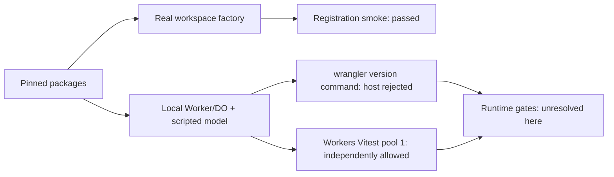

# M04 Runtime compatibility evidence

- **Status:** Think selected for the controlled configuration in ADR0014; live-provider and production checks remain separate
- **Date:** 2026-09-10
- **Scope:** M04 feasibility, repository integration, and PM review checkpoints
- **Locations:** historical isolated probes in `/tmp/ima-m04-spike`; formal fixtures in `workers/api/tests/runtime-gate`

## Conclusion

### Current checkpoint: 2026-09-10 03:11 JST

[ADR0014](../adr/0014-think-runtime-adoption.md) selects Think 0.17.0 with the
explicit V3 model injection, complete-step validation, persistence transform,
current-turn-only input projection, public Session expiry/compaction controls,
and reference-only replay demonstrated by the formal fixture.

The PM ran all 162 tests successfully: Node unit 108, Worker 3, AIChat comparison
22, Think public-API comparison 5, and the common Think configuration 24.
The common Think configuration covers native controls (12), retention (9), and
HTTP/mobile (3). The root HTTP test's missing array-element guard was corrected;
the root TypeScript rerun passed, as did package typechecks, lint, format,
31 architecture fixtures, Worker dry-run, and Expo iOS export.

Commit `6ede1bb` integrates the selected Think configuration; `683b153` records
digest-only replay and reference-only DTO tests. Native raw input is withheld
before SDK persistence but reaches the current model turn, and does not return
in the next turn or after eviction. Compaction always withholds unknown-origin
summaries. Exact replay after eviction returns the same response ID/revision
without model work or body reconstruction. Stop conditions are common to every
scenario, including empty final text after commit.

AIChat remains a comparison candidate, not an adopted fallback. Its context-free
native input path still lacks the selected Think input guard. Its 22 passing
comparison tests do not establish full suitability.

This completes the local M04 adoption gate. GitHub issue closure and push are
separate actions. M05 and M06–M10 implementation have not been completed.
Live model quality, paid APIs, production alarms/backups, and device UI behavior
remain unmeasured; see ADR0014 for the scope of the decision.

### Historical checkpoint: 2026-09-10 02:43 JST

The user installed the declared SDK dependencies and updated the complete Bun
lockfile. Normal workspace resolution runs the real Think and AIChatAgent Worker/DO
fixtures. Five Think public-API comparison tests and nine retention-policy unit
tests pass and are committed. The existing 67 unit tests, three Worker tests,
Expo iOS export, and Worker dry-run build also passed after installation.
Workspace typecheck and 31 architecture fixtures passed during integration.
These results do not establish runtime adoption or M06–M10 completion.

At the 02:43 JST checkpoint, the PM ran 91 Node unit tests, the complete workspace
typecheck, and 31 architecture fixtures successfully. The real Think configuration
passed 21 tests (native control, retention, and HTTP/mobile); the AIChat configuration
passed 26 tests. These counts are execution results, not adoption approval.
Source review still found a scenario-specific AIChat stop condition and different
input persistence paths between the Think native and retention routes. Those
corrections, mixed-policy compaction, and a final combined rerun remain pending.
This supersedes the earlier isolated green counts and previous integration failures.

See [Think public-API probes](think-public-api-probes.md) for the five comparison
cases and their limits, and [retention fixture policy](retention-fixture-policy.md)
for the distinction between policy unit tests, SQL pre-write observation, and
KV post-write reads. Commits `00599a2` and `6bedd25` record these independent
fixtures; neither is an SDK adoption decision. Further commits `9fd21f1`,
`eabfa08`, `4d951f6`, and `9fca65e` record public Core Port injection, native
Think controls, SSE pre-persistence transformation, and explicit unreadable-SQL
reporting. Each commit was checked against the 2,000 changed-line limit.

Dependency warnings have different causes:

- Think 0.17.0 brings workers-ai-provider 4.0.0, whose AI SDK peer is 7.x and
  whose model specification is v4. Installed AI SDK 6.0.182 accepts v2/v3 only
  (`ai/dist/index.mjs`, `resolveLanguageModel`). The default Workers AI path
  is incompatible. The scripted V3 model injected by the fixture does not use
  that path; this is not evidence that every Think configuration is incompatible.
- Agents 0.22.0 brings Babel decorators 8 while Expo uses Babel 7. The Agents
  Babel integration is in `agents/dist/vite.js`; the current Worker imports its
  root entry and does not enable that Vite integration. The successful iOS
  export is limited build evidence, not a reason to upgrade Expo's Babel major.

Runtime Binding declarations are generated from `wrangler.runtime-test.jsonc`
using the command recorded in `runtime-env.d.ts`. That exact generated path is
excluded from formatting and handwritten lint-directive checks; it remains
part of commit line accounting.

The dated checkpoints below are historical and retain their original limitations.

Local Workers/DO execution is available. Later runs exercised the real Think
and AIChat SDKs; the earlier rejected `wrangler --version` command did not
establish that runtime testing was blocked. The following checkpoint supersedes
the initial smoke-test conclusion below, but does not establish SDK adoption.

### PM checkpoint: 2026-09-09 21:33 JST

| Evidence                          | PM observation                                                                                                     | Limit                                                                                                                    |
| --------------------------------- | ------------------------------------------------------------------------------------------------------------------ | ------------------------------------------------------------------------------------------------------------------------ |
| Think active-tool gate            | Real Worker/DO test passed: three exposed tools, rejected `read`, positive search control                          | Does not cover every continuation/recovery path                                                                          |
| Provider-step and SSE gate        | Four tests passed, including mixed terminal-step rejection before effects and structurally sanitized stream chunks | Native-loop integration and remaining robustness corrections are pending                                                 |
| Core → AI SDK contract gate       | 21 tests passed against the actual Core public entry, including strict final envelope and malformed tool arguments | Isolated aliases; not proof of workspace installation or provider strict-generation support                              |
| Public DTO → mobile service/state | 27 contract/mobile tests passed; committed in `3597fc7`                                                            | Actual SDK HTTP response → mobile integration remains pending                                                            |
| Native repair/idempotency loop    | Five tests passed, but PM rejected the evidence as sufficient for adoption                                         | Paid-I/O counter, pre-model replay, actual Core schemas, and combined step/persistence control need correction           |
| Retention/recovery                | Six tests passed, but PM rejected the evidence as sufficient for adoption                                          | Private SDK deletion, history expiry, distinct retention/display boundaries, and failure commit behavior need correction |

The last two rows intentionally record tests whose assertions were insufficient.
A green runner is not an acceptance result when source review finds that the
fixture bypasses the required boundary or omits the side effect being measured.
Sub-agents are correcting these fixtures; neither candidate is declared adopted
or comprehensively incompatible on this evidence.

Temporary reproduction commands, run from the repository root:

```sh
node_modules/.bin/vitest run --config /tmp/ima-m04-spike/vitest.gate.config.mjs
node_modules/.bin/vitest run --config /tmp/ima-m04-spike/vitest.step.config.mjs
node_modules/.bin/vitest run --config /tmp/ima-m04-contract-gate/vitest.config.mjs
```

These paths are local investigation artifacts, not a fresh-clone test setup.
Before M04 completion, the accepted fixture sources, dependency declarations,
complete lockfile, and repeatable tests must be integrated into the Worker
package and pass repository checks. Core's pending Valibot dependency install
was rejected by the host; temporary test aliases do not resolve that prerequisite.
M05 remains gated by M03 and M04. Paid APIs, live models, and production deletion
timing have not been tested.

### PM checkpoint: 2026-09-09 22:07 JST

The PM reran the corrected sources, rather than relying on sub-agent summaries:

- Core/SDK adapter: isolated strict TypeScript check and 21 contract tests passed.
- Native loop: six Worker/DO tests passed, using the shared step validator,
  actual Core schemas, pre-model replay checks, and deadline-signal error mapping.
- Shared step/SSE: four tests passed. Final wire uses `final_message` and the
  Core validator; plain/malformed finals and mixed terminal steps are rejected.
  A module-private WeakSet prevents provider errors from impersonating internal
  policy errors. The empty-text step exception is not a public response commit.
- Retention: seven tests passed. Denied messages are rebuilt from permitted
  fields, including probes in reasoning, tool output, and metadata. Public SDK
  lifecycle/history-clear paths replace internal method/table writes. Session
  expiry and provider windows are separate; saved references survive thread
  deletion and expiry sweep, and have their own explicit delete operation.
- HTTP/mobile: two tests passed: one actual committed candidate travels through
  a Worker public-DTO response into mobile state; an error report with a commit
  is rejected. The earlier seven-case test-side conversion was superseded.

These remain **bounded, isolated results**. The HTTP fixture registry assigns
`obs-details-1` identity/allow metadata while the loop Details stub uses that ID
for opening-hours/unknown metadata. It therefore does not prove a consistent
Core observation/policy-to-DTO transformation. Message and multiple-candidate
HTTP cases, multi-turn history expiry, all persistence surfaces, and all required
cases under one selected configuration remain unverified. Retention and loop
fixtures are still separate configurations. No SDK adoption ADR or M05 code is
approved by this checkpoint. Fresh-clone installation and repository quality
checks remain outstanding; see [implementation progress](implementation-progress.md).

### Initial smoke-test observation

The pinned packages can be imported in an isolated Node environment and the
real Think workspace factory can be called. That is a registration smoke test
only. It does not prove that a model request exposes exactly three tools, that
an invalid or malicious call has no side effect, or that any persistence path is
sanitized before writing.

The isolated `wrangler --version` command was rejected by the host with
`Rejected("approval required by policy, but AskForApproval is set to Never")`.
No alternative runner or installer was used. This records that one CLI command
was rejected, not that all local Worker execution is unavailable. Foundation
independently reported that the prescribed Workers Vitest pool-1 test was
allowed; it was not run by this spike. The M04 runtime gates remain unverified,
M05 remains gated on M04 and the M03 contracts, and no adoption ADR is proposed.



## Pinned isolated packages

Versions and integrity values below come from the isolated npm lock entries and
the installed package metadata. They are not a proposal for the repository
lockfile.

| package                     | version        | integrity (sha512)                                                                         |
| --------------------------- | -------------- | ------------------------------------------------------------------------------------------ |
| `@cloudflare/think`         | `0.17.0`       | `tnfMZSqSz1dhfBx0io/mXMJE2huwJc2kTPAkx55y1bTUQwt9A2uONBmN1FixNsI9DFp1zXJDzcO0juGFKfTyLQ==` |
| `@cloudflare/ai-chat`       | `0.11.0`       | `AsISgLUUqvD/YdtyZNu0WAYl8kbsq5oqYySkl7cE333aIZye/TvkhlOFAyfi2d5sW8B0D8u0cWnU7RugMQZomQ==` |
| `agents`                    | `0.22.0`       | `dIy/BRdO5GSqdOIp0pmkcLmHCCxIKb4RBByXFXmXG6Nc6WBSNYRXoLLDvWj2fJAfi4l5/OndJjZuBAP0vW0DZQ==` |
| `ai`                        | `6.0.182`      | `ooJdziFjYrYRcsCx107roqA8gDTI3P82nUfroNWIhVvwrkYzEN3W1l50YK+XNqkUew8AiimaW0/SLBewRXMuHQ==` |
| `zod`                       | `4.5.4`        | `sC95tT5iHHH9gtpj6A81kh+NEaRAUFN+qlUPDUbRfOMvNf5QCBqsb3WgvnpVtK5Y+4UfA6KqufotuTvMGiTlsA==` |
| `@cloudflare/workers-types` | `5.20260908.1` | `cILmYEd/YtL+Hlwytc5n+QVV8F+E5doQOtc6QiBtPb51kK+5fkk909db+G8dxeUsMd2ytJgdpAt/lyciUEobcw==` |
| `wrangler`                  | `4.130.0`      | `fzNjnTzyZl31PGJOFXbiLeZqEIToQ9KOzkkvGdQz4wlB+BoHnl3BRwCR5xg8AqYyzVunvvMHlMzvlbThQ7rrAA==` |

### Reproduction chronology

The order matters because no additional install is authorized after the
runtime boundary was rejected.

1. `npm view` for Think and AIChat versions/repositories succeeded.
2. The first isolated dependency resolution used `ai@6.0.0` and `zod@4.0.0`.
   The install exposed the `chat@4.40.0` peer requirements `ai ^6.0.182 ||
^7.0.0` and `zod ^3.25.76 || ^4.1.8`; it did not produce a usable install.
3. Only the temporary package was adjusted to `ai@6.0.182` and `zod@4.5.4`.
   A package-lock-only resolution and then
   `npm install --ignore-scripts --no-audit --no-fund` succeeded in `/tmp`.
4. `node spike.mjs` succeeded and produced the factory output below.
5. `wrangler --version` from the isolated directory was rejected by the host
   approval policy. The command was not retried through `workerd` or another
   path, and no paid model API or Durable Object request ran.
6. Foundation independently reported that the prescribed Workers Vitest pool-1
   test was allowed. This spike did not run that test. After M03 contracts are
   available, the next evidence is the dedicated pool-1 Worker/DO scripted-model
   suite, not another Wrangler command.

The exact factory script is kept in `/tmp/ima-m04-spike/spike.mjs`; the reduced
reproducer below is intentionally documentation-only and must run only after
the isolated fixture dependencies exist. It is not a production import.

```js
import { createWorkspaceTools } from '@cloudflare/think/tools/workspace';

const calls = [];
const ops = Object.fromEntries(
  ['read', 'write', 'edit', 'list', 'find', 'grep', 'delete', 'bash'].map((name) => [
    name,
    async (...args) => calls.push([name, args]),
  ]),
);
const withoutBash = Object.keys(createWorkspaceTools(ops, { bash: false })).sort();
const withBash = Object.keys(createWorkspaceTools(ops, { bash: true })).sort();
console.log({ withoutBash, withBash, constructionSideEffects: calls.length });
```

Observed output from the full script:

```json
{
  "workspaceBashFalse": ["delete", "edit", "find", "grep", "list", "read", "write"],
  "workspaceBashTrue": ["bash", "delete", "edit", "find", "grep", "list", "read", "write"],
  "sideEffectCalls": 0
}
```

`sideEffectCalls: 0` means factory construction did not call an operation. It
does not exercise an invalid-tool rejection or prove that a tool cannot mutate
state after a model call.

## Installed-source observations

These are source observations from the pinned local packages, not control-flow
or sanitizer guarantees. The source files are under
`/tmp/ima-m04-spike/node_modules`.

| source                                            | observation                                                                                                                     | implication for the gate                                                                        |
| ------------------------------------------------- | ------------------------------------------------------------------------------------------------------------------------------- | ----------------------------------------------------------------------------------------------- |
| `@cloudflare/think/dist/tools/workspace.js:72-86` | `createWorkspaceTools` always creates `read`, `write`, `edit`, `list`, `find`, `grep`, `delete`; `bash:false` omits only `bash` | An exact-three model request remains unverified; the factory itself is not a three-tool factory |
| `@cloudflare/think/dist/think.js:2644-2652`       | Think creates workspace tools and then obtains `getTools()`                                                                     | `getTools()` alone does not prove the merged runtime set                                        |
| `@cloudflare/think/dist/think.js:2740-2768`       | `activeTools` is passed to `streamText`; `beforeStep` is called from `prepareStep`                                              | Model-visible filtering and a complete provider-step preinspection are separate questions       |
| `@cloudflare/think/dist/think.js:3419-3469`       | `beforeToolCall` resolves a decision immediately before a server tool's execute path                                            | It may block an individual call; no complete mixed terminal step is proven before side effects  |
| `@cloudflare/think/dist/think.js:1948-1960`       | Think wraps chat work in a fiber                                                                                                | Recovery storage must be checked by the blocked Worker/DO fixture                               |
| `@cloudflare/think/dist/think.js:6733-6753`       | assistant persistence occurs before the response hook                                                                           | `onChatResponse` cannot by itself prove pre-write sanitization                                  |
| `@cloudflare/ai-chat/dist/index.js:50-63`         | AIChat wraps chat recovery in a fiber                                                                                           | Fiber persistence remains an unverified write path                                              |
| `@cloudflare/ai-chat/dist/index.js:632-634`       | stream chunks are delegated to `ResumableStream.storeChunk`                                                                     | Stream-buffer sanitization and SQLite contents need a runtime assertion                         |
| `@cloudflare/ai-chat/dist/index.js:1470-1497`     | `sanitizeMessageForPersistence` is an overridable hook whose default returns the message                                        | A hook exists, but the default is not a policy and coverage is unverified                       |
| `@cloudflare/ai-chat/dist/index.js:2883-2895`     | sanitized messages are serialized into `cf_ai_chat_agent_messages`                                                              | This identifies one SQL path; it does not cover every path                                      |
| `@cloudflare/ai-chat/dist/index.js:2965-2977`     | internal sanitization calls the user hook                                                                                       | Hook invocation is source evidence, not proof that all forbidden payloads are removed           |
| `@cloudflare/ai-chat/dist/index.js:3365-3377`     | a streaming approval snapshot is sanitized and inserted directly into the same SQL table                                        | Stream writes require a dedicated canary test                                                   |

## Initial gate status (before the later Worker runs above)

| M04 gate                                                                                                  | status         | missing evidence                                                                         |
| --------------------------------------------------------------------------------------------------------- | -------------- | ---------------------------------------------------------------------------------------- |
| Exactly `search_places`, `get_place_details`, `submit_cards` in every provider request                    | **unverified** | real scripted provider request after Think's merge and `activeTools`                     |
| No default workspace/MCP/client/extension tool leakage                                                    | **unverified** | captured provider request plus post-rejection side-effect assertion                      |
| Full mixed terminal step inspected before any side effect                                                 | **unverified** | one step containing terminal text and multiple tool calls on a running Worker/DO         |
| Invalid known arguments and unknown tools do not call Ports/workspace                                     | **unverified** | invalid and malicious scripted model cases                                               |
| Message and cards responses cross the HTTP boundary and update mobile state                               | **unverified** | local Worker response and mobile DTO/action assertion                                    |
| `submit_cards` invalid → repair → valid, empty final text, idempotent commit                              | **unverified** | scripted multi-step turn and duplicate delivery cases                                    |
| Cancel, budget, stale revision, reconnect, and DO recovery controls                                       | **unverified** | local DO restart/recovery cases                                                          |
| User/provider-quote canary sanitized before SQLite, stream buffer, fiber, workspace, compaction, and logs | **unverified** | pre-write canary inspection of every storage surface; post-save deletion is insufficient |
| Freshness versus retention/deletion boundaries                                                            | **unverified** | fixed clock, 05:00 boundary, expiry, and deletion/restart checks                         |
| Valibot schema and fixed-version reproducibility                                                          | **unverified** | repository adapter and repeatable Worker fixture run                                     |
| Paid API or real model behavior                                                                           | **not run**    | intentionally outside this prerequisite spike                                            |

Until these statuses have runtime evidence, do not add an adoption ADR or wire
Think/AIChat into production. ADR 0011's alternative (AIChatAgent +
`streamText`) must receive the same gates; a custom generic loop is outside the
accepted architecture. M05 is gated by this unresolved evidence and the M03
contracts, rather than by the single rejected Wrangler version command.

## Primary references

- [Think API reference](https://developers.cloudflare.com/agents/api-reference/think/)
- [Think package source](https://github.com/cloudflare/agents/tree/main/packages/think)
- [AIChat package source](https://github.com/cloudflare/agents/tree/main/packages/ai-chat)
- [Cloudflare chat agents and durable recovery](https://developers.cloudflare.com/agents/communication-channels/chat/chat-agents/)
- [ADR0011: Cloudflare-led agent runtime](../adr/0011-cloudflare-led-agent-runtime.md)
- [Fixture runtime validation design](./0006-fixture-runtime-validation.md)
