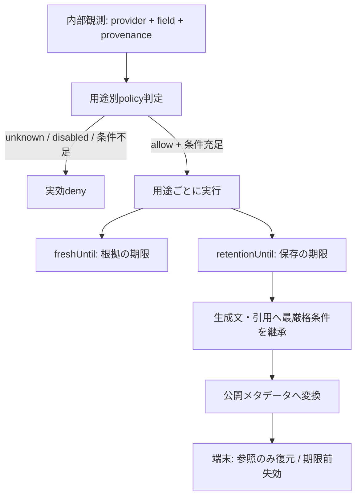

# Providerポリシー

- **資料確認日:** 2026-09-09。文書整理時の再検証は行っていない。live有効化時に現行条件を確認する。
- **対象:** Places/Routes、LLM、生成文、地図連携、端末・サーバー保存。
- **対象外:** 契約の法的解釈、料金・SKUの推測、実API・実アカウントの合格判定。実測とアカウント依存の有効化は[実接続検収](https://github.com/takapom/ima-app/issues/36)で管理する。本文のM35と`disabled_m35`はこの検収境界を指す。

この文書は「公式資料で確認できた条件」と「ima.が安全側に置く実装判断」を分ける。資料に書かれていない利用を許諾とは扱わない。`unknown` は該当する用途だけ実効 `deny` とし、他の用途の判断へ広げない。1つのfieldについて、LLM送信・表示・保存・帰属・地図併用を別々に判定する。

## 公式資料と確認結果

| ID  | 一次資料                                                                                                | 確認できたこと                                                                                                                           | 実装への意味                                                                                                   |
| --- | ------------------------------------------------------------------------------------------------------- | ---------------------------------------------------------------------------------------------------------------------------------------- | -------------------------------------------------------------------------------------------------------------- |
| S1  | [Places policies](https://developers.google.com/maps/documentation/places/web-service/policies)         | Placesの内容は許可された例外以外をpre-fetch/cache/storeしない。`place_id`はキャッシュ制限の例外。地図なし表示でもGoogle Maps帰属が必要。 | Place IDと内容を分離する。内容の保存・LLM送信は別途確認する。                                                  |
| S2  | [Place Photos (New)](https://developers.google.com/maps/documentation/places/web-service/place-photos)  | photo responseの`authorAttributions` fieldは常に返り、値があれば表示時に含める。photo nameはキャッシュ不可で失効し得る。                 | `authorAttributions`の欠落レスポンスは表示deny。写真name/URIを永続化せず、表示時に最新レスポンスから取得する。 |
| S3  | [Routes policies](https://developers.google.com/maps/documentation/routes/policies)                     | Routes結果は帰属が必要。place ID以外のキャッシュは制限される。                                                                           | 経路は一時利用し、保存許可を推測しない。                                                                       |
| S4  | [Maps Platform Service Specific Terms](https://cloud.google.com/maps-platform/terms/maps-service-terms) | Places/RoutesはGoogle MapなしのCustomer Applicationで使えるが、non-Google mapとの併用は禁止。Places/Routesの緯度経度には30日上限がある。 | Apple Maps等へGoogle Maps Contentを渡す操作はdeny。Google Map表示は帰属条件付き。                              |
| S5  | [Workers AI data usage](https://developers.cloudflare.com/workers-ai/platform/data-usage/)              | 入出力はCustomer Content。モデルは第三者サービスのライセンス対象になり得る。Cloudflareの保存はストレージ併用時に発生し得る。             | 選択モデル・アカウント・保存設定をM35で確認するまでlive送信/保存を無効化する。                                 |
| S6  | [Think](https://developers.cloudflare.com/agents/harnesses/think/)                                      | Thinkは会話・stream・再開・状態をDurable Object SQLiteへ保存する構成を持つ。                                                             | SDK自動保存を止める前提にせず、保存前制御を実SDK/DO試験で検証する。                                            |
| S7  | [AI Gateway logging](https://developers.cloudflare.com/ai-gateway/observability/logging/)               | prompt/responseを含むログが既定で有効になり得る。payloadなしのmetadata-only設定もある。                                                  | LLM本文をログへ流さない。ログ設定を確認できるまでprovider由来本文はdeny。                                      |

S1〜S4の記述はGoogleのドキュメント上の条件であり、ima.の契約アカウント・請求地域・利用するAPI版に対する法的判断ではない。S5〜S7も特定モデルの契約を確定しない。M35は請求地域、契約、API有効化、モデルライセンス、ログ/保存設定を記録してからlive profileを有効にする。

## 判定契約

各 policy record は次の値を持つ。fixturesも同じ概念をデータだけで表す。

```text
decision: allow | deny | unknown
activation: fixture_only | disabled_until_m35 | live_verified
use: llm_input | display | persistence | attribution | maps
policyStatus: available | policy_withheld | disabled_m35 | disabled_capability | attribution_missing | expired
fieldStatus: known | unknown | unsupported | error
```

`decision=unknown`、`activation=disabled_until_m35`、条件未充足のいずれかがあれば、その用途の実効判定は `deny` である。`fixture_only` は生成データを使った境界検証を意味し、live providerの許諾や可用性を意味しない。

`policyStatus` と `fieldStatus` は混同しない。providerが値を返さない場合は `fieldStatus=unknown/unsupported`、値を取得済みでも方針上LLMへ出せない場合は `policyStatus=policy_withheld`、M35前は `policyStatus=disabled_m35` とする。policyで伏せた値を「未取得」「未対応」と表示して別の理由に偽装しない。

### 期限と由来

- `sessionExpiresAt`: threadの「今夜」表示窓。JSTで、作成時刻が05:00より前なら当日05:00、05:00ちょうどを含む05:00以後なら翌日05:00。再起動・再取得で延長しない。
- `freshUntil`: 事実として再利用できる期限。鮮度切れでも、保存が許可されていれば参照IDを残せる。`freshUntil`を延長して再取得扱いにしない。
- `displayUntil`: 画面へpayloadを出してよい期限。`freshUntil`より後に表示する場合はstale表示を明示し、`displayUntil`または`sessionExpiresAt`の到達後は表示denyとする。写真のようなrequest-only fieldはレスポンスの表示ライフサイクルだけを許す。
- `retentionUntil`: 保存payloadを利用できる期限。`min(sessionExpiresAt, providerRetentionUntil)`で計算する。providerの上限・許可が不明ならpayloadの `retentionUntil` は設定せず、保存をdenyする。
- `deletionScheduledAt`: `retentionUntil`到達時の削除予約時刻。削除処理が遅れても期限後の読出し・モデル入力・表示はdenyする。停止中は次回起動時の利用前cleanupを先に行い、削除目標は15分以内。厳密な物理削除を確認できないprovider fieldは永続化denyとする。
- `place_id`だけはS1/S4の明示されたID例外により、所有者scope内の参照IDとして期限なし保存を許可できる。これは名称・住所・座標・写真・経路・生成文の保存許可を含まない。
- 許可されたfieldを引用した生成文、要約、カード理由は、引用元fieldの最も厳しい `decision`・`retentionUntil`・帰属条件を継承する。由来を追跡できない生成文は `unknown` として保存denyにする。
- ユーザー原文はユーザー由来として扱う。ただしprovider内容を引用・貼り付けしていればprovider fieldの制約を継承する。



## Provider/field別ポリシー

`allow*` は条件を満たしたときだけ許可する。M35完了前のlive実効値は全provider行でdenyであり、fixturesは条件とdenyを検証する。

| provider / field                            | LLM送信                                              | 表示                                                       | 保存                                                | 帰属                   | 地図併用                                    | 期限・補足                                                |
| ------------------------------------------- | ---------------------------------------------------- | ---------------------------------------------------------- | --------------------------------------------------- | ---------------------- | ------------------------------------------- | --------------------------------------------------------- |
| `google_places.place_id`                    | deny（モデルへ生IDを渡さずopaque candidateIdを使う） | deny（生IDを表示しない）                                   | **allow**（owner-scoped参照ID、期限なし）           | 不要                   | Google Mapsのsource linkに限りM35確認後     | ID例外を他fieldへ拡張しない                               |
| `google_places.display_name`                | unknown→deny                                         | **allow**（Google Maps帰属、出典リンク、M35）              | unknown→deny                                        | Google Maps帰属        | Google Mapのみ。non-Google mapはdeny        | fresh 30分案。保存payload期限なし                         |
| `google_places.formatted_address`           | unknown→deny                                         | **allow**（帰属、M35）                                     | unknown→deny                                        | Google Maps帰属        | Google Mapのみ                              | fresh 30分案                                              |
| `google_places.location`                    | unknown→deny                                         | **allow**（帰属、M35）                                     | **allow**（lat/lngのみ、最大30日かつsession期限内） | Google Maps帰属        | Google Mapのみ。Apple Maps等はdeny          | fresh 30分案。保存は用途・scopeを限定                     |
| `google_places.opening_hours`               | unknown→deny                                         | **allow**（掲載情報と明示、M35）                           | unknown→deny                                        | Google Maps帰属        | 地図表示の根拠にしない                      | fresh 5分案。NOW/入店保証へ変換しない                     |
| `google_places.price_level`                 | unknown→deny                                         | **allow**（元のlevel/通貨を改変しない、M35）               | unknown→deny                                        | Google Maps帰属        | 地図表示の根拠にしない                      | fresh 30分案。円や単位を推測しない                        |
| `google_places.photos[].name` / `photoUri`  | deny                                                 | **allow**（最新取得、`authorAttributions`を同時表示、M35） | **deny**                                            | author attribution必須 | non-Google mapへ渡さない                    | nameはキャッシュ不可・失効あり                            |
| `google_routes.duration` / `distance`       | unknown→deny                                         | **allow**（経路の出典・Google Maps帰属、M35）              | unknown→deny                                        | Google Maps帰属        | Google Mapのみ。Apple Mapsへrouteを渡さない | fresh 5分案。保存せず再取得                               |
| `google_places.contact`                     | unknown→deny                                         | **allow**（公式リンク/電話の元値、Google Maps帰属、M35）   | unknown→deny                                        | Google Maps帰属        | 地図併用はGoogle Mapのみ                    | fresh 30分案。サーバーが任意URLを取得しない               |
| `google_places.facilities`                  | unknown→deny                                         | **allow**（供給されたenumと元表現、Google Maps帰属、M35）  | unknown→deny                                        | Google Maps帰属        | 地図表示の根拠にしない                      | fresh 30分案。静かさ・空席へ読み替えない                  |
| `google_maps.attribution` / `googleMapsUri` | deny（帰属をモデル生成させない）                     | **allow**（削除・隠蔽・改変しない）                        | unknown→deny（必要ならsession metadataのみM35）     | このfield自体が帰属    | source linkはGoogle Mapへ                   | 内容の許可を代弁しない                                    |
| `cloudflare_think.transcript`               | unknown→deny                                         | unknown→deny                                               | **deny**（用途別の保存許可がなければ）              | 該当providerの確認後   | 該当なし                                    | DO/stream/replay/logの全保存先を確認                      |
| `cloudflare_workers_ai.prompt/output`       | unknown→deny                                         | unknown→deny                                               | unknown→deny                                        | 該当モデルの条件次第   | 該当なし                                    | S5の第三者モデル条件とM35 accountを必須化                 |
| `llm.selected_provider`                     | **deny**                                             | **deny**                                                   | **deny**                                            | unknown                | 該当なし                                    | OpenAIの採用設定とaccountの利用許諾は別。検収までdisabled |
| `official_homepage.*`（M32）                | unknown→deny                                         | unknown→deny                                               | unknown→deny                                        | unknown                | unknown→deny                                | M32/M35で個別確認。Placesの許可を流用しない               |
| `rail.last_train`（M33）                    | unknown→deny                                         | unknown→deny                                               | unknown→deny                                        | unknown                | 該当なし                                    | 検証済みjourney投入までdisabled                           |

表示の `allow` は、取得時の条件・帰属・期限が満たされる場合に限る。失敗・欠落・矛盾はunknownとして表示をdenyし、不明表示へ落とす。表のfresh期限は正しさの上限案であり、providerの保存許可ではない。

## 境界と利用規則

### LLM送信と生成文

1. Worker内部はprovider fieldを含むObservationを保持してよいが、LLMへ投影する前にfield単位で `llm_input` を評価する。
2. provider fieldの `llm_input` がunknown/denyなら、値・生URL・生JSON・写真bytesを渡さない。公開文脈には `policyStatus=policy_withheld` または `disabled_m35` を記録し、値の欠落を `fieldStatus=unknown/unsupported` と偽装しない。
3. 公式資料にLLM連携の明示があるAPI（例: Maps Grounding Lite）と、Places/Routesを別のLLMへ送る経路を混同しない。後者の許可は本表に存在しない。
4. 生成文が複数fieldを引用する場合は、最も厳しい保存・帰属・期限を継承する。`evidenceIds`は由来の追跡に使い、制約を解除するために使わない。
5. Thinkの自動会話保存、compaction、stream再開buffer、AI Gateway payload logは、保存前制御の検証なしに使わない。保存禁止fieldが1つでも混ざるturnは本文保存をdenyする。

### 表示・帰属・地図

- Places/Routesのデータを表示する場合は、Google Maps帰属をコンテンツと同じ表示領域で見える状態にする。写真は`authorAttributions`と必要なsource linkをfield単位で保持する。
- Google Maps ContentをApple Mapsその他のnon-Google mapへ重ねる、routeや座標を地図入力へ渡す、providerのsourceを隠す操作はdenyする。単なるユーザー入力の目的地リンクはprovider fieldと混同しない。
- M35でGoogleの請求地域・契約・API版・帰属表示方式を確認するまで、`allow`行もlive UIから有効化しない。表示できない画面幅を理由に帰属を削除しない。

### 保存・復元・別thread

- `place_id`を無期限に残せるのはproviderの許諾上限であり、今夜のthread/candidate参照は `sessionExpiresAt` までとする。明示的な保存リストへ登録された `savedPlaceRef` だけがsessionと独立して残り、ユーザーの削除まで保持する。
- 明示的な「保存」は、`place_id`または内部opaque `savedPlaceRef`だけを登録する。名称・住所・座標・写真・経路・provider由来生成文を保存店レコードへ埋め込まない。
- 次threadで使うときは、同一owner scopeの保存参照を明示的に登録してから新しいcandidateIdを発行し、現行policyで再取得する。前threadのcandidateId・観測・freshUntilを自動移送しない。
- 保存参照を復元できても、provider内容の完全なオフライン復元を約束しない。再取得不可なら `reference_only` として表示し、利用前にdenyする。
- session期限到達時はprovider payload、引用生成文、表示用snapshot、LLM履歴を利用前に失効させる。`deletionScheduledAt`を登録し、停止中は再開時に削除してから読む。保存が許可されたIDとユーザー自身の保存設定だけはsessionとは独立して扱う。

### GPS・終電のhard constraint

- GPSがdenied/reduced/timeout/期限切れなら、徒歩上限など明示されたhard constraintを解除しない。位置なしのnamed-area検索は許せるが、徒歩根拠が必要なsubmitは`LOCATION_REQUIRED`/`LOCATION_IMPRECISE`でdenyする。IPから位置を推測しない。
- `rail.last_train` がdisabled/unsupported/unknown、または帰宅駅・運行日・店→駅経路が不足する場合、終電・最低滞在のhard constraintを解除しない。submitは`MISSING_EVIDENCE`/`UNSUPPORTED_FIELD`でdenyし、別条件へ黙って緩和しない。
- 新しいthreadやM35未完了は、hard constraintの変更根拠にならない。変更はユーザー原文に基づく明示的なturn constraintだけで行う。

## 実装境界と検収

責務・依存方向は[アーキテクチャ](architecture.md)、公開メタデータは[契約](contracts.md)に従う。
Workerが用途別の判断をCoreと公開DTOへ変換し、端末は公開メタデータを保存前・利用前・表示前に適用する。
実SDK/DOの保存前制御をfixtureで検証しても、実Provider/account/modelの許諾が得られたことにはならない。
保存禁止本文はSDK永続化とlive cacheの前に置換し、当該turnだけのモデル入力窓へ分離する。後から消えたことだけを保存禁止の証明にしない。

## 期待値fixture

[保持ポリシーの期待値JSON](fixtures/provider-policy) はSDK・HTTP・実API・実providerレスポンスを含まない。全fixtureは `provenance: "generated"`、`liveProvider: false` を持ち、生成データをlive成功として扱わない。公開メタデータの必須field欠落・offsetなし/不正timestamp・期限順序違反は、値を補完せずdenyする。

- `allowances.json`: fieldごとの5用途判定、公式source、M35 disabled。
- `retention-boundaries.json`: 05:00、freshnessとretentionの独立、生成文・provider引用を含むユーザー原文への厳格制約継承。
- `cross-thread-reference.json`: 保存place IDの参照登録、新candidate発行、再取得必須。
- `hard-constraints.json`: GPS欠如・終電disabled時のdenyと条件未解除。
- `validation-boundaries.json`: 欠落field、malformed timestamp、削除予約、写真帰属欠落のfail-closed期待値。

これらは公開契約・SDK・サーバー保存・端末保存がそれぞれの入力形式へ変換して同じ期待値を検証する基準である。fixtureの合格はprovider契約・live account・SDK保存制御の合格を意味しない。
